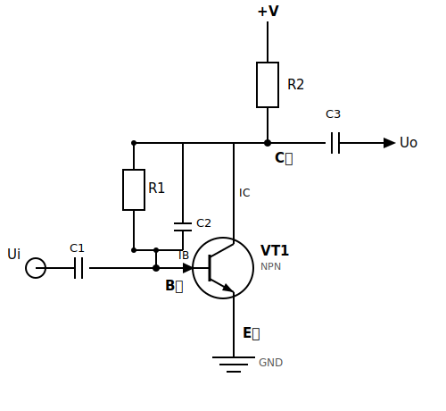
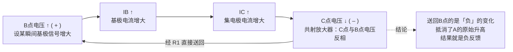
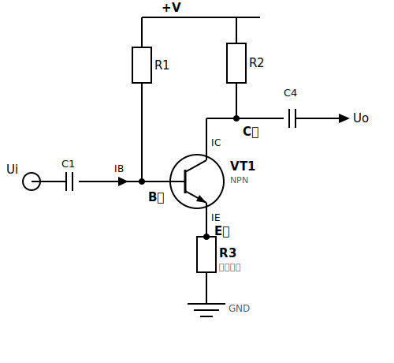
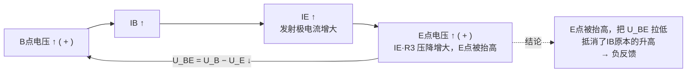
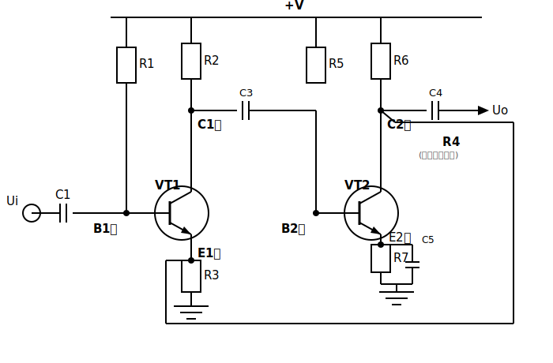
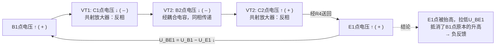
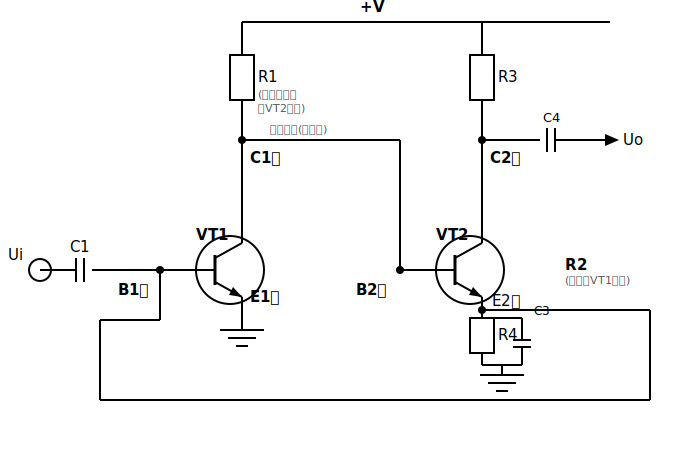

# 4种典型负反馈放大器——原理详解与图解

> 对应教材《电子工程师必备——九大系统电路识图宝典》第1章 1.2 节（图1-41、图1-49、图1-67、图1-72）。
> 原文把4种电路拆散在好几页里讲，每种电路又反复重画好几次示意图，容易看到后面忘了前面。这份笔记把每种电路的**电路图、节点对照表、判断依据、信号极性走向**一次性放在一起，方便对照着看。

---

## 0. 先建立一张总地图：4种电路到底是怎么分出来的

判断一个负反馈电路属于哪一种，其实是回答两个**互相独立**的问题：

1. **反馈信号是从输出端"量电压"还是"量电流"？** → 决定是"电压"还是"电流"反馈
2. **反馈信号加回输入端时，和原输入信号是"挤在同一个节点"还是"分处两个不同的电极"？** → 决定是"并联"还是"串联"反馈

这两个问题的答案任意组合，就是4种电路：

| | 反馈信号回到输入端时**并联**加入 （和 Ui 挤在同一个节点） | 反馈信号回到输入端时**串联**加入 （和 Ui 分处两个不同电极） |
|---|---|---|
| 反馈信号取自输出端**电压**（电压反馈） | **电路一：电压并联负反馈** | **电路三：电压串联负反馈** |
| 反馈信号取自输出端**电流**（电流反馈） | **电路四：电流并联负反馈** | **电路二：电流串联负反馈** |

判断口诀（教材原有的，很好用，放在这里备查）：

| 要判断的问题 | 方法 | 结论 |
|---|---|---|
| 电压反馈 or 电流反馈？ | 把放大器**输出端对地交流短路**，看反馈信号是否消失 | 消失 → 电压反馈；不消失 → 电流反馈 |
| 电压反馈 or 电流反馈？（等价判据） | 看反馈电阻**是否直接接在输出端节点上** | 直接接在输出端 → 电压反馈；不直接接 → 电流反馈 |
| 串联 or 并联？ | 看输入信号 Ui 和反馈信号 Uf 是加在三极管**同一个电极**还是**不同电极** | 同一个电极 → 并联；不同电极 → 串联 |

下面对每种电路，先给电路图，再给节点表，再用这两条判据逐一验证，最后画出"瞬时极性分析"信号链，直观看到"为什么它是负反馈"。

---

## 1. 电压并联负反馈放大器（对应图1-41）

### 1.1 电路图

### 1.2 节点对照表

| 图中位置 | 名称 | 作用 |
|---|---|---|
| 最顶端 | +V | 直流电源正极，给整个电路供电 |
| +V 正下方 | R2 | 集电极负载电阻（把 $I_C$ 的变化转换成 C点的电压变化，见下方说明） |
| 三极管上方 | C点（集电极） | 整个放大器的输出端 |
| 流经R2、进出C点的电流 | IC | 集电极电流 |
| C点到Uo之间 | C3 | 输出耦合电容 |
| 最右侧输出端 | Uo | 输出电压信号 |
| 跨接在B、C之间，与C2并联 | R1 | **反馈电阻**：把C点的电压变化直接送回B点；全频段（直流、交流）都导通 |
| 与R1并联的支路 | C2 | **高频消振电容**：容量很小（如100pF），只在高频信号时才导通，专门用来压低高频增益、防止放大器高频自激 |
| 左边输入端 | Ui | 输入电压信号 |
| Ui 后面的电容 | C1 | 输入耦合电容（隔直流，只让交流信号通过） |
| 三极管左侧 | B点（基极） | 净输入信号真正加入的地方 |
| 流入B点的箭头 | IB | 基极电流 |
| 圆圈本体，B/C/E三根引脚 | VT1（NPN） | 放大管本身，图中标注的"NPN"是三极管的类型 |
| 三极管下方 | E点（发射极） | 直接接地（本电路没有发射极电阻） |
| 最下方接地符号 | GND | 电路的公共参考地，E点在这里直接接地 |

> **为什么集电极（C点）是输出端，不是基极或发射极？**
>
> 这是共发射极组态本身的放大机制决定的，跟负反馈无关：
>
> 1. **基极电流 $I_B$ 只是"控制信号"**，Ui 经 C1 加到基极，只引起 $I_B$ 一个很小的变化，这不是放大的结果，只是"指令"。
> 2. **集电极电流 $I_C$ 受 $I_B$ 控制，且被放大了**：$I_C \approx \beta \cdot I_B$（β 是电流放大倍数，通常几十到几百）。$I_B$ 一个微小变化，引起 $I_C$ 大得多的变化——**放大真正发生在这里**。
> 3. **R2 把"电流的变化"转换成"电压的变化"**：$U_C = V_{CC} - I_C \times R2$。$I_C$ 变大，R2 上压降变大，$U_C$ 就相应变小——$I_C$ 的变化经过 R2，变成了 C 点电压的摆动，这个摆动幅度远大于基极的原始信号，这就是电压增益的来源。R2 存在的**唯一目的**就是做这个"电流→电压"的转换；没有 R2，$I_C$ 的变化会直接被 +V 电源"吸收"掉，C 点电压恒定在 +V 附近，没有信号可取。
>
> 基极是输入端，那里只有未放大的原始小信号；发射极在共射组态里是公共端（本电路直接接地），不是信号摆动最大的点。对比另外两种组态更清楚：共集电极（射极输出器）从发射极取输出，只有电流放大没有电压放大；共基极从集电极取输出但输入在发射极，只有电压放大没有电流放大。**共发射极**（这4种反馈电路全都用这个组态）能同时提供电流和电压放大，所以输出自然就在集电极。后面3种电路的 C点/C1点/C2点 是输出端，道理都一样，不再重复说明。

### 1.3 为什么是"电压"反馈

R1 的一端**直接焊在 C 点（输出端）**上。如果把 C 点对地交流短路（比如在 C 点并一个大电容到地），R1 上就再也没有信号可以往回送了——反馈直接消失。这正是"电压反馈"的判据：**取的是输出端那个点的电压本身**。

### 1.4 为什么是"并联"反馈

顺着 R1 往下走，它最终落到的点，正好是 **Ui 经 C1 进来的那同一个 B 点**。也就是说，输入信号和反馈信号是在 B 点这一个节点上"汇合"的——两股电流在同一节点相加（$I_{B(净)} = I_{Ui来的} - I_{反馈来的}$）。两个信号源共用一个节点，这就是"并联"的定义。

### 1.5 瞬时极性分析（信号是怎么被"压回去"的）

### 1.6 这种反馈的效果

- 电压反馈 → 能**稳定输出电压**，降低放大器的输出电阻
- 并联反馈 → **降低**放大器的输入电阻（因为R1和输入信号的内阻在B点是并联关系，相当于给输入信号"分流"）
- R1 上还并了 C2（很小的高频电容），只在高频信号时才导通，专门用来压低高频增益、防止放大器高频自激（消振）

---

## 2. 电流串联负反馈放大器（对应图1-49）

### 2.1 电路图

### 2.2 节点对照表

| 图中位置 | 名称 | 作用 |
|---|---|---|
| 最顶端 | +V | 直流电源正极 |
| +V左侧分支 | R1 | 基极偏置电阻，给VT1提供基极偏置电流 |
| +V右侧分支 | R2 | 集电极负载电阻 |
| 三极管上方 | C点（集电极） | 放大器输出端（**本电路的反馈信号不取自这里**） |
| 流经R2、进出C点的电流 | IC | 集电极电流 |
| C点到Uo之间 | C4 | 输出耦合电容 |
| 最右侧输出端 | Uo | 输出电压信号 |
| 左边输入端 | Ui | 输入电压信号 |
| Ui 后面的电容 | C1 | 输入耦合电容 |
| 三极管左侧 | B点（基极） | 净输入 $U_{BE}$ 的正端 |
| 流入B点的箭头 | IB | 基极电流 |
| 圆圈本体，B/C/E三根引脚 | VT1（NPN） | 放大管本身 |
| 三极管下方 | E点（发射极） | 净输入 $U_{BE}$ 的负端（反馈信号真正的取样点） |
| 流经R3的电流 | IE | 发射极电流 |
| E点下方 | R3 | **反馈电阻**：发射极电流 $I_E$ 流过它产生的压降就是反馈信号 |
| 最下方接地符号 | GND | 电路的公共参考地 |

### 2.3 为什么是"电流"反馈（不是电压）

把 C 点（输出端）开路断掉，$I_E$（流过R3的电流）会不会消失？**不会**——因为集电极支路和发射极支路是两条不同的回路，输出端断不断路，发射结的电流照样存在。反馈信号压根不关心C点电压是多少，它只关心**流过R3的电流**（约等于 $I_C$）。这就是电流反馈。

> 对比电路一：电路一的 R1 直接焊在 C 点上，C 点一断（对地短路），反馈立刻消失；这里的 R3 根本不焊在 C 点，C 点的死活跟它没关系——这是区分两者最直观的方式。

### 2.4 为什么是"串联"反馈（不是并联）

Ui 加在 **B点**，反馈信号（R3上的压降）却出现在 **E点**——是三极管的**两个不同电极**，不是同一个节点。三极管真正起作用的是

$$U_{BE} = U_B - U_E$$

这是两个电压"相减"，而不是两路电流在同一节点"相加"。凡是反馈信号和输入信号分别加在不同电极上，都是串联反馈。

### 2.5 瞬时极性分析

### 2.6 这种反馈的效果

- 电流反馈 → **稳定输出电流**，提高放大器的输出电阻
- 串联反馈 → **提高**放大器的输入电阻
- R3 上如果并联旁路电容，交流电流会抄近路走电容，不再流过R3 → 只剩直流负反馈（用来稳定静态工作点），交流增益不受影响。这是实际电路里最常用的手法。

---

## 3. 电压串联负反馈放大器（对应图1-67，两级阻容耦合）

这是一个**两级**放大器（VT1 → VT2），反馈电阻跨接在"第二级的输出"和"第一级的发射极"之间，形成"大环路"负反馈。

### 3.1 电路图

图中最显眼的是那条绕了一整圈的 R4：从 VT2 集电极（C2点，整个放大器的输出端）出发，绕到最外圈，一路送回 VT1 的发射极（E1点）。这条又长又绕的路径，画出来正好就是"大环路负反馈"这个名字的字面意思——反馈信号跨过了两级放大器才回到输入级。

### 3.2 节点对照表

| 图中位置 | 名称 | 作用 |
|---|---|---|
| 最顶端 | +V | 直流电源正极，同时给两级放大器供电 |
| 第一级：+V下方左支 | R1 | VT1基极偏置电阻 |
| 第一级：+V下方右支 | R2 | VT1集电极负载电阻 |
| VT1 上方 | C1点（VT1集电极） | 第一级输出端 |
| C1点到B2点之间 | C3 | 级间耦合电容（隔直流，只让交流信号传到第二级） |
| 左边输入端 | Ui | 输入电压信号 |
| Ui 后面的电容 | C1 | 输入耦合电容 |
| VT1 基极 | B1点 | 输入信号 Ui 加入的地方 |
| 第一个圆圈 | VT1 | 第一级放大管 |
| VT1 发射极 | E1点 | **反馈信号 R4 真正落地的地方** |
| E1点下方 | R3 | VT1**本级**的发射极电阻（局部偏置/稳定用，不是跨级反馈电阻，别和R4搞混） |
| 第二级：+V下方左支 | R5 | VT2基极偏置电阻 |
| 第二级：+V下方右支 | R6 | VT2集电极负载电阻 |
| VT2 上方 | C2点（VT2集电极） | 整个放大器的**最终输出端** |
| C2点到Uo之间 | C4 | 输出耦合电容 |
| 最右侧输出端 | Uo | 输出电压信号 |
| VT2 基极 | B2点 | 接收第一级经C3送来的信号 |
| 第二个圆圈 | VT2 | 第二级放大管 |
| VT2 发射极 | E2点 | VT2本级的发射极 |
| E2点下方 | R7 | VT2**本级**的发射极电阻 |
| 与R7并联的支路 | C5 | R7的旁路电容：让VT2本级只剩直流负反馈，交流负反馈被旁路掉 |
| 跨接 C2点 到 E1点 的长导线 | R4 | **反馈电阻**：把最终输出端（C2点）的电压变化，跨两级直接送回第一级的发射极（E1点） |
| R4 旁边的小字 | (跨级环路反馈) | 提示这是跨两级的大环路反馈，不是某一级自己的局部反馈 |

### 3.3 为什么是"电压"反馈

R4 的一端直接焊在 **C2点**——也就是整个放大器**最终的输出端**上。把 C2 点对地交流短路，R4 上就没有信号可送，反馈消失。取的是输出端的电压 → 电压反馈。

### 3.4 为什么是"串联"反馈

反馈信号送到 **E1点**，而输入信号 Ui 加在 **B1点**——分别是 VT1 的两个不同电极，构成 $U_{BE1} = U_{B1} - U_{E1}$ 的相减关系。两个信号分处不同电极 → 串联反馈。

### 3.5 瞬时极性分析（跨两级的信号链）

> 这条链子跨了两个三极管，一路"+ → － → － → + → +"，每一步的正负都由"共射放大器输出与输入反相"或"直接/耦合传递不变号"这两条规则决定，最后落回B1点时正好是能抵消原变化的方向。

### 3.6 这种反馈的效果

- 电压反馈 → 稳定输出电压，降低输出电阻
- 串联反馈 → 提高输入电阻
- 因为是跨两级的大环路反馈，开环增益大，负反馈效果比单级反馈好得多——这也是多级放大器常采用大环路反馈的原因。

---

## 4. 电流并联负反馈放大器（对应图1-72，两级直接耦合）

也是**两级**放大器，但两级之间是**直接耦合**（没有耦合电容，VT1集电极直接接到VT2基极），反馈电阻从"第二级发射极"跨接回"第一级基极"。

### 4.1 电路图

和电路三对比着看最清楚：电路三的大圈子最终绕回了 **E1点**（发射极）；这里的大圈子（R2）最终绕回的是 **B1点**（基极）——和 Ui 输入信号挤在同一个点上。这一个终点的不同，就是"串联"和"并联"的全部区别。另外注意 VT1 和 VT2 之间没有耦合电容，C1点的直流电压直接决定了 VT2 的偏置（图上已标出"直接耦合"字样）。

### 4.2 节点对照表

| 图中位置 | 名称 | 作用 |
|---|---|---|
| 最顶端 | +V | 直流电源正极 |
| +V正下方 | R1 | **双重作用**：VT1的集电极负载电阻，同时它的直流电压又直接作为VT2的基极偏置（图中已标注"集电极负载＋VT2偏置"） |
| VT1 基极 | B1点 | 输入信号 Ui 加入的地方；同时也是反馈信号R2落地的地方 |
| VT1 集电极 | C1点 | 直接接到 VT2 基极（无耦合电容） |
| C1点到B2点之间的小字 | 直接耦合(无电容) | 提示这里没有隔直电容，C1点的直流电压直接传给VT2基极 |
| 左边输入端 | Ui | 输入电压信号 |
| Ui 后面的电容 | C1 | 输入耦合电容 |
| 第一个圆圈 | VT1 | 第一级放大管 |
| VT1 发射极 | E1点 | 直接接地（本电路中VT1没有发射极电阻） |
| VT2 基极 | B2点 | 直流电位由 C1点 决定，交流信号也直接传递 |
| +V右侧分支 | R3 | VT2集电极负载电阻 |
| VT2 集电极 | C2点 | 整个放大器的最终输出端 |
| C2点到Uo之间 | C4 | 输出耦合电容 |
| 最右侧输出端 | Uo | 输出电压信号 |
| 第二个圆圈 | VT2 | 第二级放大管 |
| VT2 发射极 | E2点 | **反馈信号真正的取样点** |
| E2点下方 | R4 | VT2的发射极电阻 |
| 与R4并联的支路 | C3 | R4的旁路电容 |
| 跨接 E2点 到 B1点 的长导线 | R2 | **双重作用**：反馈电阻（把 E2点 的电流变化送回 B1点），同时也是VT1的偏置电流来源（图中已标注"反馈＋VT1偏置"） |

### 4.3 为什么是"电流"反馈

把最终输出端（**C2点**）开路断掉，E2点的电流会不会消失？不会——发射极支路和集电极支路是两条不同回路。R2 上的反馈信号只跟"流过 E2 的电流"有关，跟 C2 点电压是否存在无关 → 电流反馈。

### 4.4 为什么是"并联"反馈

R2 反馈信号最终落到的点，正好是 **Ui 进来的同一个 B1点**——两路信号在 B1点这一个节点上汇合相加，这是"并联"的定义。

> 对比电路三：电路三的反馈落点是 E1点（和Ui所在的B1点不是同一个电极）→ 串联；这里的反馈落点直接就是 B1点（和Ui是同一个电极）→ 并联。这是区分电路三和电路四最关键的一步。

### 4.5 瞬时极性分析

### 4.6 这种反馈的效果

- 电流反馈 → 稳定输出电流，提高输出电阻
- 并联反馈 → 降低输入电阻
- 因为是直接耦合，R2 同时身兼两职（既是反馈电阻，又是VT1的偏置电阻），这是这种电路结构省元件的巧妙之处，但也导致直流分析和交流反馈分析必须分开看，是4种电路里最容易看晕的一种。

---

## 5. 四种电路总对照表

| | 电压并联 | 电流串联 | 电压串联 | 电流并联 |
|---|---|---|---|---|
| 对应图 | 图1-41 | 图1-49 | 图1-67 | 图1-72 |
| 级数 | 单级 | 单级 | 两级（阻容耦合） | 两级（直接耦合） |
| 反馈电阻 | R1 | R3 | R4 | R2 |
| 反馈信号取自 | 输出端**电压**（C点） | 输出电流（经E点/R3） | 输出端**电压**（第二级C点） | 输出电流（第二级E点） |
| 反馈信号送回 | 输入端同一节点（B点，并联） | 输入端不同电极（E点，串联） | 输入端不同电极（第一级E点，串联） | 输入端同一节点（第一级B点，并联） |
| 输出端短路测试 | 反馈消失 → 电压反馈 | 反馈仍在 → 电流反馈 | 反馈消失 → 电压反馈 | 反馈仍在 → 电流反馈 |
| 对输入电阻影响 | 降低 | 提高 | 提高 | 降低 |
| 对输出电阻影响 | 降低（稳定输出电压） | 提高（稳定输出电流） | 降低（稳定输出电压） | 提高（稳定输出电流） |

**记忆技巧**：只要抓住"两个独立判断"——① 输出端短路测试（电压/电流）② 反馈落点是否和 Ui 同一电极（并联/串联）——4种电路就是这两个二选一的排列组合，不需要死记4张图。
