# grub中iommu=pt的作用

## linux iommu的作用？grub中iommu=pt的作用？

在Linux系统中，IOMMU（Input-Output Memory Management Unit）和相关的内核参数（如`iommu=pt`）主要用于管理设备对内存的访问，以下是详细解释：

---

### **1. Linux中IOMMU的作用**

IOMMU是一种硬件特性（如Intel的VT-d或AMD的VI），其核心功能包括：
• **内存隔离与保护**：防止设备直接访问任意物理内存，仅允许访问内核明确分配的地址空间，提升安全性（如防止DMA攻击）。
• **地址转换**：将设备使用的虚拟地址（IOVA）转换为物理地址，支持大内存和非连续内存分配。
• **设备直通（Passthrough）**：在虚拟化环境中，允许虚拟机直接控制物理设备（如GPU、网卡），IOMMU确保设备DMA操作仅限于虚拟机所属的内存区域。
• **性能优化**：减少内存拷贝（如通过`swiotlb`的 bounce buffer）。

---

### **2. `iommu=pt`的作用**

在GRUB内核启动参数中，`iommu=pt`（Pass-Through模式）的用途：
• **仅对直通设备启用IOMMU**：  
  内核默认可能对所有设备启用IOMMU（如`iommu=on`），而`pt`模式仅对**实际需要直通**的设备（如分配给虚拟机的设备）启用IOMMU映射，其他设备绕过IOMMU，从而减少不必要的地址转换开销。
• **性能优化**：  
  避免对普通设备（如内置网卡、磁盘控制器）的IOMMU管理开销，提升性能，尤其在不需要全系统IOMMU的场景下。

---

### **3. 相关参数对比**

| 参数 | 作用 |
|------|------|
| `iommu=on` | 强制启用所有设备的IOMMU（完全保护，可能有性能开销） |
| `iommu=off` | 完全禁用IOMMU（不安全，但无转换开销） |
| `iommu=pt` | **折中方案**：仅直通设备使用IOMMU，其他设备直接访问内存 |

---

### **4. 典型应用场景**

• **虚拟化（如KVM）**：  
  需直通设备给虚拟机时，`iommu=pt`确保直通设备隔离，同时避免非直通设备的性能损失。
• **安全性要求高的场景**：  
  配合`iommu=strict`确保DMA严格受限，但可能牺牲性能。
• **调试**：  
  使用`iommu=debug`查看IOMMU初始化细节。

---

### **5. 配置方法**

在GRUB配置中（如`/etc/default/grub`）添加参数：

```sh
GRUB_CMDLINE_LINUX="iommu=pt"
```

更新GRUB后重启：

```sh
sudo update-grub && sudo reboot
```

---

### **总结**

• **IOMMU**：提供设备内存访问的安全隔离和地址转换。
• **`iommu=pt`**：优化性能，仅在必要时（如设备直通）启用IOMMU，适合虚拟化或特定设备隔离场景。

## 给出流程图，注明iommu在哪一层起作用？

以下是IOMMU在Linux系统中的作用层次及流程图，结合硬件、内核和用户空间的交互关系：

---

### **1. IOMMU作用层次示意图**

```plaintext
+-----------------------+
|     User Space         | ← 应用程序（如虚拟机、普通进程）
+-----------------------+
|     Kernel Space       | ← 驱动、内存管理、IOMMU子系统（iommu=pt参数生效处）
+-----------------------+
|     Hardware Layer     | ← IOMMU硬件（VT-d/AMD-Vi）、PCIe设备
+-----------------------+
```

---

### **2. 详细流程图**

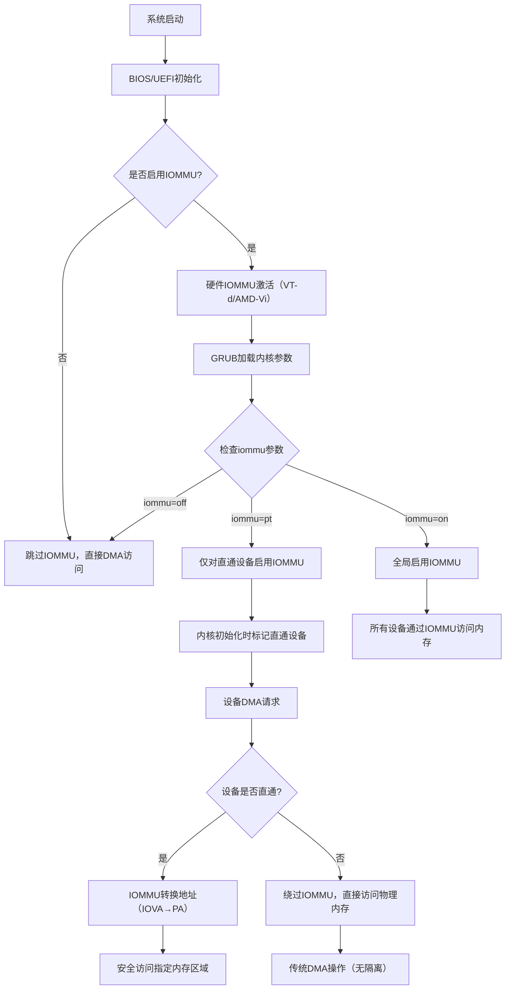

---

### **3. 关键点说明**

1. **硬件层**：  
   • IOMMU是CPU/芯片组提供的硬件功能，位于PCIe设备和物理内存之间，负责地址转换和访问控制。

2. **内核层**：  
   • **GRUB参数**（如`iommu=pt`）在内核启动时解析，决定IOMMU子系统的行为。  
   • 内核的**IOMMU子系统**管理设备与内存的映射关系，直通设备（如VFIO绑定的设备）通过IOMMU隔离。

3. **用户层**：  
   • 虚拟机（如QEMU-KVM）通过VFIO驱动使用直通设备，依赖IOMMU保证安全。

---

### **4. IOMMU的作用位置**

• **地址转换**：在设备发起DMA时，IOMMU硬件将设备看到的**IO虚拟地址（IOVA）**转换为**物理地址（PA）**。  
• **访问控制**：IOMMU的**DMAR（DMA Remapping）表**由内核配置，限制设备仅能访问授权内存。

---

### **5. 典型场景示例**

• **虚拟化直通**：  

  ```plaintext
  虚拟机 → VFIO驱动 → 设备DMA → IOMMU转换 → 虚拟机专属内存
  ```

• **普通设备**（`iommu=pt`时）：  

  ```plaintext
  网卡驱动 → DMA请求 → 绕过IOMMU → 直接访问内核缓冲区
  ```

---

### **总结**

• **流程图**展示了从系统启动到设备DMA的完整路径，`iommu=pt`在内核初始化阶段介入，动态控制IOMMU的启用范围。  
• **核心作用层**：IOMMU在**硬件层执行转换**，由**内核层配置策略**，最终保障用户层（如虚拟机）的内存安全。

## 虚拟机 → VFIO驱动 → 设备DMA → IOMMU转换 → 虚拟机专属内存 这里没有iommu会怎样？

如果虚拟机直通设备（PCIe Passthrough）时**没有IOMMU**，会导致严重的安全性和功能问题，具体表现如下：

---

### **1. 安全问题：DMA攻击（直接内存访问失控）**

• **设备可以访问任意物理内存**：  
  未隔离的DMA操作允许直通设备读写**宿主机全部物理内存**，包括：
  • 其他虚拟机的内存。
  • 宿主机内核敏感数据（如密码、密钥）。
  • 其他进程的私有内存。
• **后果**：恶意虚拟机可通过直通设备发起DMA攻击，篡改系统或窃取数据。

---

### **2. 功能问题：地址冲突与错误**

• **物理地址错误**：  
  虚拟机内部的驱动认为设备DMA目标是虚拟机的“物理地址”（GPA），但设备实际直接使用宿主机的物理地址（HPA），两者不一致会导致：
  • 数据写入错误的内存位置（如覆盖宿主关键数据）。
  • 设备读取到无效数据，引发崩溃或静默错误。
• **示例**：  
  虚拟机内网卡驱动配置DMA缓冲区地址为 `0x1000`（GPA），但宿主机中该地址可能对应完全不同的内容（如其他虚拟机内存）。

---

### **3. 虚拟化场景的完全失效**

• **内存隔离破坏**：  
  虚拟化的核心要求是隔离各虚拟机的资源，无IOMMU时：
  • 直通设备可能读取其他虚拟机的磁盘数据（如通过NVMe SSD控制器）。
  • GPU直通可能泄露显存中的图形数据。
• **稳定性问题**：  
  多虚拟机竞争同一设备的DMA资源会导致随机崩溃。

---

### **4. 替代方案（无IOMMU时的妥协方法）**

若硬件不支持IOMMU，仍需要直通设备时，只能依赖以下**不安全且低效**的替代方案：

1. **软件模拟IOMMU（如QEMU的`-device ioh3420`）**：  
   通过软件拦截设备DMA并重定向地址，但性能极差（需陷入模拟层）。
2. **使用用户态驱动（如UIO）**：  
   将设备映射到用户空间，但无法解决DMA安全问题。
3. **禁用直通，改用虚拟设备（如virtio-net）**：  
   完全放弃性能，回归纯软件虚拟化。

---

### **5. 为什么IOMMU是必须的？**

• **硬件级隔离**：  
  IOMMU的地址转换表（由宿主机内核配置）确保设备DMA仅能访问**指定虚拟机的内存区域**。
• **透明性**：  
  虚拟机无需感知宿主机物理地址，IOMMU自动完成`GPA→HPA`转换。
• **性能**：  
  硬件加速的地址转换（对比软件模拟可提升10倍以上吞吐量）。

---

### **总结**

无IOMMU的直通设备会：

1. **彻底破坏虚拟化隔离性**，引发安全灾难。
2. **导致DMA操作混乱**，使设备无法正常工作。
3. **迫使使用低效替代方案**，丧失直通的性能优势。

因此，在生产环境中，启用IOMMU（如`iommu=on`或`iommu=pt`）是PCIe Passthrough的必要前提。

## 虚拟机 → VFIO驱动 → 设备DMA → IOMMU转换 → 虚拟机专属内存 这里进一步表明虚拟机专属内存与物理机专属内存的关系？

在虚拟化环境中，**虚拟机专属内存**（Guest Physical Memory, **GPA**）与**物理机专属内存**（Host Physical Memory, **HPA**）的关系由**虚拟化层（KVM/QEMU）+ IOMMU**共同管理，以下是详细解析：

---

### **1. 内存映射关系**

#### （1）**虚拟机视角（GPA）**

• 虚拟机（VM）认为自己独占连续的物理内存（GPA），例如：
  • 虚拟机内操作系统分配内存地址 `0x1000`（GPA）。
  • 虚拟机驱动程序配置设备DMA目标为 `0x1000`（GPA）。

#### （2）**物理机视角（HPA）**

• 宿主机实际将虚拟机的GPA映射到**分散的物理内存页**（HPA），例如：
  • GPA `0x1000` → HPA `0x8000`（可能是宿主机的一个4KB页面）。
  • GPA `0x2000` → HPA `0x12000`（另一个物理页）。
• 这种映射由**KVM内存虚拟化**（EPT/NPT）维护，对虚拟机透明。

---

### **2. IOMMU的作用：GPA → HPA的二次转换**

当直通设备发起DMA时，IOMMU需完成**两级地址转换**：

1. **虚拟机驱动 → GPA**  
   设备DMA目标地址由虚拟机驱动设置为GPA（如 `0x1000`）。
2. **IOMMU转换：GPA → HPA**  
   IOMMU通过**I/O页表**（由VFIO驱动配置）将GPA转换为真实的HPA（如 `0x8000`）。

```plaintext
设备DMA请求:  [GPA 0x1000] → IOMMU转换 → [HPA 0x8000]
```

#### **关键点**

• **IOMMU的I/O页表**由宿主机内核（VFIO驱动）动态维护，确保设备只能访问**该虚拟机对应的HPA范围**。
• **EPT/NPT**（KVM的扩展页表）负责虚拟机内`GVA→GPA`的转换，而IOMMU负责`GPA→HPA`的转换，两者协作完成完整映射。

---

### **3. 内存隔离示意图**

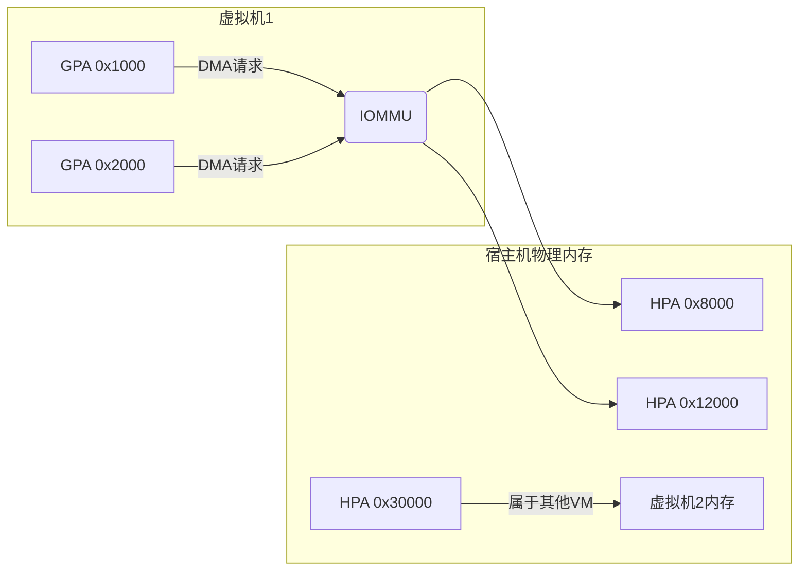

• **隔离性**：IOMMU确保虚拟机1的设备无法访问 `HPA 0x30000`（虚拟机2的内存）。

---

### **4. 无IOMMU时的内存混乱**

若未启用IOMMU，设备直接使用GPA作为HPA，导致：
• **地址错位**：  
  虚拟机内 `GPA 0x1000` 可能对应宿主机 `HPA 0x1000`（完全无关的数据）。
• **越界访问**：  
  设备可能写入宿主机的内核内存或其他虚拟机内存。

---

### **5. 实际案例（以KVM为例）**

1. **QEMU启动参数**：  

   ```bash
   -device vfio-pci,host=01:00.0  # 将物理设备01:00.0直通给虚拟机
   ```

2. **内存分配流程**：  
   • 虚拟机分配 `GPA 0x1000`，QEMU通过`mmap`在宿主机分配 `HPA 0x8000`。  
   • VFIO驱动将 `GPA 0x1000 → HPA 0x8000` 写入IOMMU页表。  
3. **设备DMA**：  
   设备写入 `GPA 0x1000`，IOMMU自动重定向到 `HPA 0x8000`。

---

### **6. 总结**

| 概念                | 说明                                                                 |
|---------------------|----------------------------------------------------------------------|
| **GPA**             | 虚拟机看到的“物理内存”，连续且独占（实际由宿主机碎片化映射）。         |
| **HPA**             | 宿主机真实的物理内存，可能被多个虚拟机共享（通过IOMMU隔离）。          |
| **IOMMU转换**       | 将设备DMA的GPA动态转换为HPA，确保隔离性和正确性。                     |
| **无IOMMU的后果**   | DMA直接使用GPA作为HPA，导致内存污染、安全漏洞和系统崩溃。             |

通过IOMMU的`GPA→HPA`转换，虚拟化环境实现了**高性能的设备直通**与**严格的内存隔离**。

## 没有iommu，ept页表会将gpa转成hpa啊，难道在vm 外设dma的时候ept扩展页表不参与？

你的问题非常关键！这里涉及到 **EPT（Extended Page Table，扩展页表）** 和 **IOMMU** 在虚拟化环境中的分工协作关系。确实，EPT 负责将虚拟机内部的 **GPA（Guest Physical Address）** 转换为宿主机的 **HPA（Host Physical Address）**，但 **EPT 并不直接参与外设 DMA 的地址转换**，原因如下：

---

## **1. EPT 和 IOMMU 的分工**

### **(1) EPT（扩展页表）**

• **作用**：负责 **CPU 访问内存时的 GPA→HPA 转换**（即虚拟机内部的 MMU 页表转换）。
• **适用场景**：
  • 虚拟机内部的 **CPU 指令访问内存**（如 `mov [rax], rbx`）。
  • **软件模拟的设备**（如 virtio）的 MMIO 访问。
• **不适用场景**：
  • **外设 DMA 操作**（如 PCIe 设备直接读写内存），因为 DMA 不经过 CPU MMU，EPT 无法介入。

### **(2) IOMMU（如 Intel VT-d / AMD-Vi）**

• **作用**：负责 **外设 DMA 的 GPA→HPA 转换**，确保设备只能访问虚拟机被分配的内存。
• **适用场景**：
  • PCIe 设备直通（如 GPU、NVMe SSD、网卡）的 DMA 操作。
  • 防止设备越界访问其他虚拟机或宿主机的内存（DMA 攻击防护）。
• **不适用场景**：
  • CPU 访问内存（由 EPT 负责）。

---

## **2. 为什么 EPT 不能直接用于外设 DMA？**

• **DMA 绕过 CPU MMU**：
  • 外设（如网卡、GPU）进行 DMA 时，直接向内存控制器发起读写请求，**不经过 CPU MMU**，因此 EPT 无法拦截和转换地址。
• **IOMMU 是硬件级 DMA 隔离机制**：
  • IOMMU 位于 **PCIe 设备和内存控制器之间**，可以拦截所有 DMA 请求并转换地址。
  • 如果只有 EPT 而没有 IOMMU，设备 DMA 会直接使用 **GPA** 作为 **HPA**，导致内存错乱。

---

## **3. 无 IOMMU 时的 DMA 行为**

如果 **没有 IOMMU**，设备 DMA 会直接使用 **GPA** 作为 **HPA**，导致：

1. **地址错乱**：
   • 虚拟机内 `GPA 0x1000` 可能对应宿主机 `HPA 0x5000`（由 EPT 管理），但设备 DMA 会直接访问 `HPA 0x1000`（错误的物理地址）。
2. **内存污染**：
   • 设备可能写入其他虚拟机或宿主机的内存（安全漏洞）。
3. **系统崩溃**：
   • 错误的 DMA 访问可能导致宿主机内核 panic 或虚拟机异常退出。

---

## **4. 完整流程对比（有/无 IOMMU）**

### **(1) 有 IOMMU 的正常流程**

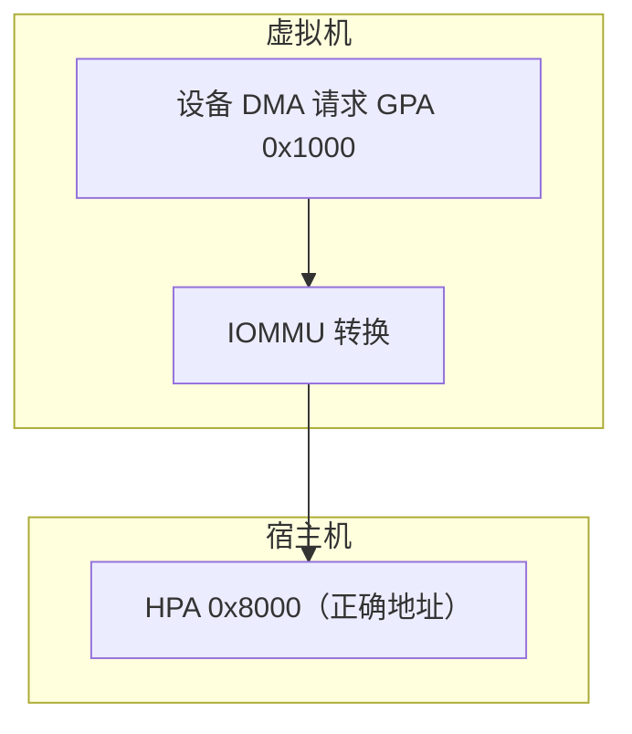

• **IOMMU 确保**：设备 DMA 的 `GPA 0x1000` 被转换为正确的 `HPA 0x8000`。

### **(2) 无 IOMMU 的错误流程**

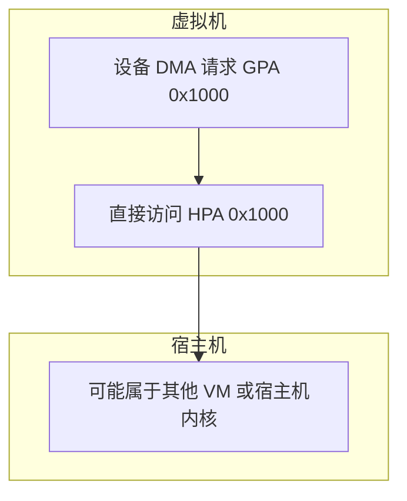

• **无 IOMMU**：设备 DMA 直接使用 `GPA 0x1000` 作为 `HPA 0x1000`，导致越界访问。

---

## **5. 结论**

• **EPT 负责 CPU 访问内存的 GPA→HPA 转换**（软件层面）。
• **IOMMU 负责外设 DMA 的 GPA→HPA 转换**（硬件层面）。
• **如果没有 IOMMU，EPT 无法保护 DMA 操作**，设备会直接使用错误的 HPA，导致内存污染和安全问题。
• **IOMMU 是 PCIe 设备直通（PCI Passthrough）的必备条件**，否则无法安全使用 GPU、NVMe SSD 等高性能设备。

### **简单总结**

| 机制  | 作用范围 | 是否影响 DMA | 是否影响 CPU 访问 |
|-------|---------|-------------|------------------|
| **EPT** | CPU MMU | ❌ 不参与 | ✅ 负责 GPA→HPA |
| **IOMMU** | PCIe 设备 DMA | ✅ 负责 GPA→HPA | ❌ 不参与 |

因此，**EPT 和 IOMMU 是互补的**，两者共同确保虚拟机的内存访问（CPU + 设备）都能正确映射到宿主机的物理内存。

## iommu中会进行ioremap吗？

在 Linux 内核中，**IOMMU 和 `ioremap` 是两个不同的机制**，但它们可能在某些场景下协同工作。以下是详细分析：

---

## **1. `ioremap` 的作用**

`ioremap` 是 Linux 内核提供的函数，用于：
• **将设备的 MMIO（Memory-Mapped I/O）区域映射到内核虚拟地址空间**，使内核可以访问设备的寄存器或内存。
• **不涉及 DMA**，仅用于 CPU 通过 load/store 指令访问设备寄存器。
• **典型场景**：
  • 设备驱动通过 `ioremap` 映射 PCI BAR 空间，读写设备控制寄存器。
  • 例如：网卡驱动配置寄存器、GPU 驱动访问显存。

**示例代码**：

```c
void __iomem *regs = ioremap(phys_addr, size);
writel(value, regs + offset); // 写入设备寄存器
```

---

## **2. IOMMU 的作用**

IOMMU 的核心功能是：
• **管理设备 DMA 的内存访问**，将设备使用的 I/O 虚拟地址（IOVA）转换为物理地址（HPA）。
• **不直接参与 `ioremap`**，但可能影响 MMIO 的物理地址访问（某些架构下）。
• **典型场景**：
  • PCIe 设备直通（Passthrough）时，隔离设备的 DMA 操作。
  • 防止设备 DMA 越界访问（如 DMA 攻击）。

---

## **3. IOMMU 和 `ioremap` 的关系**

### **(1) 一般情况下：IOMMU 不介入 `ioremap`**

• `ioremap` 是 **CPU 访问 MMIO** 的机制，而 IOMMU 管理的是 **设备 DMA**。
• `ioremap` 直接操作物理地址（绕过 IOMMU），因为 CPU 访问设备寄存器时不需要地址转换。

### **(2) 特殊情况：IOMMU 可能影响 MMIO 访问**

在某些架构（如 ARM SMMU）或配置下：
• 如果设备的 **MMIO 区域被 IOMMU 隔离**，内核可能需要先通过 IOMMU 映射，再使用 `ioremap`。
• 例如：
  • 在 **ARM 系统** 中，SMMU 可能对设备的 MMIO 也进行保护，此时 `ioremap` 需要确保物理地址可被 CPU 访问。
  • 在 **虚拟化环境** 中，直通设备的 MMIO 可能需要额外的 IOMMU 配置。

### **(3) DMA 相关：`dma_alloc_coherent` 和 IOMMU**

• 如果设备需要通过 DMA 访问内存（而非 MMIO），驱动会使用 `dma_alloc_coherent`：

  ```c
  void *buf = dma_alloc_coherent(dev, size, &dma_handle, GFP_KERNEL);
  ```

  • 该函数会返回 **内核虚拟地址（`buf`）** 和 **设备可用的 DMA 地址（`dma_handle`）**。
  • **如果 IOMMU 启用**，`dma_handle` 是 IOVA（IOMMU 转换后的地址），而非真实物理地址（HPA）。
  • **如果 IOMMU 禁用**，`dma_handle` 直接是物理地址。

---

## **4. 总结**

| 机制          | 作用范围               | 是否依赖 IOMMU？       | 典型 API                |
|---------------|-----------------------|-----------------------|-------------------------|
| **`ioremap`** | CPU 访问设备 MMIO      | ❌ 通常不依赖         | `ioremap()`, `iowrite32()` |
| **IOMMU**     | 设备 DMA 地址转换      | ✅ 直接影响 DMA       | `dma_alloc_coherent()`   |
| **两者关系**  | 独立，但在某些架构下协同 | MMIO 可能受 IOMMU 保护 | 架构相关（如 ARM SMMU）  |

### **关键结论**

1. **`ioremap` 通常不涉及 IOMMU**，因为它是 CPU 直接访问 MMIO 的机制。
2. **IOMMU 主要管理设备 DMA**，但某些架构可能扩展其对 MMIO 的保护。
3. 在编写设备驱动时：
   • 访问寄存器 → 用 `ioremap`。
   • 分配 DMA 缓冲区 → 用 `dma_alloc_coherent`（受 IOMMU 影响）。

## 网卡收发包dma讲一下

### **网卡收发包的 DMA（直接内存访问）流程详解**

网卡（NIC, Network Interface Card）通过 **DMA（Direct Memory Access）** 技术高效地收发数据包，避免 CPU 频繁参与数据拷贝，从而提升网络性能。以下是详细流程：

---

## **1. 基本概念**

### **(1) DMA 的作用**

• **CPU 不直接参与数据搬运**，而是由网卡直接读写内存。
• **减少 CPU 开销**，提高吞吐量（如 10G/25G/100G 高速网络）。

### **(2) 关键组件**

| 组件                | 作用                                                                 |
|---------------------|----------------------------------------------------------------------|
| **网卡（NIC）**     | 负责物理层数据收发，通过 DMA 与内存交互。                            |
| **驱动（Driver）**  | 管理网卡，分配 DMA 缓冲区，处理中断。                                |
| **环形队列（Ring）**| 存储数据包描述符（Descriptor），指向 DMA 缓冲区地址。                |
| **DMA 缓冲区**      | 存放实际数据包的内核内存区域，由网卡直接访问。                       |

---

## **2. 收包流程（Rx, Receive）**

### **(1) 驱动初始化**

1. **分配 DMA 缓冲区**（`dma_alloc_coherent`）：
   • 内核为收包分配一组内存块（通常为 `sk_buff` 或 `page` 结构）。
   • 如果启用 **IOMMU**，返回的是 **IOVA（I/O Virtual Address）**，否则是物理地址（HPA）。
2. **填充描述符到 Rx Ring**：
   • 每个描述符指向一个 DMA 缓冲区地址（如 `buf1 → 0x1000`, `buf2 → 0x2000`）。
   • 网卡通过 PCIe 总线读取这些描述符。

### **(2) 网卡收包**

1. **数据包到达网卡**：
   • 网卡从物理端口接收数据（如以太网帧）。
2. **DMA 写入内存**：
   • 网卡根据 Rx Ring 中的描述符，找到空闲的 DMA 缓冲区（如 `buf1`）。
   • 直接通过 DMA 将数据写入 `buf1`（地址 `0x1000`）。
3. **更新描述符状态**：
   • 网卡标记描述符为“已填充”，并可能触发中断（MSI-X）通知 CPU。

### **(3) 内核处理**

1. **CPU 收到中断**：
   • 驱动检查 Rx Ring，发现 `buf1` 有新数据。
2. **解析数据包**：
   • 将 `buf1` 的数据封装为 `sk_buff`，传递给网络协议栈（如 IP/TCP 处理）。
3. **回收缓冲区**：
   • 驱动重新填充 `buf1` 到 Rx Ring，供下一次收包使用。

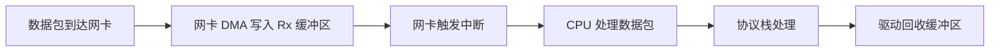

---

## **3. 发包流程（Tx, Transmit）**

### **(1) 驱动准备数据**

1. **协议栈构造数据包**：
   • 应用数据经过 TCP/IP 封装后，生成 `sk_buff`。
2. **分配 DMA 缓冲区**：
   • 驱动将 `sk_buff` 的数据映射到 DMA 区域（`dma_map_single`）。
   • 如果启用 **IOMMU**，会生成 IOVA，否则直接使用物理地址。
3. **填充描述符到 Tx Ring**：
   • 描述符指向数据包的 DMA 地址和长度（如 `buf_tx → 0x3000`）。

### **(2) 网卡发包**

1. **驱动触发网卡**：
   • 通过写寄存器通知网卡“有数据待发送”。
2. **网卡读取 Tx Ring**：
   • 找到待发送的描述符（如 `buf_tx`）。
3. **DMA 读取内存**：
   • 网卡从 `0x3000` 读取数据，通过物理端口发送。

### **(3) 完成通知**

1. **网卡发送完成**：
   • 数据发送后，网卡更新描述符状态，并可能触发中断。
2. **驱动回收资源**：
   • 释放 DMA 映射（`dma_unmap_single`），回收 `sk_buff`。

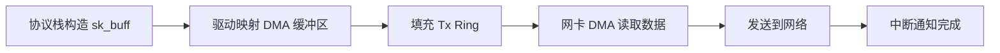

---

## **4. 关键优化技术**

### **(1) 多队列（RSS, Receive Side Scaling）**

• **每个 CPU 核心绑定独立的 Rx/Tx 队列**，避免锁竞争，提升多核性能。

### **(2) 零拷贝（Zero-Copy）**

• **用户态直接访问 DMA 缓冲区**（如 DPDK、XDP），跳过内核协议栈。

### **(3) 中断合并（Interrupt Coalescing）**

• 网卡积累多个数据包后触发一次中断，减少 CPU 负载。

### **(4) IOMMU 隔离**

• 防止网卡 DMA 越界访问其他内存（安全关键）。

---

## **5. 无 DMA 的对比（PIO 模式）**

如果网卡不使用 DMA，只能通过 **PIO（Programmed I/O）**：

1. **CPU 必须逐字节读写网卡寄存器**，性能极低。
2. **仅用于早期低速网卡（如 10Mbps）**，现代网卡均依赖 DMA。

---

## **6. 总结**

| 步骤       | 收包（Rx）                          | 发包（Tx）                          |
|------------|-------------------------------------|-------------------------------------|
| **1. 准备** | 驱动分配 DMA 缓冲区，填充 Rx Ring   | 协议栈构造数据包，映射 DMA          |
| **2. 硬件** | 网卡 DMA 写入内存，触发中断         | 网卡 DMA 读取内存，发送数据         |
| **3. 软件** | CPU 处理数据包，回收缓冲区          | CPU 释放资源                        |

• **DMA 核心作用**：网卡直接访问内存，减少 CPU 参与。
• **IOMMU 的作用**：保护 DMA 操作的安全性（防止越界访问）。
• **性能关键**：多队列、零拷贝、中断合并。

## 进一步给出网卡收发包流程图

以下是 **网卡收发包 DMA 流程的详细流程图**，分为 **收包（Rx）** 和 **发包（Tx）** 两个部分，并标注关键步骤和硬件/软件交互：

---

### **1. 收包流程（Rx）**

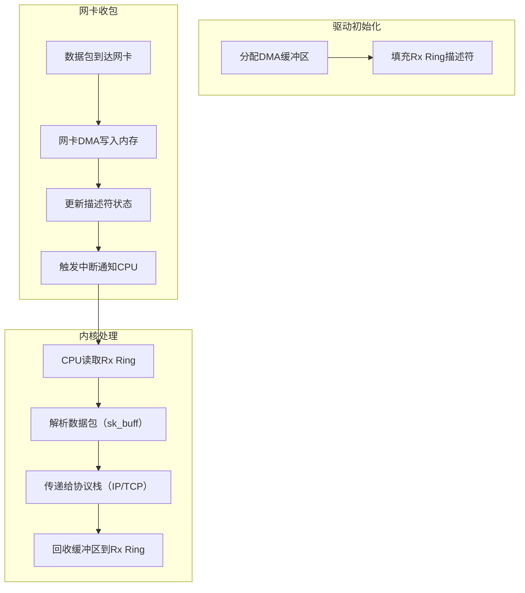

#### **关键步骤说明**

1. **驱动初始化**：  
   • 分配 DMA 缓冲区（如 `dma_alloc_coherent`），填充到 Rx Ring 描述符中。
2. **网卡收包**：  
   • 网卡通过 DMA 将数据直接写入内存，更新描述符并触发中断。
3. **内核处理**：  
   • CPU 从 Rx Ring 读取数据，交给协议栈处理，最后回收缓冲区。

---

### **2. 发包流程（Tx）**

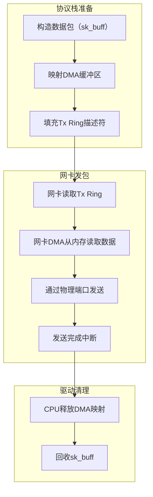

#### **关键步骤说明**

1. **协议栈准备**：  
   • 将数据包映射到 DMA 缓冲区（如 `dma_map_single`），描述符填入 Tx Ring。
2. **网卡发包**：  
   • 网卡从 Tx Ring 获取描述符，通过 DMA 读取内存数据并发送。
3. **驱动清理**：  
   • 发送完成后，CPU 释放 DMA 映射并回收资源。

---

### **3. 完整收发包交互图**

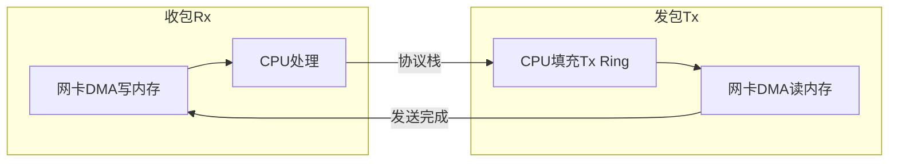

#### **核心交互**

• **绿色箭头**：数据流向（收包是网卡→内存→CPU，发包是 CPU→内存→网卡）。  
• **DMA 双向操作**：  
  • 收包：网卡 DMA **写**内存。  
  • 发包：网卡 DMA **读**内存。  

---

### **4. 关键组件关系图**

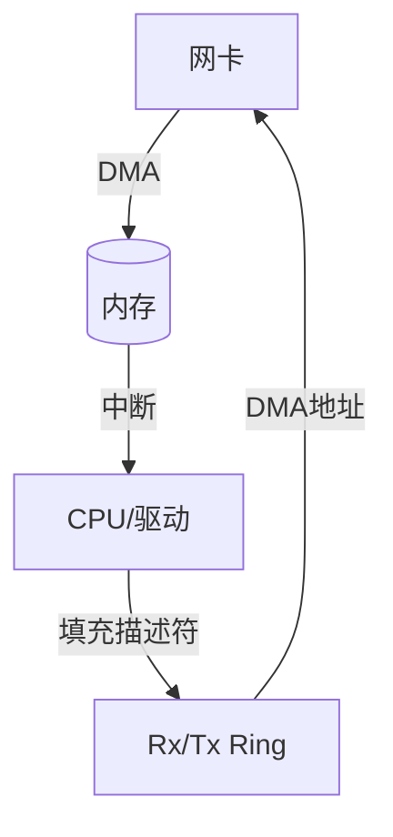

#### **组件角色**

• **网卡**：发起 DMA 读写，触发中断。  
• **内存**：存储数据包（DMA 缓冲区）。  
• **CPU/驱动**：管理描述符，处理中断。  
• **Ring**：描述符队列，协调硬件和软件。  

---

### **总结**

1. **DMA 核心作用**：  
   • 收包：网卡直接写内存，CPU 后处理。  
   • 发包：CPU 准备数据，网卡直接读内存。  
2. **性能关键**：  
   • 减少 CPU 拷贝（零拷贝）、多队列并行、中断合并。  
3. **安全依赖**：  
   • IOMMU 确保 DMA 只能访问指定内存区域。  

通过流程图可以清晰看到 **数据如何绕过 CPU 直接流动**，这是高性能网络的核心设计！

## 网卡驱动中包含dma代码？

是的，**网卡驱动中必须包含DMA相关的代码**，因为现代网卡依赖DMA（直接内存访问）来高效传输数据。以下是网卡驱动中DMA代码的核心组成部分及其作用：

---

### **1. DMA在网卡驱动中的核心作用**

• **数据缓冲区管理**：驱动需要为网卡分配DMA可访问的内存区域（用于收发包）。
• **地址映射**：将内核内存的物理地址（或IOVA）传递给网卡，使其能直接读写。
• **同步机制**：确保CPU和网卡对共享内存的访问一致性（如内存屏障、缓存刷新）。

---

### **2. 网卡驱动中的关键DMA代码**

#### **(1) DMA缓冲区分配**

```c
// 分配DMA一致性内存（收包/发包缓冲区）
dma_addr_t dma_handle;
void *buffer = dma_alloc_coherent(dev, size, &dma_handle, GFP_KERNEL);
```

• **作用**：分配一段物理连续的内存，并返回**内核虚拟地址**（`buffer`）和**设备可用的DMA地址**（`dma_handle`）。
• **IOMMU支持**：若系统启用IOMMU，`dma_handle`是IOVA（设备看到的虚拟地址），否则是物理地址。

#### **(2) 描述符队列（Ring）初始化**

```c
struct descriptor {
    dma_addr_t dma_addr;  // 缓冲区DMA地址
    u32 length;           // 数据长度
    u32 status;           // 状态（如是否已使用）
};

// 填充Rx/Tx Ring描述符
for (i = 0; i < ring_size; i++) {
    ring[i].dma_addr = dma_map_single(dev, skb->data, skb->len, DMA_FROM_DEVICE);
    ring[i].length = skb->len;
}
```

• **作用**：描述符是驱动和网卡之间的“合约”，告诉网卡从哪里读写数据。

#### **(3) DMA地址映射与解映射**

```c
// 映射数据包内存供网卡DMA访问（发包时）
dma_addr_t dma_addr = dma_map_single(dev, skb->data, skb->len, DMA_TO_DEVICE);

// 解映射（数据发送完成后）
dma_unmap_single(dev, dma_addr, skb->len, DMA_TO_DEVICE);
```

• **方向参数**：
  • `DMA_TO_DEVICE`：数据从内存到网卡（发包）。
  • `DMA_FROM_DEVICE`：数据从网卡到内存（收包）。
• **缓存一致性**：`dma_map_single`会触发缓存刷新（如ARM的`cache invalidate`）。

#### **(4) 中断处理与DMA同步**

```c
// 中断处理函数（收包完成后）
irqreturn_t irq_handler(int irq, void *dev_id) {
    // 检查Rx Ring中哪些描述符已被网卡填充
    for (i = 0; i < rx_ring_size; i++) {
        if (rx_ring[i].status == READY) {
            // 将数据传递给协议栈
            netif_receive_skb(skb);
            // 重新填充描述符（回收缓冲区）
            rx_ring[i].dma_addr = dma_map_single(...);
        }
    }
}
```

---

### **3. 典型DMA工作流程（以收包为例）**

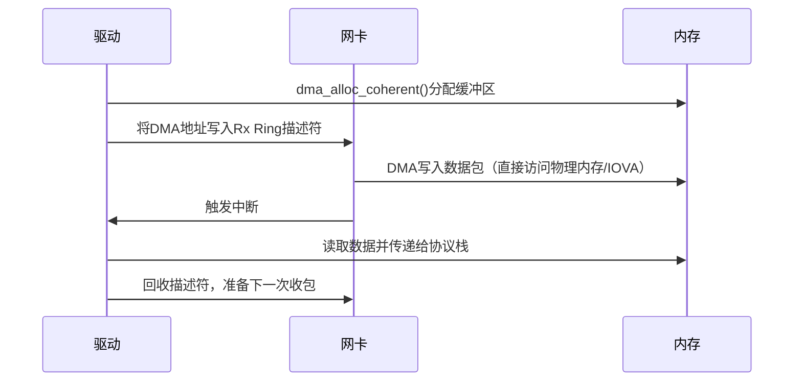

---

### **4. 不同场景的DMA代码差异**

| **场景**               | **DMA代码差异**                                                                 |
|------------------------|--------------------------------------------------------------------------------|
| **启用IOMMU**          | `dma_alloc_coherent`返回IOVA，驱动无需关心物理地址。                           |
| **禁用IOMMU**          | `dma_alloc_coherent`返回物理地址，驱动直接操作硬件寄存器。                     |
| **多队列网卡（RSS）**  | 每个队列独立分配DMA缓冲区，避免竞争。                                         |
| **零拷贝（XDP/DPDK）** | 用户态直接操作DMA缓冲区，绕过内核协议栈（需特殊内存映射）。                   |

---

### **5. 常见问题与调试**

#### **(1) DMA地址错误**

• **现象**：网卡访问错误内存导致系统崩溃。
• **调试**：

  ```bash
  # 查看DMA映射情况（Linux内核调试）
  cat /proc/iomem
  dmesg | grep -i dma
  ```

#### **(2) 性能优化**

• **预分配缓冲区**：启动时一次性分配大量DMA内存，避免运行时动态分配。
• **缓存对齐**：使用`kmalloc`时指定`GFP_DMA`标志，确保内存位于DMA可访问区域。

---

### **6. 总结**

• **网卡驱动必须实现DMA逻辑**：包括内存分配、地址映射、同步和中断处理。
• **核心API**：`dma_alloc_coherent`、`dma_map_single`、`dma_unmap_single`。
• **安全依赖**：IOMMU防止设备越界访问，但驱动仍需正确管理生命周期。

通过DMA，网卡驱动能够实现**高性能、低CPU占用**的数据传输，这是现代网络栈（如10G/100G网卡）的基础。

## dma是个独立的子系统？

在 Linux 内核中，**DMA（Direct Memory Access）并不是一个完全独立的子系统**，而是一个**跨模块的核心机制**，由多个内核组件协同实现。以下是详细分析：

---

### **1. DMA 的模块化实现**

DMA 的功能分散在内核多个子系统中，各司其职：

| **组件**               | **职责**                                                                 | **所属子系统**              |
|------------------------|--------------------------------------------------------------------------|---------------------------|
| **DMA 引擎框架**        | 提供通用 DMA 控制器驱动接口（如 PL330、Intel IOAT）                     | `drivers/dma/`            |
| **DMA 内存映射 API**    | 提供 `dma_alloc_coherent`、`dma_map_single` 等函数                      | 内核内存管理（MM）          |
| **IOMMU 子系统**        | 管理设备 DMA 地址转换（VT-d/AMD-Vi）                                    | `drivers/iommu/`          |
| **设备驱动**            | 调用 DMA API 实现具体设备的 DMA 操作（如网卡、NVMe）                    | 各设备驱动模块（如 `drivers/net/`） |
| **PCI 核心层**          | 处理 PCI 设备的 DMA 配置（如 BAR 空间、MSI-X 中断与 DMA 关联）          | `drivers/pci/`            |

---

### **2. 为什么 DMA 不是独立子系统？**

#### **(1) 功能跨越多层**

• **硬件依赖性强**：不同 DMA 控制器（如嵌入式 SoC 的 PL330 vs. 服务器的 Intel IOAT）需要不同驱动。
• **与内存管理深度耦合**：DMA 缓冲区分配依赖 `mm` 子系统（如 `GFP_DMA` 标志）。
• **设备驱动集成**：每个设备（网卡、磁盘）的 DMA 操作由各自驱动实现。

#### **(2) 无统一的“DMA 核心”**

• 内核没有类似 `kernel/dma/` 的独立目录，而是通过 **API 抽象**（如 `include/linux/dma-mapping.h`）供其他模块调用。

---

### **3. 关键 DMA 相关子系统详解**

#### **(1) DMA 引擎框架（`drivers/dma/`）**

• **作用**：为 **专用 DMA 控制器**（非设备内置 DMA）提供驱动框架。
• **示例**：

  ```c
  // 注册一个 DMA 控制器驱动（如 PL330）
  struct dma_device *dma_dev = alloc_dma_device();
  dma_async_device_register(dma_dev);
  ```

• **适用场景**：内存拷贝加速（如 `async_tx`）、音频数据传输等。

#### **(2) DMA 内存映射 API**

• **核心函数**：

  ```c
  // 分配一致性 DMA 内存
  void *dma_alloc_coherent(struct device *dev, size_t size, dma_addr_t *dma_handle, gfp_t flag);
  
  // 映射单页内存供设备 DMA
  dma_addr_t dma_map_single(struct device *dev, void *ptr, size_t size, enum dma_data_direction dir);
  ```

• **底层依赖**：
  • 若启用 IOMMU，调用 `iommu_dma_alloc()`。
  • 若无 IOMMU，直接返回物理地址。

#### **(3) IOMMU 子系统（`drivers/iommu/`）**

• **功能**：将设备 DMA 地址（IOVA）转换为物理地址（HPA），提供隔离保护。
• **与 DMA 的关系**：

  ```mermaid
  flowchart LR
    A[设备DMA请求 IOVA] --> B{是否启用IOMMU?}
    B -->|是| C[IOMMU硬件转换 HPA]
    B -->|否| D[直接使用物理地址]
  ```

#### **(4) 设备驱动中的 DMA 实现**

以网卡驱动（如 `drivers/net/ethernet/intel/igb/igb_main.c`）为例：

```c
// 初始化 Rx 环的 DMA 缓冲区
for (i = 0; i < rx_ring->count; i++) {
    rx_ring->desc[i].addr = dma_map_single(dev, skb->data, size, DMA_FROM_DEVICE);
}
```

---

### **4. DMA 工作流程示例（以网卡收包为例）**

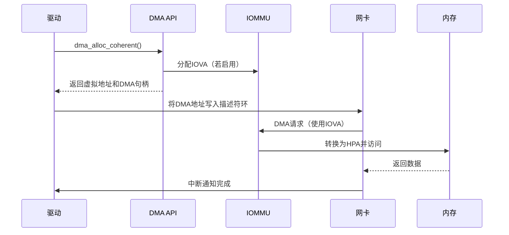

---

### **5. 调试与监控**

#### **(1) 查看 DMA 内存使用**

```bash
# 显示 DMA 内存区域
cat /proc/iomem | grep DMA

# 监控 DMA 映射泄漏（内核配置 CONFIG_DMA_API_DEBUG）
echo 1 > /sys/kernel/debug/dma-api/leak
```

#### **(2) 跟踪 IOMMU 活动**

```bash
# 启用 IOMMU 调试日志
dmesg | grep -i iommu
```

---

### **6. 总结**

• **DMA 是跨模块机制**：依赖内存管理、IOMMU、设备驱动等多个子系统协作。
• **无独立子系统**：通过 API 抽象和硬件驱动分散实现。
• **核心价值**：为设备提供高效、安全的内存直接访问能力，是高性能 I/O 的基石。

## dma本身也是个外设？

DMA（Direct Memory Access）**既可以是独立的外设，也可以是集成在其他硬件模块中的功能**，具体取决于系统设计。以下是详细分类和解释：

---

### **1. 作为独立外设的DMA控制器**

#### **(1) 典型场景**

• **嵌入式系统**（如STM32、Zynq SoC）  
  独立的DMA控制器（如ARM的PL080、PL330）作为片上外设存在，专门负责数据搬运。
• **x86平台的历史设计**  
  早期的ISA DMA控制器（如Intel 8237）用于软盘、声卡等低速设备。

#### **(2) 工作方式**

• **CPU配置DMA控制器**：  
  通过寄存器设置源地址、目标地址、传输长度等参数。
• **触发传输**：  
  外设（如UART、ADC）发出请求信号，DMA控制器接管总线，直接完成内存与外设间的数据传输。
• **中断通知**：  
  传输完成后，DMA控制器通过中断通知CPU。

#### **(3) 代码示例（Linux内核）**

```c
// 注册DMA控制器驱动（PL330示例）
struct dma_device *pl330_dev = alloc_dma_device();
dma_async_device_register(pl330_dev);

// 发起DMA传输
struct dma_async_tx_descriptor *tx = dma_dev->device_prep_dma_memcpy(
    dma_chan, dest, src, size, flags);
dmaengine_submit(tx);
dma_async_issue_pending(dma_chan);
```

---

### **2. 集成在其他硬件中的DMA引擎**

#### **(1) 现代高性能设备**

• **网卡（NIC）**、**NVMe SSD**、**GPU**等设备内置DMA引擎，无需外部DMA控制器。
• **工作流程**：  

  1. 驱动分配DMA缓冲区（如`dma_alloc_coherent`）。  
  2. 将缓冲区地址写入设备寄存器。  
  3. 设备直接通过PCIe总线发起DMA读写。

#### **(2) 优势**

• **低延迟**：省去独立DMA控制器的中间环节。  
• **高吞吐**：支持并行多队列DMA（如网卡的RSS）。  

#### **(3) 代码示例（网卡驱动）**

```c
// 网卡驱动映射DMA缓冲区
dma_addr_t dma_addr = dma_map_single(dev, skb->data, skb->len, DMA_TO_DEVICE);

// 将DMA地址写入网卡寄存器
writel(dma_addr, nic_reg_base + TX_DESC_ADDR);
```

---

### **3. DMA的硬件实现差异**

| **类型**         | **独立DMA控制器**               | **集成DMA引擎**                |
|------------------|--------------------------------|-------------------------------|
| **典型硬件**      | ARM PL330, Intel 8237          | 网卡（Intel I350）、NVMe SSD   |
| **总线占用**      | 需要接管系统总线                | 通过PCIe/NVLink等直接访问内存  |
| **灵活性**        | 可服务多个外设                 | 仅服务于所属设备               |
| **性能**          | 较低（共享带宽）               | 高（专用通道）                |

---

### **4. 操作系统视角的DMA**

#### **(1) 内核抽象**

• **DMA API统一接口**：  
  无论DMA是独立外设还是集成功能，驱动均使用相同的API（如`dma_map_single`）。
• **IOMMU介入**：  
  若系统有IOMMU，设备DMA地址会被转换为物理地址，对设备透明。

#### **(2) 设备树描述（嵌入式系统）**

```dts
// 独立DMA控制器的设备树节点（ARM PL330示例）
dma: dma@4e000000 {
    compatible = "arm,pl330";
    reg = <0x4e000000 0x1000>;
    interrupts = <0 34 4>;
    #dma-cells = <1>;
};

// 使用DMA的外设节点（如UART）
uart0: serial@49000000 {
    compatible = "ti,omap3-uart";
    dmas = <&dma 12>, <&dma 13>;  // Tx和Rx通道
    dma-names = "tx", "rx";
};
```

---

### **5. 常见问题**

#### **(1) 为什么需要独立DMA控制器？**

• **历史原因**：早期CPU性能有限，卸载数据搬运任务可提高效率。  
• **资源共享**：为多个低速外设（如UART、SPI）提供统一DMA服务。

#### **(2) 现代设备为何集成DMA？**

• **性能需求**：高速设备（如40G网卡）需要专属DMA通道避免竞争。  
• **简化设计**：减少系统总线拥塞，降低延迟。

#### **(3) 如何判断DMA是否独立？**

• **查芯片手册**：若存在独立的DMA控制器章节（如PL330），则为独立外设。  
• **看驱动代码**：独立DMA控制器通常有专属驱动（如`drivers/dma/pl330.c`）。

---

### **6. 总结**

• **DMA可以是独立外设**（如PL330），**也可以是设备内置功能**（如网卡DMA引擎）。  
• **操作系统通过统一API抽象差异**，驱动无需关心底层硬件实现。  
• **选择依赖场景**：  
  • 独立DMA：适合多外设共享的低速场景。  
  • 集成DMA：适合高性能专用设备（如NVMe、GPU）。  

通过这种分层设计，DMA在保证效率的同时，实现了硬件与软件的灵活解耦。
