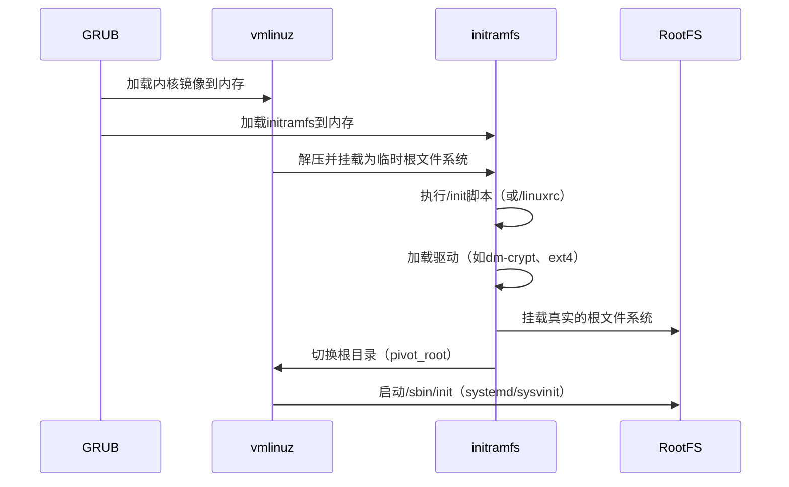
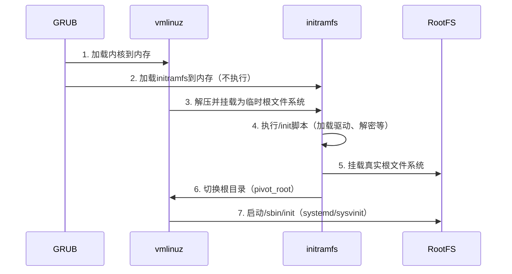
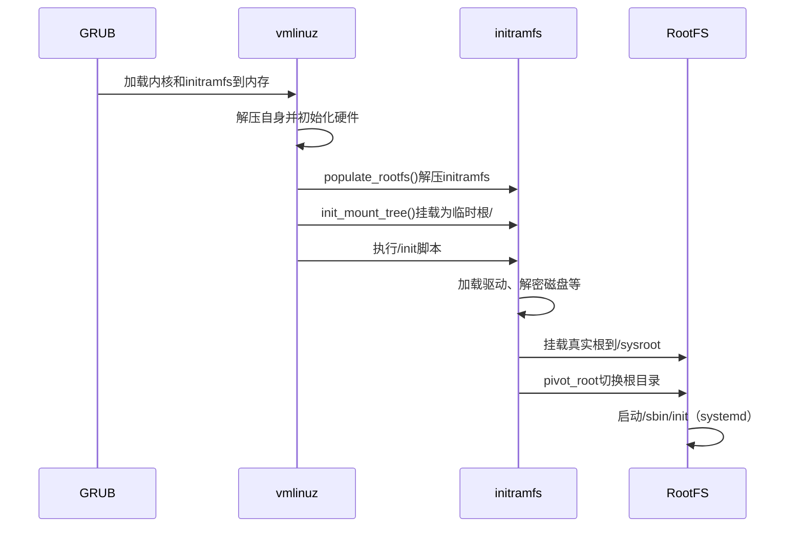
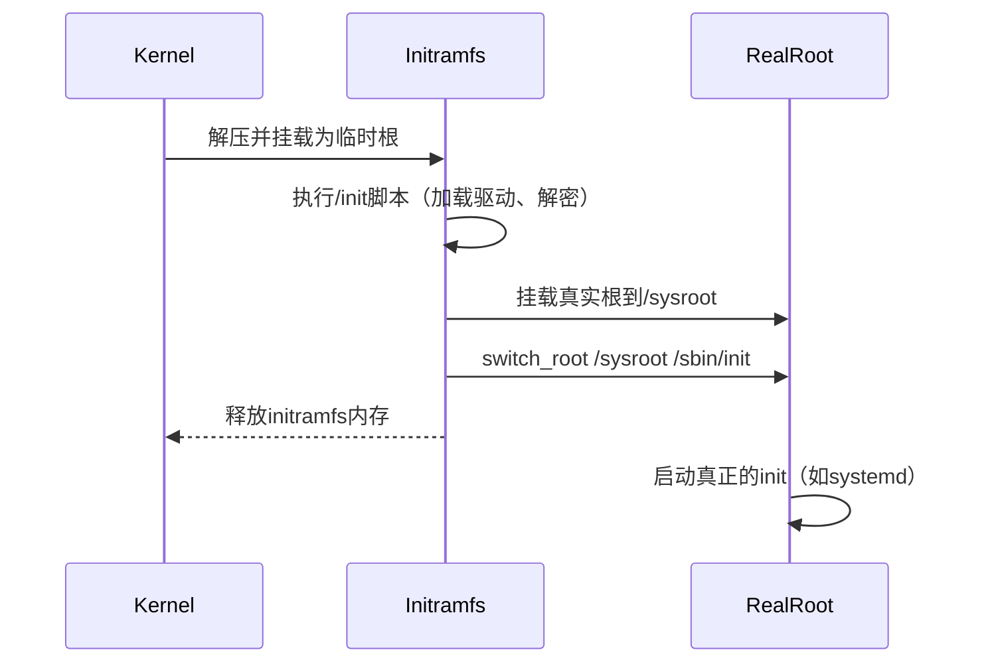
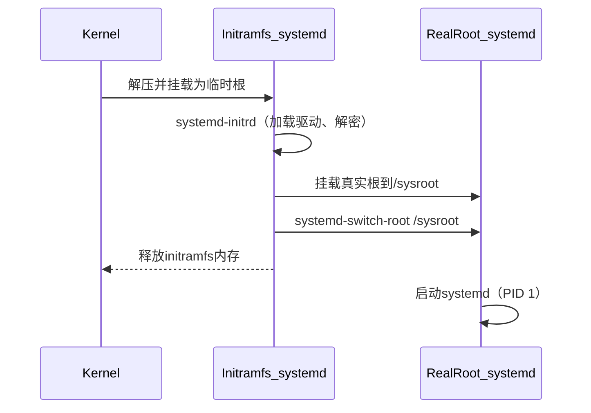

# grub中vmlinuz initramfs分析

## linux grub中vmlinuz initramfs在系统启动中的作用？

在 Linux 系统启动过程中，**vmlinuz** 和 **initramfs** 是 GRUB 加载的两个关键组件，它们分别承担内核初始化和临时根文件系统准备的任务。以下是它们的详细作用及协作流程：

---

### **1. `vmlinuz`：压缩的 Linux 内核**

#### **作用**

• **核心功能**：包含 Linux 内核的压缩镜像（通常为 `zImage` 或 `bzImage`），负责初始化硬件、加载驱动、挂载根文件系统，并最终启动用户空间的 `init` 进程。
• **关键任务**：
  • 检测和初始化 CPU、内存、存储控制器等硬件。
  • 加载必要的内核模块（如文件系统驱动、磁盘控制器驱动）。
  • 移交控制权给用户空间（通过 `initramfs` 或直接挂载根文件系统）。

#### **GRUB 中的配置**

• 在 GRUB 配置文件（如 `/boot/grub/grub.cfg`）中通过 `linux` 指令加载：

  ```grub
  menuentry 'Linux' {
      linux /boot/vmlinuz-5.15.0-86-generic root=/dev/sda2 ro quiet
  }
  ```

  • `root=` 指定根文件系统设备。
  • `ro` 表示以只读模式挂载根文件系统（后续可能切换为读写）。

---

### **2. `initramfs`：初始 RAM 文件系统**

#### **作用**

• **临时根文件系统**：是一个包含工具和内核模块的 CPIO 归档，在内存中解压成临时根目录（`/`），用于在真实根文件系统挂载前提供关键环境。
• **解决依赖问题**：
  • 加载存储设备驱动（如 NVMe、RAID、LVM 驱动）。
  • 解密加密的根文件系统（如 LUKS）。
  • 挂载复杂存储设备（如网络存储 NFS、iSCSI）。
• **灵活性与模块化**：允许内核动态加载所需模块，避免将全部驱动编译进内核。

#### **GRUB 中的配置**

• 通过 `initrd` 指令加载，与 `vmlinuz` 配合使用：

  ```grub
  menuentry 'Linux' {
      linux /boot/vmlinuz-5.15.0-86-generic root=/dev/sda2 ro quiet
      initrd /boot/initramfs-5.15.0-86-generic.img
  }
  ```

---

### **3. 启动流程详解**



#### **关键步骤**

1. **GRUB 阶段**：
   • 读取配置文件，加载 `vmlinuz` 和 `initramfs` 到内存。
2. **内核初始化**：
   • `vmlinuz` 解压并启动，但此时无法直接访问真实的根文件系统（因驱动未加载或存储未解密）。
3. **initramfs 接管**：
   • 提供临时环境，加载必要的驱动和工具（如 `cryptsetup`、`lvm2`）。
   • 挂载真实的根文件系统到 `/sysroot`。
4. **根切换**：
   • 执行 `pivot_root` 将 `/sysroot` 切换为新的根目录 `/`。
5. **用户空间启动**：
   • 内核启动 `/sbin/init`（如 systemd），进入常规系统初始化流程。

---

### **4. 为什么需要 `initramfs`？**

• **硬件多样性**：现代存储设备（如 NVMe、RAID）需要内核模块支持，但这些模块可能存储在未挂载的根文件系统中，形成“鸡生蛋”问题。
• **加密与网络根**：解密 LUKS 分区或挂载 NFS 根文件系统需要提前加载工具和配置。
• **灵活性**：允许发行版为不同硬件生成定制的 `initramfs`，而无需重新编译内核。

---

### **5. 无 `initramfs` 的极简场景**

若内核已内置所有必要驱动且根文件系统无加密/复杂配置，可直接启动：

```grub
menuentry 'Linux (No initramfs)' {
    linux /boot/vmlinuz-5.15.0-86-generic root=/dev/sda2 ro
    # 无 initrd 指令
}
```

**适用条件**：
• 根文件系统在简单设备上（如 `ext4` 格式的 SATA 磁盘）。
• 内核已编译所有必需驱动（无模块依赖）。

---

### **6. 调试与自定义**

#### **(1) 查看 initramfs 内容**

```bash
mkdir /tmp/initramfs && cd /tmp/initramfs
zcat /boot/initramfs-*.img | cpio -idmv
ls -l  # 查看解压后的脚本和模块
```

#### **(2) 重建 initramfs**

```bash
# Ubuntu/Debian
update-initramfs -u -k $(uname -r)

# RHEL/CentOS
dracut -f /boot/initramfs-$(uname -r).img $(uname -r)
```

#### **(3) 启动时进入 initramfs Shell**

在 GRUB 启动菜单中编辑内核参数，添加 `break` 或 `rd.break`：

```grub
linux /boot/vmlinuz-... root=/dev/sda2 ro rd.break
```

启动后会暂停在 initramfs 的调试 Shell，便于排查挂载问题。

---

### **7. 总结**

| **组件**    | **作用**                                                                 | **是否必需**               |
|-------------|--------------------------------------------------------------------------|---------------------------|
| `vmlinuz`   | 内核本体，初始化硬件并启动系统。                                         | 是                        |
| `initramfs` | 提供临时根文件系统，加载驱动/工具以挂载真实根文件系统。                   | 依赖硬件和根文件系统复杂度 |
| **协作关系** | `vmlinuz` 依赖 `initramfs` 解决早期启动依赖，最终移交控制权给用户空间。   |                           |

通过 `vmlinuz` 和 `initramfs` 的分工协作，Linux 系统能够灵活应对各种硬件和存储配置，确保启动过程的可靠性和可扩展性。

## 也就是一般将驱动放到initramfs中？

是的！**通常会将关键驱动（尤其是存储和文件系统相关驱动）打包到 `initramfs` 中**，以确保内核在挂载真实根文件系统前能正确识别硬件。以下是具体原因和实现方式：

---

### **1. 为什么驱动要放到 `initramfs` 中？**

#### **(1) 解决“鸡生蛋”问题**

• **场景**：根文件系统存储在需要驱动的设备上（如 NVMe、RAID、LUKS 加密分区），但这些驱动可能存放在未挂载的根文件系统中。
• **方案**：`initramfs` 提前加载驱动，打破依赖循环。

#### **(2) 模块化内核的灵活性**

• 现代 Linux 内核默认以**模块化方式**编译驱动（如 `ext4.ko`、`nvme.ko`），而非全部内置。
• `initramfs` 包含这些模块，避免内核体积膨胀。

#### **(3) 支持复杂存储配置**

• 加密（LUKS）、逻辑卷（LVM）、网络存储（NFS/iSCSI）等需要额外工具（如 `cryptsetup`、`lvm2`），这些工具依赖的驱动和库也需放入 `initramfs`。

---

### **2. 哪些驱动会被放入 `initramfs`？**

• **存储控制器驱动**：NVMe、AHCI、SCSI、RAID（`mdadm`）、USB 存储。
• **文件系统驱动**：`ext4`、`xfs`、`btrfs`、`f2fs`。
• **加密和卷管理**：`dm-crypt`（LUKS）、`dm-mod`（LVM）。
• **关键硬件驱动**：部分 GPU 驱动（如 `fbdev`）、键盘输入（用于解密密码）。

---

### **3. 驱动如何被添加到 `initramfs`？**

#### **(1) 自动生成（推荐）**

工具（如 `mkinitramfs`、`dracut`）会扫描系统配置，自动包含所需驱动和工具：

```bash
# Ubuntu/Debian
update-initramfs -u -k $(uname -r)

# RHEL/CentOS
dracut -f /boot/initramfs-$(uname -r).img $(uname -r)
```

#### **(2) 手动配置**

通过配置文件指定额外驱动或工具：
• **Debian/Ubuntu**：编辑 `/etc/initramfs-tools/modules`：

  ```plaintext
  nvme
  dm_crypt
  ext4
  ```

• **RHEL/CentOS**：编辑 `/etc/dracut.conf` 或 `/etc/dracut.conf.d/*.conf`：

  ```ini
  add_drivers+="nvme ahci"
  ```

#### **(3) 检查已包含的驱动**

解压 `initramfs` 查看内容：

```bash
mkdir /tmp/initrd && cd /tmp/initrd
zcat /boot/initramfs-$(uname -r).img | cpio -idmv
ls lib/modules/$(uname -r)/kernel/drivers/
```

---

### **4. 无 `initramfs` 的替代方案**

若所有驱动已编译进内核（非模块化），且无需复杂存储配置，可跳过 `initramfs`：

#### **(1) 内核配置**

确保驱动标记为 `[*]`（内置）而非 `[M]`（模块）：

```plaintext
Device Drivers →
  -> Storage controllers →
    -> <*> NVMe support
  -> File systems →
    -> <*> Ext4 filesystem support
```

#### **(2) GRUB 配置**

删除 `initrd` 行：

```grub
linux /boot/vmlinuz-5.15.0-86-generic root=/dev/nvme0n1p2 ro
# 无 initrd 指令
```

---

### **5. 调试驱动加载问题**

#### **(1) 查看内核消息**

```bash
dmesg | grep -E 'nvme|ahci|ext4|sd'
```

#### **(2) 启动时添加调试参数**

在 GRUB 中编辑内核参数，添加：

```plaintext
rd.debug rd.luks.debug=1
```

#### **(3) 进入救援 Shell**

若 `initramfs` 加载失败，添加 `break` 或 `rd.break` 进入调试环境：

```grub
linux /boot/vmlinuz-... root=/dev/nvme0n1p2 ro rd.break
```

---

### **6. 总结**

| **场景**               | **驱动存放位置**          | **优点**                     | **缺点**                     |
|------------------------|--------------------------|------------------------------|------------------------------|
| **常规系统**           | `initramfs`              | 灵活支持模块化驱动和复杂配置  | 增加启动时间（约1-3秒）       |
| **嵌入式/极简系统**    | 内核内置（无 `initramfs`）| 启动更快，无额外文件         | 内核体积大，硬件适应性差      |

**最佳实践**：  
• **服务器/桌面**：使用 `initramfs` 自动包含驱动。  
• **嵌入式设备**：定制内核，将关键驱动内置以节省空间。

## 那grub中到底是先执行initramfs还是先执行vmlinuz?

在系统启动过程中，**GRUB 会先加载 `vmlinuz`（内核镜像），然后加载 `initramfs`（初始内存文件系统）到内存**，但实际执行顺序是 **`vmlinuz` 先运行，随后由内核解压并执行 `initramfs` 中的初始化脚本**。以下是详细流程和关键点：

---

### **1. GRUB 的加载顺序**

#### **(1) 加载阶段**

• **第一步**：GRUB 读取配置文件（如 `/boot/grub/grub.cfg`），**先将 `vmlinuz` 加载到内存**。

  ```grub
  menuentry 'Linux' {
      linux /boot/vmlinuz-5.15.0-86-generic root=/dev/nvme0n1p2 ro quiet
      initrd /boot/initramfs-5.15.0-86-generic.img
  }
  ```

  • `linux` 指令指定内核镜像路径。
  • `initrd` 指令指定 `initramfs` 路径。
• **第二步**：GRUB **将 `initramfs` 加载到内存的指定位置**（不执行它）。

#### **(2) 移交控制权**

• GRUB 通过 **`bootmgr` 或 `multiboot` 协议** 将控制权交给 `vmlinuz`，并传递以下信息：
  • `initramfs` 在内存中的地址。
  • 内核参数（如 `root=/dev/nvme0n1p2`）。

---

### **2. 内核（`vmlinuz`）的执行流程**

#### **(1) 内核初始化**

• **硬件初始化**：CPU、内存、基本设备（如屏幕、键盘）。
• **解压自身**：`vmlinuz` 是压缩镜像，首先解压到内存中运行。

#### **(2) 处理 `initramfs`**

• **内核从 GRUB 提供的地址中读取 `initramfs`**，将其解压到临时内存文件系统（`tmpfs`）。
• **挂载为临时根文件系统**：  
  内核将 `initramfs` 挂载为 `/`，并执行其中的初始化脚本（如 `/init` 或 `/linuxrc`）。

#### **(3) 关键区别**

• **`vmlinuz` 是执行主体**：它是内核本体，负责所有硬件初始化和后续流程。
• **`initramfs` 是数据文件**：由内核主动解压并挂载，本身不会“执行”。

---

### **3. 完整启动流程**



#### **关键步骤解释**

1. **GRUB 加载**：`vmlinuz` 和 `initramfs` 被加载到内存，但只有 `vmlinuz` 被启动。
2. **内核接管**：`vmlinuz` 解压自身并初始化基础硬件。
3. **initramfs 处理**：内核解压 `initramfs` 并挂载为临时根文件系统。
4. **initramfs 脚本**：执行 `/init` 脚本，加载驱动、解密磁盘、挂载真实根文件系统。
5. **根切换**：通过 `pivot_root` 切换到真实根文件系统，最终启动用户空间的 `init` 进程。

---

### **4. 常见误区澄清**

#### **(1) 不是“先执行 initramfs”**

• `initramfs` 是数据文件，由内核主动调用，**它没有独立的执行能力**。
• 类比：`vmlinuz` 是“操作系统内核”，`initramfs` 是“启动时用的工具包”，内核需要工具包来完成初始化。

#### **(2) 为什么需要 GRUB 加载 `initramfs`？**

• 内核在启动时无法直接从磁盘读取文件（因驱动未加载），必须由引导加载程序（GRUB）提前将 `initramfs` 放入内存。

#### **(3) 无 `initramfs` 的情况**

若内核已内置所有驱动（如嵌入式系统），可直接挂载根文件系统，无需 `initramfs`：

```grub
menuentry 'Linux (No initramfs)' {
    linux /boot/vmlinuz-5.15.0-86-generic root=/dev/sda2 ro
    # 无 initrd 指令
}
```

---

### **5. 调试技巧**

#### **(1) 查看 GRUB 加载信息**

在 GRUB 菜单按 `e` 编辑条目，观察 `linux` 和 `initrd` 行：

```grub
linux /boot/vmlinuz-... root=/dev/nvme0n1p2 ro
initrd /boot/initramfs-...img
```

#### **(2) 跟踪内核启动过程**

添加内核参数 `rd.debug` 或 `initcall_debug`：

```grub
linux /boot/vmlinuz-... root=/dev/nvme0n1p2 ro rd.debug
```

#### **(3) 进入 initramfs Shell**

在 GRUB 中添加 `break` 或 `rd.break`：

```grub
linux /boot/vmlinuz-... root=/dev/nvme0n1p2 ro rd.break
```

启动后会停在 `initramfs` 的调试 Shell，可手动执行 `/init` 或检查驱动。

---

### **6. 总结**

| **阶段**       | **组件      | **动作**                                |
|----------------|------------|----------------------------------------|
| **GRUB 加载**  | `vmlinuz`  | 先加载到内存（执行主体）。               |
|                | `initramfs`| 后加载到内存（数据文件）。               |
| **内核执行**   | `vmlinuz`  | 解压自身并挂载 `initramfs` 为临时根。    |
|                | `initramfs`| 由内核调用其脚本完成早期初始化。         |

**核心原则**：  
• **`vmlinuz` 是执行者**，`initramfs` 是它使用的工具包。  
• GRUB 只是“搬运工”，负责将两者放入内存，不参与实际执行。

## vmlinuz初始化基础硬件讲一下？

在 Linux 系统启动过程中，**`vmlinuz`（压缩的内核镜像）负责初始化基础硬件**，这是内核早期启动的核心阶段。以下是详细的硬件初始化流程和关键步骤：

---

### **1. `vmlinuz` 的硬件初始化阶段**

`vmlinuz` 解压并运行后，硬件初始化分为多个层次，从 CPU 到存储设备逐步展开：

#### **(1) 解压内核镜像**

• `vmlinuz` 是经过压缩的（如 `gzip` 或 `LZ4`），首先由引导加载程序（如 GRUB）加载到内存，然后内核自解压到指定内存地址。
• **代码路径**：`arch/x86/boot/compressed/head_64.S`（x86 架构示例）。

#### **(2) 底层 CPU 和内存初始化**

• **CPU 设置**：
  • 激活保护模式（x86）或 EL2/EL3（ARM），启用虚拟内存（MMU）。
  • 检测 CPU 特性（如 SSE、AVX、多核信息）。
• **内存管理**：
  • 初始化页表（`paging_init`），建立虚拟地址映射。
  • 探测物理内存布局（通过 BIOS/UEFI 或设备树（DTB）获取）。

#### **(3) 早期控制台和调试输出**

• 初始化串口（`8250 UART`）、VGA 文本模式或 EFI 帧缓冲区，用于输出内核日志（`printk`）。
• **关键日志**：  

  ```plaintext
  [    0.000000] Linux version 5.15.0-86-generic ...
  [    0.000000] Command line: root=/dev/nvme0n1p2 ro
  [    0.000000] x86: Booting SMP configuration...
  ```

#### **(4) 设备树（DTB）/ACPI 解析**

• **ARM/嵌入式系统**：加载设备树（DTB），描述硬件拓扑（如 CPU、中断控制器、时钟）。
• **x86**：解析 ACPI 表（如 `DSDT`、`MADT`），获取 PCI、APIC 等信息。

#### **(5) 中断和时钟初始化**

• 设置中断控制器（如 APIC、GIC），初始化时钟源（如 TSC、HPET）。
• **关键函数**：

  ```c
  init_IRQ();      // 中断初始化
  time_init();     // 时钟初始化
  ```

#### **(6) 存储设备探测**

• **PCI/NVMe/SATA 控制器**：扫描 PCI 总线，初始化存储控制器。

  ```plaintext
  [    0.123456] pci 0000:00:1f.2: [8086:9d03] AHCI controller
  [    0.234567] nvme nvme0: pci function 0000:01:00.0
  ```

• **磁盘设备识别**：读取存储设备的 `Vendor/Model` 信息，但此时尚未加载文件系统驱动。

---

### **2. 为什么需要 `initramfs` 配合？**

尽管 `vmlinuz` 初始化了基础硬件，但以下任务需要 `initramfs` 辅助：

1. **加载存储驱动模块**：  
   • 内核可能以模块形式编译了 NVMe、RAID、LUKS 等驱动，这些模块存储在磁盘上的 `/lib/modules`，但磁盘尚未挂载。
   • `initramfs` 提前包含这些模块，确保内核能访问根文件系统。

2. **解密和复杂存储配置**：  
   • 加密的根文件系统（LUKS）、逻辑卷（LVM）需要用户态工具（如 `cryptsetup`、`vgchange`），这些工具依赖 `initramfs` 提供的临时环境。

3. **网络根文件系统**：  
   • 若根文件系统在 NFS/iSCSI 上，需提前加载网络驱动和配置。

---

### **3. 关键代码流程（简化版）**

```c
// arch/x86/kernel/head_64.S
start_kernel()               // 内核入口
  → setup_arch()            // 架构相关初始化（如内存、ACPI）
  → trap_init()             // 异常处理
  → init_IRQ()             // 中断控制器
  → time_init()            // 时钟
  → pci_init()             // PCI 总线扫描
  → rest_init()            // 创建第一个用户进程（init）
    → kernel_init()        // 启动用户空间
      → prepare_namespace()
        → mount_root()     // 挂载根文件系统（依赖initramfs）
```

---

### **4. 无 `initramfs` 的极简场景**

若内核已内置所有必要驱动（如嵌入式系统），`vmlinuz` 可直接挂载根文件系统：

1. **内核配置**：  

   ```plaintext
   Device Drivers →
     [*] NVMe support (编译进内核，非模块)
     File systems →
       [*] Ext4 filesystem support (内置)
   ```

2. **GRUB 配置**：  

   ```grub
   linux /boot/vmlinuz root=/dev/nvme0n1p2 ro
   # 无 initrd 指令
   ```

---

### **5. 调试硬件初始化问题**

#### **(1) 查看内核日志**

```bash
dmesg | grep -E 'Memory|PCI|AHCI|NVMe|ACPI'
```

#### **(2) 启动时观察**

在 GRUB 中移除 `quiet` 参数，显示详细启动日志：

```grub
linux /boot/vmlinuz-... root=/dev/nvme0n1p2 ro  # 删除 quiet
```

#### **(3) 使用 QEMU 调试**

```bash
qemu-system-x86_64 -kernel vmlinuz -append "console=ttyS0" -serial stdio
```

---

### **6. 总结**

| **阶段**               | `vmlinuz` 的职责                          | 依赖 `initramfs` 的场景               |
|------------------------|------------------------------------------|--------------------------------------|
| **CPU/内存**           | 激活保护模式、初始化页表                  | 无                                   |
| **控制台/中断**        | 设置串口、中断控制器                     | 无                                   |
| **存储设备探测**       | 识别 PCI/NVMe/SATA 控制器                 | 驱动以模块形式存在时需加载            |
| **根文件系统挂载**     | 调用 `mount_root()`                      | 需要解密、LVM、网络存储等复杂配置时   |

`vmlinuz` 是内核的核心，负责奠定硬件运行基础，而 `initramfs` 是其“助手”，解决模块化和复杂配置的依赖问题。两者协作确保系统从硬件初始化平滑过渡到用户空间。

## 这个流程中没有体现出将initramfs解压挂成假根啊？

```c
// arch/x86/kernel/head_64.S

start_kernel()               // 内核入口
  → setup_arch()            // 架构相关初始化（如内存、ACPI）
  → trap_init()             // 异常处理
  → init_IRQ()             // 中断控制器
  → time_init()            // 时钟
  → pci_init()             // PCI 总线扫描
  → rest_init()            // 创建第一个用户进程（init）
    → kernel_init()        // 启动用户空间
      → prepare_namespace()
        → mount_root()     // 挂载根文件系统（依赖initramfs）
```

您完全正确！之前的流程简化版本确实遗漏了 `initramfs` 解压和挂载为临时根文件系统的关键步骤。以下是 **修正后的完整流程**，明确标注了 `initramfs` 的处理位置和细节：

---

### **修正后的内核启动流程（含 `initramfs` 处理）**

```c
start_kernel()                  // 内核入口（init/main.c）
  → setup_arch()               // 架构相关初始化（内存、ACPI）
  → trap_init()                // 异常处理
  → init_IRQ()                // 中断控制器
  → time_init()               // 时钟
  → pci_init()                // PCI 总线扫描
  → vfs_caches_init()         // 虚拟文件系统缓存初始化
  → rest_init()               // 创建第一个用户进程
    → kernel_init()           // 启动用户空间
      → kernel_init_freeable()
        → do_basic_setup()    // 驱动模块初始化
          → do_initcalls()    // 调用所有 __initcall
            → populate_rootfs() // 解压 initramfs 到 rootfs
              → unpack_to_rootfs() // 实际解压到内存文件系统
        → prepare_namespace() // 准备命名空间
          → init_mount_tree() // 挂载 initramfs 为临时根
            → mount_root()    // 挂载真正的根文件系统（若需要）
          → devtmpfs_init()  // 初始化 devtmpfs
        → init_post()        // 执行用户空间 init
          → run_init_process("/init") // 执行 initramfs 的 /init 脚本
```

---

### **关键步骤详解：`initramfs` 如何成为临时根？**

#### **1. 解压 `initramfs`（`populate_rootfs`）**

• **位置**：在 `do_basic_setup()` 阶段，内核调用 `populate_rootfs()`。
• **动作**：
  • 从内存中读取 GRUB 加载的 `initramfs` 镜像（CPIO 格式）。
  • 解压到内核内部的 `rootfs`（内存文件系统）。
• **代码路径**：`init/initramfs.c`

  ```c
  static int __init populate_rootfs(void) {
      if (initrd_start) // initrd_start 是 GRUB 传递的 initramfs 内存地址
          unpack_to_rootfs((char *)initrd_start, initrd_end - initrd_start);
  }
  ```

#### **2. 挂载为临时根（`init_mount_tree`）**

• **位置**：在 `prepare_namespace()` 中调用 `init_mount_tree()`。
• **动作**：
  • 将包含 `initramfs` 内容的 `rootfs` 挂载为 `/`。
  • 创建必要的设备节点（如 `/dev/console`）。
• **效果**：

  ```plaintext
  /                ← 临时根（initramfs 内容）
  ├── bin/         ← BusyBox 工具
  ├── dev/         ← 设备节点
  ├── lib/         ← 内核模块
  └── init         ← 初始化脚本
  ```

#### **3. 执行 `/init` 脚本**

• **位置**：`run_init_process("/init")`。
• **动作**：
  • 执行 `initramfs` 中的 `/init` 脚本（通常是 BusyBox 的 shell 脚本）。
  • 脚本任务：
    ◦ 加载存储驱动（如 `modprobe nvme`）。
    ◦ 解密 LUKS 分区或激活 LVM。
    ◦ 挂载真实的根文件系统到 `/sysroot`。
    ◦ 执行 `pivot_root` 切换到真实根。

#### **4. 切换到真实根文件系统**

• **`pivot_root` 操作**：

  ```bash
  # initramfs 的 /init 脚本示例
  mount /dev/nvme0n1p2 /sysroot  # 挂载真实根
  pivot_root /sysroot /sysroot/initrd  # 切换根
  exec /sbin/init                 # 启动真正的 init（如 systemd）
  ```

---

### **对比原流程的遗漏点**

| **原流程遗漏**          | **修正后补充**                                                                 |
|-------------------------|------------------------------------------------------------------------------|
| 未体现 `initramfs` 解压 | 明确 `populate_rootfs()` 和 `unpack_to_rootfs()` 步骤。                      |
| 未展示临时根挂载        | 添加 `init_mount_tree()` 将 `rootfs` 挂载为 `/`。                            |
| 未说明 `/init` 执行     | 补充 `run_init_process("/init")` 和 `pivot_root` 流程。                      |

---

### **完整流程图**



---

### **调试技巧**

#### **1. 验证 `initramfs` 解压**

在内核启动参数添加 `rdinit=/bin/sh`，进入 `initramfs` 的 Shell：

```grub
linux /boot/vmlinuz-... root=/dev/nvme0n1p2 ro rdinit=/bin/sh
```

检查 `/` 下的内容是否为 `initramfs` 的文件。

#### **2. 查看内核日志**

```bash
dmesg | grep -E 'initramfs|pivot_root|mount'
```

输出示例：

```plaintext
[    0.345678] unpacking initramfs...
[    1.234567] Initramfs unpacking done.
[    2.123456] Trying to unpack rootfs image as initramfs...
[    3.456789] Freeing initrd memory: 32768K
[    5.678901] pivot_root: switching to /sysroot
```

#### **3. 手动解压 `initramfs`**

```bash
mkdir /tmp/initramfs && cd /tmp/initramfs
zcat /boot/initramfs-$(uname -r).img | cpio -idmv
ls -l /tmp/initramfs  # 查看解压后的文件结构
```

---

### **总结**

• **`vmlinuz` 负责解压和挂载 `initramfs`**：通过 `populate_rootfs()` 和 `init_mount_tree()` 将其设为临时根。
• **`/init` 是过渡桥梁**：由 `initramfs` 的脚本完成硬件初始化和根切换。
• **最终目标**：将控制权移交到真实根文件系统的 `init` 进程（如 systemd）。

这一流程确保了内核在无法直接访问磁盘时，仍能通过内存中的 `initramfs` 完成关键初始化！

## 那systemd为啥还要switch_root?到底是initramfs执行的switch_root还是systemd执行的？

在 Linux 系统启动过程中，**`switch_root`（或 `pivot_root`）操作是由 `initramfs` 中的初始化脚本执行的，而不是由 `systemd` 执行的**。这是为了完成从临时内存文件系统（`initramfs`）到真实根文件系统的切换。以下是详细解释：

---

### **1. 为什么需要 `switch_root`？**

• **`initramfs` 是临时根**：  
  内核启动初期会将 `initramfs` 解压到内存并挂载为 `/`，但它仅包含必要的工具和驱动（如 `cryptsetup`、`lvm2`、`modprobe`），并非完整的操作系统环境。
• **真实根文件系统需要挂载**：  
  真正的根文件系统（如 `/dev/nvme0n1p2`）可能位于加密设备、LVM 卷或网络存储上，需要 `initramfs` 先准备好这些环境才能挂载。
• **避免路径冲突**：  
  若直接挂载真实根到 `/`，会导致 `initramfs` 的文件被覆盖，引发混乱。`switch_root` 会清空临时根，确保干净切换。

---

### **2. 谁执行 `switch_root`？**

#### **(1) `initramfs` 的初始化脚本**

• 在传统的 `initramfs` 中，通常是一个简单的 Shell 脚本（如 `/init`），由 BusyBox 或类似工具解析。
• 在基于 `systemd` 的 `initramfs` 中，由 `systemd` 的 `initramfs` 版本（即 `systemd-initrd`）调用 `switch-root` 命令。
• **关键点**：  
  • **`switch_root` 是 `initramfs` 的最后一步操作**，完成后才会移交控制权给真实根文件系统的 `systemd`。
  • **`systemd`（真实根的）此时尚未启动**，因此不可能由它执行切换。

#### **(2) `systemd` 在 `initramfs` 中的角色**

• 若 `initramfs` 使用 `systemd` 作为初始化工具（如现代发行版），其流程如下：

  1. `initramfs` 中的 `systemd`（`systemd-initrd`）负责加载驱动、解密磁盘等。
  2. 挂载真实根文件系统到 `/sysroot`。
  3. 调用 `systemd-switch-root` 切换到 `/sysroot`。
  4. **退出并移交控制权**：`initramfs` 的 `systemd` 进程终止，真实根的 `systemd`（PID 1）接管。

---

### **3. 具体流程对比**

#### **(1) 传统 `initramfs`（BusyBox）**



#### **(2) 基于 `systemd` 的 `initramfs`**



---

### **4. 关键代码和命令**

#### **(1) 传统 `initramfs` 的 `/init` 脚本**

```bash
#!/bin/sh
# 加载驱动
modprobe nvme
modprobe ext4

# 解密LUKS分区
cryptsetup open /dev/nvme0n1p2 cryptroot

# 挂载真实根
mount /dev/mapper/cryptroot /sysroot

# 切换根并启动/sbin/init
exec switch_root /sysroot /sbin/init
```

#### **(2) `systemd` 的 `initramfs` 操作**

```plaintext
# 查看 initramfs 中的 systemd 日志
journalctl -b -t systemd -o short-monotonic

# 关键日志示例
[initramfs] Mounted /sysroot.
[initramfs] Switching root to /sysroot...
[systemd] Successfully switched to new root.
```

---

### **5. 常见误区澄清**

#### **(1) 不是由真实根的 `systemd` 执行切换**

• **真实根的 `systemd`（PID 1）尚未启动**，直到 `switch_root` 完成后才会运行。
• `initramfs` 的 `systemd`（若有）和真实根的 `systemd` 是**两个独立进程**。

#### **(2) `switch_root` vs `pivot_root`**

• `switch_root`：专为 initramfs 设计，会清空临时根的所有文件。
• `pivot_root`：更通用的根切换机制，需手动卸载旧根（较少在 initramfs 中使用）。

---

### **6. 调试方法**

#### **(1) 观察启动日志**

```bash
# 查看 initramfs 的 systemd 日志
journalctl -b -t systemd -o short-monotonic

# 或直接跟踪启动过程
dmesg | grep -E 'initramfs|switch_root'
```

#### **(2) 进入 initramfs Shell**

在 GRUB 启动菜单中编辑内核参数，添加 `rd.break`：

```grub
linux /boot/vmlinuz-... root=/dev/nvme0n1p2 ro rd.break
```

启动后会停在 `initramfs` 的 Shell，可手动执行 `switch_root`。

---

### **7. 总结**

| **阶段**               | 执行者                     | 操作                                                                 |
|------------------------|---------------------------|----------------------------------------------------------------------|
| **initramfs 初始化**   | `initramfs` 的 `/init` 或 `systemd-initrd` | 加载驱动、挂载真实根文件系统到 `/sysroot`。                          |
| **根切换**             | `initramfs` 的脚本或 `systemd-switch-root` | 调用 `switch_root` 切换到 `/sysroot`，移交控制权。                   |
| **真实根启动**         | 真实根的 `systemd`（PID 1） | 接管系统，继续启动用户空间服务。                                     |

**核心原则**：  
• **`switch_root` 是 `initramfs` 的“临终遗言”**，完成后 `initramfs` 及其进程（包括自身的 `systemd`）会被彻底销毁。  
• **真实根的 `systemd` 是全新的 PID 1**，它从未见过 `initramfs` 的环境。

## 那这日志前面为啥标注systemd?

```bash
rd.break=pre-mount

有的时候退出去后，还是会报错
systemd[1]: No /sbin/init, trying fallback
systemd[1]: Failed to execute /bin/sh, giving up: No such file or directory
```

您遇到的问题是 **`initramfs` 在切换根文件系统时失败**，而日志中标注 `systemd` 的原因在于：**即使系统未成功切换到真实根文件系统，`initramfs` 内部可能仍在使用 `systemd` 作为初始化工具**。以下是详细分析和解决方案：

---

### **1. 为什么日志中标注 `systemd`？**

#### **(1) `initramfs` 使用了 `systemd` 作为初始化工具**

现代发行版（如 Ubuntu 20.04+、RHEL 8+）的 `initramfs` 默认集成 **`systemd-initrd`**（`systemd` 的轻量版），用于：
• 管理 `initramfs` 中的服务（如加载驱动、解密磁盘）。
• 尝试启动真实根文件系统的 `/sbin/init`（即 `systemd`）。

#### **(2) 错误来源**

当您使用 `rd.break=pre-mount` 中断启动流程时：

1. **`initramfs` 的 `systemd`** 仍在运行（负责初始化硬件和挂载前的准备工作）。
2. 当它尝试执行 `/sbin/init` 或 `/bin/sh` 时，**真实根文件系统尚未挂载**，因此找不到这些文件。
3. 错误日志由 `initramfs` 的 `systemd`（PID 1）打印，而非真实根的 `systemd`。

---

### **2. 错误日志的完整上下文**

```plaintext
# 日志示例
systemd[1]: No /sbin/init, trying fallback       ← initramfs 的 systemd 打印
systemd[1]: Failed to execute /bin/sh, giving up: No such file or directory
```

• **`systemd[1]`**：表示这是 PID 1 的进程（即 `initramfs` 的 `systemd`）。
• **`No /sbin/init`**：`initramfs` 尝试启动真实根的 `/sbin/init`，但 `/sysroot` 未挂载，导致路径无效。
• **`/bin/sh fallback`**：`systemd` 的备用方案是启动 Shell，但 `initramfs` 中可能未包含 `/bin/sh`（或路径错误）。

---

### **3. 根本原因**

#### **(1) 真实根文件系统未挂载**

• `rd.break=pre-mount` 会在挂载真实根文件系统**前**暂停，此时：
  • `/sysroot` 目录为空或未挂载。
  • `initramfs` 的 `systemd` 无法找到真实根中的 `/sbin/init` 或 `/bin/sh`。

#### **(2) `initramfs` 的 Shell 工具缺失**

• 若 `initramfs` 未包含 `/bin/sh`（或 BusyBox 未正确链接），`systemd` 的回退操作会失败。

---

### **4. 解决方案**

#### **(1) 手动挂载真实根文件系统**

在 `rd.break=pre-mount` 暂停后，**手动完成挂载和切换**：

```bash
# 1. 检查存储设备（如 NVMe、LUKS）
lsblk
cryptsetup open /dev/nvme0n1p2 cryptroot  # 如果是加密分区

# 2. 挂载真实根文件系统
mount /dev/mapper/cryptroot /sysroot      # 或直接挂载 /dev/nvme0n1p2

# 3. 检查 /sysroot 内容
ls /sysroot/sbin/init                     # 确认 /sbin/init 存在

# 4. 切换根目录
exec switch_root /sysroot /sbin/init      # 或 /usr/lib/systemd/systemd
```

#### **(2) 修复 `initramfs`**

若 `initramfs` 缺少关键工具（如 `/bin/sh`），需重新生成：

```bash
# Ubuntu/Debian
update-initramfs -u -k $(uname -r)

# RHEL/CentOS
dracut -f /boot/initramfs-$(uname -r).img $(uname -r)
```

#### **(3) 使用更完整的调试 Shell**

在 GRUB 中改用 `rd.break`（不带 `pre-mount`），进入 `initramfs` 的完整 Shell：

```grub
linux /boot/vmlinuz-... root=/dev/nvme0n1p2 ro rd.break
```

---

### **5. 为什么 `initramfs` 的 `systemd` 会尝试启动 `/sbin/init`？**

• **设计逻辑**：  
  `initramfs` 的 `systemd` 默认假设真实根文件系统已挂载到 `/sysroot`，因此会尝试：

  1. 执行 `/sysroot/sbin/init`（真实根的 `systemd`）。
  2. 若失败，尝试 `/sysroot/bin/sh` 作为备用。
  3. 若仍失败，报错并停止（如您所见）。

• **在 `rd.break=pre-mount` 时的问题**：  
  流程被中断，`/sysroot` 未挂载，因此所有路径解析失败。

---

### **6. 总结**

| **现象**                | **原因**                                                                 | **解决方案**                          |
|-------------------------|--------------------------------------------------------------------------|---------------------------------------|
| `systemd[1]` 报错       | `initramfs` 的 `systemd` 尝试启动真实根的 `/sbin/init`，但 `/sysroot` 未挂载。 | 手动挂载 `/sysroot` 并执行 `switch_root`。 |
| 缺少 `/bin/sh`          | `initramfs` 未包含必要的 Shell 工具。                                    | 重新生成 `initramfs`。                |

**关键点**：  
• **`initramfs` 的 `systemd` ≠ 真实根的 `systemd`**，前者是过渡工具，后者是最终目标。  
• `rd.break=pre-mount` 是一个“半成品”状态，需手动干预完成挂载和切换。

## initramfs中有systemd？

是的！现代 Linux 发行版（如 **Ubuntu 20.04+、RHEL/CentOS 8+、Fedora、Arch Linux**）的 `initramfs` 中确实会包含一个轻量版的 **`systemd`**（称为 `systemd-initrd`），用于替代传统的 Shell 脚本（如 BusyBox）来管理初始化流程。以下是关键细节：

---

### **1. 为什么 `initramfs` 需要 `systemd`？**

#### **(1) 统一初始化管理**

• **传统 `initramfs`**：依赖 `/init` 脚本（通常是 BusyBox）手动加载驱动、解密磁盘等，逻辑分散且难以维护。
• **`systemd-initrd`**：用 `systemd` 的单元文件（`.service`）管理任务，提供依赖关系、并行启动和标准化日志。

#### **(2) 支持复杂功能**

• **自动解密**：通过 `systemd-cryptsetup` 服务处理 LUKS 加密。
• **网络挂载根**：通过 `systemd-networkd` 配置网络后挂载 NFS/iSCSI。
• **早期用户空间服务**：如 `systemd-udev` 处理设备检测。

#### **(3) 与主系统无缝衔接**

• 真实根文件系统的 `systemd`（PID 1）可以平滑继承 `initramfs` 中的服务状态。

---

### **2. `initramfs` 中的 `systemd` 如何工作？**

#### **(1) 文件结构**

解压 `initramfs` 后可以看到 `systemd` 相关文件：

```bash
lsinitrd /boot/initramfs-$(uname -r).img | grep -E 'systemd|init'
# 示例输出：
usr/lib/systemd/systemd          # systemd 二进制文件
usr/lib/systemd/systemd-udevd    # udev 守护进程
usr/lib/systemd/systemd-cryptsetup
etc/systemd/system/              # 单元文件目录
```

#### **(2) 启动流程**

1. **内核加载 `initramfs`**：  
   解压后执行默认入口 `/init`（通常是一个符号链接到 `/usr/lib/systemd/systemd`）。
2. **`systemd` 作为 PID 1**：  
   读取 `initramfs` 中的单元文件（如 `cryptsetup-pre.target`、`sysroot.mount`）。
3. **执行任务**：  
   • 加载驱动模块（`modprobe.service`）。
   • 解密磁盘（`systemd-cryptsetup@.service`）。
   • 挂载真实根文件系统到 `/sysroot`。
4. **切换根目录**：  
   调用 `systemd-switch-root` 切换到 `/sysroot`，启动真实根的 `systemd`。

#### **(3) 日志查看**

```bash
journalctl -b -t systemd -o short-monotonic
# 示例输出：
[initramfs] systemd[1]: Reached target Cryptography Setup.
[initramfs] systemd[1]: Mounting /sysroot...
[initramfs] systemd[1]: Successfully switched to root.
```

---

### **3. 与传统 `initramfs`（BusyBox）的对比**

| **特性**               | **传统 `initramfs`（BusyBox）**       | **`systemd-initrd`**                     |
|------------------------|--------------------------------------|------------------------------------------|
| **初始化逻辑**         | 手动脚本（`/init`）                  | 通过 `.service` 单元文件管理               |
| **驱动加载**           | `modprobe` 命令                      | `systemd-modules-load.service`           |
| **磁盘解密**           | `cryptsetup` 脚本                    | `systemd-cryptsetup@.service`            |
| **日志记录**           | 输出到控制台或临时文件                | 通过 `journald` 结构化记录                 |
| **调试便利性**         | 需手动添加 `break` 或 `rd.break`      | 支持 `systemctl` 命令和日志过滤            |

---

### **4. 如何确认 `initramfs` 使用了 `systemd`？**

#### **(1) 检查 `/init` 的链接目标**

```bash
ls -l /init
# 若输出指向 systemd：
lrwxrwxrwx 1 root root 20 Jan 1 00:00 /init -> usr/lib/systemd/systemd
```

#### **(2) 查看 `initramfs` 内容**

```bash
lsinitrd /boot/initramfs-$(uname -r).img | grep 'systemd'
# 或解压后检查：
mkdir /tmp/initrd && cd /tmp/initrd
zcat /boot/initramfs-$(uname -r).img | cpio -idmv
ls -l usr/lib/systemd/
```

#### **(3) 检查启动日志**

```bash
dmesg | grep -i 'systemd.*initramfs'
# 或：
journalctl -b -t systemd -o short-monotonic
```

---

### **5. 常见问题与解决**

#### **(1) 启动卡在 `initramfs` 的 `systemd`**

• **原因**：真实根文件系统未挂载（如驱动缺失、解密失败）。
• **解决**：
  • 在 GRUB 中添加 `rd.break` 进入紧急 Shell。
  • 手动挂载 `/sysroot` 并检查：
    ```bash
    cryptsetup open /dev/nvme0n1p2 cryptroot
    mount /dev/mapper/cryptroot /sysroot
    exit  # 继续启动
    ```

#### **(2) `systemd` 报错找不到 `/sbin/init`**

• **原因**：`/sysroot` 未挂载时，`initramfs` 的 `systemd` 尝试启动真实根的 `systemd` 失败。
• **解决**：
  • 确保真实根文件系统已挂载到 `/sysroot`。
  • 检查 `/sysroot/sbin/init` 是否存在：
    ```bash
    chroot /sysroot /bin/bash -c "ls -l /sbin/init"
    ```

#### **(3) 禁用 `initramfs` 的 `systemd`**

• **不推荐**：但可通过重建 `initramfs` 切换回 BusyBox：

  ```bash
  # Ubuntu/Debian
  echo 'FRAMEWORK=busybox' > /etc/initramfs-tools/conf.d/no-systemd
  update-initramfs -u

  # RHEL/CentOS
  dracut --no-systemd -f /boot/initramfs-$(uname -r).img $(uname -r)
  ```

---

### **6. 总结**

• **`initramfs` 中的 `systemd`** 是一个轻量级版本，用于替代传统初始化脚本，提供更强大的服务管理和日志功能。
• **核心作用**：  

  1. 加载驱动、解密磁盘、挂载真实根文件系统。  
  2. 通过 `systemd-switch-root` 切换到真实根的 `systemd`（PID 1）。  
• **调试技巧**：  
  • 使用 `journalctl` 查看 `initramfs` 日志。  
  • 通过 `rd.break` 进入紧急 Shell 手动修复。  

这种设计使得现代 Linux 系统的启动流程更加统一和可靠，尤其在处理加密、网络根等复杂场景时优势明显。

## initramfs中轻量级的systemd与真实的systemd的区别？initramfs中轻量级别的systemd是怎么被执行的？

在 Linux 系统启动过程中，`initramfs` 中的轻量级 `systemd`（称为 `systemd-initrd`）与真实根文件系统中的完整 `systemd`（PID 1）有显著区别。以下是它们的核心差异和执行机制的详细分析：

---

### **一、轻量级 `systemd-initrd` vs 完整 `systemd`**

| **特性**                | **`initramfs` 中的 `systemd-initrd`**                     | **真实根文件系统的 `systemd` (PID 1)**          |
|-------------------------|----------------------------------------------------------|-----------------------------------------------|
| **二进制文件**          | 精简版，仅包含必要功能（如 `cryptsetup`、`mount`）         | 完整功能，支持所有系统服务管理（如 `networkd`、`logind`） |
| **服务单元**            | 仅加载关键服务（如 `dracut-cmdline`、`sysroot.mount`）     | 加载所有用户和系统服务（如 `sshd`、`getty`）   |
| **目标（target）**       | 主要使用 `initrd.target` 和 `initrd-switch-root.target`   | 使用标准目标（如 `multi-user.target`、`graphical.target`） |
| **日志系统**            | 日志输出到内存或控制台（无持久化）                        | 通过 `journald` 持久化存储日志                 |
| **设备管理**            | 依赖 `systemd-udevd` 的轻量级版本                         | 完整版 `udev` 规则和设备管理                   |
| **依赖关系**            | 仅处理与启动相关的依赖（如 `cryptsetup-pre.target`）       | 处理所有服务的复杂依赖关系                     |
| **运行环境**            | 运行在 `initramfs` 的临时根文件系统中                     | 运行在真实的根文件系统上                       |
| **退出方式**            | 通过 `systemd-switch-root` 切换到真实根后自我终止         | 持续运行，作为系统的初始化进程（PID 1）         |

---

### **二、`initramfs` 中轻量级 `systemd` 的执行流程**

#### **1. 内核加载 `initramfs`**

• **GRUB 配置**：  
  GRUB 通过 `initrd` 指令将 `initramfs` 镜像加载到内存，并传递给内核：

  ```grub
  linux /boot/vmlinuz-5.15.0-86-generic root=/dev/nvme0n1p2 ro
  initrd /boot/initramfs-5.15.0-86-generic.img
  ```

• **内核解压**：  
  内核解压 `initramfs` 到内存中的 `tmpfs`，并挂载为临时根文件系统（`/`）。

#### **2. 启动轻量级 `systemd`**

• **入口点**：  
  `initramfs` 的 `/init` 通常是一个符号链接，指向 `/usr/lib/systemd/systemd`：

  ```bash
  ls -l /init
  # 输出示例：
  lrwxrwxrwx 1 root root 20 Jan 1 00:00 /init -> usr/lib/systemd/systemd
  ```

• **执行流程**：  

  1. 内核调用 `/init`，启动 `systemd-initrd` 作为第一个用户空间进程（PID 1）。  
  2. `systemd-initrd` 读取 `initramfs` 中的单元文件（位于 `/etc/systemd/system/` 或 `/usr/lib/systemd/system/`）。  
  3. 依次执行关键任务：  
     ◦ 加载内核模块（`modprobe.service`）。  
     ◦ 解密磁盘（`systemd-cryptsetup@.service`）。  
     ◦ 挂载真实根文件系统到 `/sysroot`（`sysroot.mount`）。  
     ◦ 准备设备节点（`initrd-udevadm-cleanup-db.service`）。  

#### **3. 切换到真实根文件系统**

• **`systemd-switch-root`**：  
  轻量级 `systemd` 最终调用以下命令完成切换：

  ```bash
  exec /usr/lib/systemd/systemd-switch-root /sysroot /sbin/init
  ```

  • **操作细节**：  
    1. 卸载 `initramfs` 的所有文件系统。  
    2. 将 `/sysroot` 挂载为新的根目录 `/`。  
    3. 执行真实根文件系统的 `/sbin/init`（即完整版 `systemd`）。  
  • **自我终止**：  
    `systemd-initrd` 进程退出，由真实根的 `systemd` 接管 PID 1。

---

### **三、关键代码与调试技巧**

#### **1. 查看 `initramfs` 中的 `systemd` 单元**

```bash
# 解压 initramfs 并检查单元文件
lsinitrd /boot/initramfs-$(uname -r).img | grep -A 10 "systemd/system"
# 或手动解压：
mkdir /tmp/initrd && cd /tmp/initrd
zcat /boot/initramfs-$(uname -r).img | cpio -idmv
ls -l usr/lib/systemd/system/*.target
```

#### **2. 调试 `systemd-initrd` 启动过程**

• **方法 1：添加调试参数**  
  在 GRUB 中编辑内核命令行，添加 `systemd.log_level=debug`：

  ```grub
  linux /boot/vmlinuz-... root=/dev/nvme0n1p2 ro systemd.log_level=debug
  ```

• **方法 2：进入 Shell**  
  使用 `rd.break` 暂停启动流程：

  ```grub
  linux /boot/vmlinuz-... root=/dev/nvme0n1p2 ro rd.break
  ```

  进入 Shell 后手动执行：

  ```bash
  # 查看 systemd 运行状态
  systemctl --no-pager list-units
  # 尝试挂载真实根
  mount /dev/nvme0n1p2 /sysroot
  exit  # 继续启动
  ```

#### **3. 日志分析**

```bash
# 查看 initramfs 阶段的 systemd 日志
journalctl -b -t systemd -o short-monotonic
# 过滤关键事件：
journalctl -b | grep -E 'systemd.*(Mounting|Reached|Starting)'
```

---

### **四、常见问题解答**

#### **Q1: 为什么 `initramfs` 不直接使用完整版 `systemd`？**

• **资源限制**：`initramfs` 需尽量小巧（通常几 MB 到几十 MB），完整 `systemd` 包含大量非必要功能（如用户会话管理）。  
• **单一职责**：`systemd-initrd` 仅需完成硬件初始化和根切换，无需管理长期运行的服务。

#### **Q2: 如何自定义 `initramfs` 中的 `systemd` 服务？**

• **添加自定义单元**：  
  在 `/etc/dracut.conf.d/` 或 `/usr/lib/dracut/modules.d/` 中定义新服务，然后重建 `initramfs`：

  ```bash
  # RHEL/CentOS
  dracut -f
  # Ubuntu/Debian
  update-initramfs -u
  ```

#### **Q3: 轻量级 `systemd` 失败后会怎样？**

• **Fallback 机制**：  
  若 `systemd-switch-root` 失败，会尝试启动 `emergency shell`（若编译时启用了该选项）。  
• **错误日志**：  
  通过 `journalctl` 或控制台输出查看具体原因（如磁盘未解密、`/sysroot` 未挂载）。

---

### **五、总结**

• **轻量级 `systemd-initrd`** 是 `initramfs` 的“临时管理员”，专为启动初期设计，功能精简且目标明确。  
• **执行流程**：由内核调用 `/init` → 加载关键服务 → 挂载真实根 → 通过 `systemd-switch-root` 自我替换为完整 `systemd`。  
• **调试核心**：通过 `rd.break` 和 `journalctl` 观察初始化过程，重点关注服务依赖和根文件系统挂载步骤。  

这种设计既保证了启动流程的标准化，又兼顾了灵活性和性能，是现代 Linux 系统可靠启动的关键架构！

## 两个systemd共用一份systemd代码？

在 Linux 系统中，**`initramfs` 中的轻量级 `systemd`（`systemd-initrd`）和真实根文件系统中的完整 `systemd`（PID 1）共享同一份源代码**，但在编译和运行时会有显著差异。以下是具体分析：

---

### **1. 代码共享：同一代码库，不同编译配置**

#### **(1) 源代码相同**

• **代码来源**：两者均来自 [systemd 官方代码库](https://github.com/systemd/systemd)，共用相同的核心模块（如 `systemd.c`、`unit.c`）。
• **关键区别**：通过编译时的配置选项（`meson` 参数）和运行时环境，决定其功能范围和行为。

#### **(2) 编译差异**

| **编译选项**               | **`systemd-initrd`（initramfs）**       | **完整 `systemd`（PID 1）**             |
|----------------------------|----------------------------------------|----------------------------------------|
| **`-Dinitrd=true`**        | 启用，仅编译初始化必需的模块            | 禁用，编译全部功能模块                 |
| **`-Dstandalone-binaries=true`** | 生成独立二进制文件（如 `systemd-udevd`） | 生成完整集成二进制文件                 |
| **`-Ddefault-hierarchy=unified`** | 可能禁用 cgroups v2 的复杂功能         | 完全支持 cgroups v2                     |
| **依赖库**                 | 仅链接最小依赖（如 `libc`、`libcrypt`） | 链接所有依赖（如 `libselinux`、`dbus`） |

#### **(3) 二进制文件对比**

```bash
# 查看 initramfs 中的 systemd 大小（精简版）
ls -lh /usr/lib/systemd/systemd
# 对比真实根的 systemd（完整版）
ls -lh /lib/systemd/systemd
```

• **`systemd-initrd`**：通常更小（几百 KB 到 1 MB），仅包含必要功能。
• **完整 `systemd`**：更大（几 MB），包含所有功能模块。

---

### **2. 运行时差异：功能与行为**

#### **(1) 功能裁剪**

• **`systemd-initrd`** 会动态禁用非必要功能：

  ```c
  // systemd 源代码中检查是否运行在 initramfs
  if (in_initrd()) {
      disable_non_essential_features();
  }
  ```

  • 例如：跳过 `user sessions`、`dbus`、`socket activation`。

#### **(2) 单元文件加载**

• **`systemd-initrd`** 仅加载 `initramfs` 中的单元文件：

  ```plaintext
  /etc/systemd/system/initrd.target.wants/
  └── sysroot.mount          # 挂载真实根文件系统
  └── cryptsetup.target      # 解密磁盘
  ```

• **完整 `systemd`** 加载 `/etc/systemd/system/` 和 `/usr/lib/systemd/system/` 下的所有单元。

#### **(3) 日志与调试**

• **`systemd-initrd`**：日志默认输出到控制台或内存缓冲区（无持久化）。
• **完整 `systemd`**：通过 `journald` 持久化存储日志。

---

### **3. 执行流程：如何从 `systemd-initrd` 切换到完整 `systemd`？**

#### **(1) 内核启动 `initramfs`**

1. GRUB 加载 `vmlinuz` 和 `initramfs` 到内存。
2. 内核解压 `initramfs`，执行 `/init`（符号链接到 `/usr/lib/systemd/systemd`）。

#### **(2) `systemd-initrd` 初始化**

• 运行 `initrd.target` 目标，依次执行：

  ```plaintext
  systemd-modules-load.service → 加载内核模块
  systemd-cryptsetup@.service → 解密磁盘
  sysroot.mount → 挂载真实根到 /sysroot
  ```

#### **(3) 切换根文件系统**

调用 `systemd-switch-root` 完成以下操作：

1. 卸载 `initramfs` 的所有文件系统。
2. 将 `/sysroot` 挂载为新的 `/`。
3. 执行 `/sbin/init`（指向完整 `systemd`），自身退出。

```c
// systemd-switch-root 的核心逻辑（简化）
execve("/sbin/init", argv, envp);  // 替换为完整 systemd
```

---

### **4. 验证共享代码的实践方法**

#### **(1) 检查二进制文件符号**

```bash
# 对比两个 systemd 的编译选项
strings /usr/lib/systemd/systemd | grep "INITRD"
strings /lib/systemd/systemd | grep "FEATURES"
```

• `initramfs` 的 `systemd` 会包含 `INITRD_COMPAT` 等标志。

#### **(2) 查看版本信息**

```bash
/usr/lib/systemd/systemd --version
/lib/systemd/systemd --version
```

• 两者版本号应完全一致（如 `systemd 252`），但功能列表不同。

#### **(3) 调试编译过程**

若自行编译 systemd，可通过 `meson` 参数控制：

```bash
# 编译 initramfs 专用版本
meson setup build-initrd -Dinitrd=true -Dstandalone-binaries=true
ninja -C build-initrd

# 编译完整版本
meson setup build-full -Dinitrd=false
ninja -C build-full
```

---

### **5. 常见问题解答**

#### **Q1: 为什么 `initramfs` 不直接使用完整 `systemd`？**

• **空间限制**：`initramfs` 需尽量小巧（通常几 MB），完整 `systemd` 可能占用数十 MB。
• **安全性**：减少攻击面，避免在早期启动时加载非必要功能。

#### **Q2: 能否修改 `initramfs` 中的 `systemd` 行为？**

• **是**：通过覆盖 `initramfs` 中的单元文件（如 `/etc/systemd/system/initrd.target.wants/`），然后重建 `initramfs`：

  ```bash
  # Ubuntu/Debian
  update-initramfs -u
  # RHEL/CentOS
  dracut -f
  ```

#### **Q3: 如果 `systemd` 代码更新，是否需要同步两者？**

• **是**：需重新编译并更新 `initramfs` 和真实根的 `systemd` 二进制文件，保持版本一致。

---

### **6. 总结**

| **维度**       | **`systemd-initrd`（initramfs）**       | **完整 `systemd`（PID 1）**          |
|----------------|----------------------------------------|--------------------------------------|
| **代码来源**   | 同一份源代码，编译时启用 `-Dinitrd=true` | 同一份源代码，默认编译               |
| **功能范围**   | 仅保留硬件初始化和根切换功能            | 支持全部系统管理功能                 |
| **二进制大小** | 精简（几百 KB）                        | 完整（几 MB）                        |
| **运行时行为** | 临时进程，退出后由完整 `systemd` 接管  | 持久运行，作为系统的初始化进程（PID 1） |

通过代码复用和编译优化，Linux 既保持了 `systemd` 的统一架构，又满足了启动阶段对轻量化和高效性的需求。

