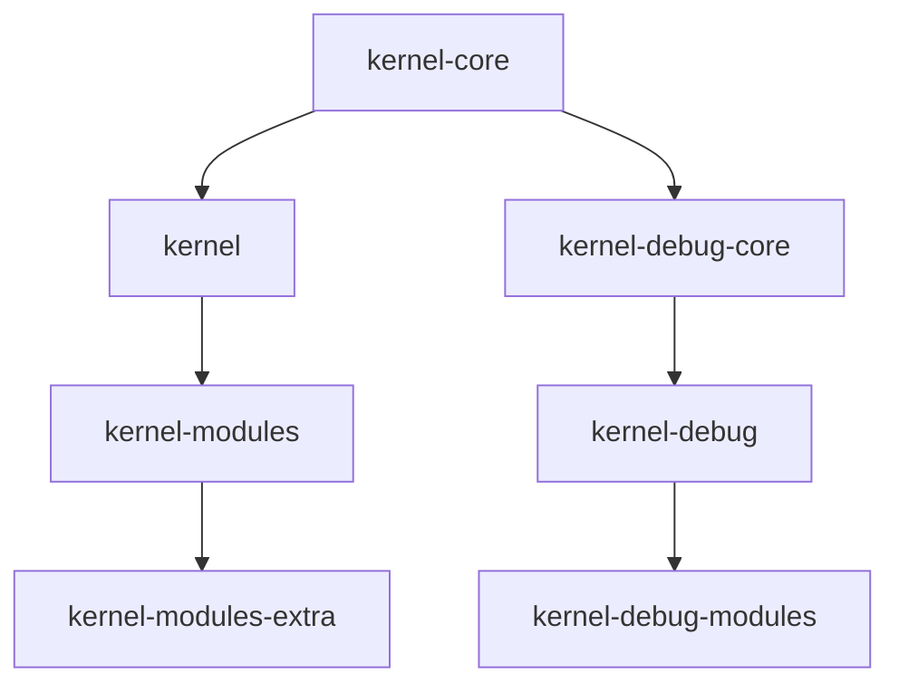

# 包管理

## apt dpkg yum rpm brew

- [<font color=Red>五种常见 Linux 系统安装包管理工具中文使用指南</font>](https://mp.weixin.qq.com/s/4XXl-dcbH0eUqYcHwZYKxg)
- [Linux基础-包管理工具yum和apt对比](https://mp.weixin.qq.com/s/c826iDRMNx2XLuT7qMKpyA)
- [Linux 包管理基础：apt、yum、dnf 和 pkg](https://linux.cn/article-8782-1.html)

## debian

- [第 2 章 Debian 软件包管理](https://www.debian.org/doc/manuals/debian-reference/ch02.zh-cn.html#_basic_package_management_operations_with_the_commandline)
- [安装debian 9.1后，中文环境下将home目录下文件夹改为对应的英文](https://www.cnblogs.com/samgg/p/7501199.html)

    ```bash
    #安装需要的软件
    sudo apt install xdg-user-dirs-gtk

    #临时转换系统语言为英文，重启后会自动恢复原值的
    export LANG=en_US

    #执行转换命令，弹出的窗口中会询问是否将目录转化为英文路径，同意并关闭
    xdg-user-dirs-gtk-update
    
    #转换回系统语言为中文，也可以不执行下面的命令，直接重启也一样的
    export LANG=zh_CN
    ```

### iso

- [Debian images: installer images, live images, cloud images](https://get.debian.org/images/)
- [Debian CDs/DVDs archive](https://cloud.debian.org/cdimage/archive/)

### deb仓库源

- [<font color=Red>GNU/Linux 更换系统软件源脚本及 Docker 安装脚本</font>](https://github.com/SuperManito/LinuxMirrors)
  - [使用方法](https://linuxmirrors.cn/use/)

    ```bash
    bash <(curl -sSL https://linuxmirrors.cn/main.sh)
    ```

- [<font color=Red>中国科学技术大学开源软件镜像</font>](http://mirrors.ustc.edu.cn/)
- [USTC Mirror Help—USTC Mirror Help文档](http://mirrors.ustc.edu.cn/help/)

    debian10 中科大源：

    ```text
    deb https://mirrors.ustc.edu.cn/debian/ buster main contrib non-free
    deb-src https://mirrors.ustc.edu.cn/debian/ buster main contrib non-free

    deb https://mirrors.ustc.edu.cn/debian/ buster-updates main contrib non-free
    deb-src https://mirrors.ustc.edu.cn/debian/ buster-updates main contrib non-free

    deb https://mirrors.ustc.edu.cn/debian/ buster-backports main contrib non-free
    deb-src https://mirrors.ustc.edu.cn/debian/ buster-backports main contrib non-free

    deb https://mirrors.ustc.edu.cn/debian-security/ buster/updates main contrib non-free
    deb-src https://mirrors.ustc.edu.cn/debian-security/ buster/updates main contrib non-free
    ```

- [阿里云官方镜像站](https://developer.aliyun.com/mirror/?spm=a2c6h.12873639.J_5404914170.29.2feb6235F6x30d)
- [Debian 镜像使用帮助-清华大学开源软件镜像站](https://mirrors.tuna.tsinghua.edu.cn/help/debian/)

- [<font color=Red>Debian 全球镜像站</font>](https://www.debian.org/mirror/list)
- [netselect-apt 用于选择快速 Debian 镜像的速度测试器](https://packages.debian.org/bullseye/netselect-apt)

#### Debian 搜索软件包

- [<font color=Red>Debian 搜索软件包</font>](https://packages.debian.org/zh-cn/)

#### sources.list

- [/etc/apt/sources.list 和 /etc/apt/sources.list.d](https://www.cnblogs.com/kelamoyujuzhen/p/9728260.html)
- [修复 Ubuntu 中的 “Key is stored in legacy trusted.gpg keyring” 问题 | Linux 中国](https://zhuanlan.zhihu.com/p/608493042)

##### 固件源

- [软件包：firmware-iwlwifi（20210315-3） [non-free]](https://packages.debian.org/bullseye/firmware-iwlwifi)
- [How to Install the Latest AMD Drivers on Debian 10 Buster](https://linuxconfig.org/how-to-install-the-latest-amd-drivers-on-debian-10-buster)

##### ubuntu mainline

- [Ubuntu - Kernel Team Server](https://kernel.ubuntu.com/mainline/)

### dpkg

- [dpkg常用命令总结](https://www.toutiao.com/article/7209575948562334247)
- [Ubuntu系统下deb包的解压、打包、安装、卸载及常用命令](https://blog.csdn.net/linuxvfast/article/details/117701825)
- [<font color=Red>Debian软件包常用管理命令整理</font>](https://cloud.tencent.com/developer/article/1579495)
- [Linux apt命令](https://www.runoob.com/linux/linux-comm-apt.html)
- [<font color=Red>apt dpkg常用命令汇总</font>](https://blog.csdn.net/weixin_44596606/article/details/87654398)

- [Linux软件安装管理之——dpkg与apt-*详解](https://www.jianshu.com/p/6432015c52a6)

### apt

- [列出ubuntu软件管理工具apt的一些用法(自由总结)](https://blog.csdn.net/weixin_51867896/article/details/121883910)

#### 卸载

- [Ubuntu apt-get彻底卸载软件包_刘康的专栏-CSDN博客_apt 卸载](https://blog.csdn.net/get_set/article/details/51276609)
- [apt remove和apt purge:有什么区别？](https://www.toutiao.com/article/7190217952308757053/)

#### 升级

- [apt update，apt upgrade和apt dist-upgrade的区别](https://www.cnblogs.com/thespace/p/12445252.html)
- [sudo apt full-upgrade（也可以用 sudo apt dist-upgrade ，据我所知，它们效果是一样的）](https://www.learndiary.com/2021/04/debian-deepin-upgrade/)
- [What is "dist-upgrade" and why does it upgrade more than "upgrade"?](https://askubuntu.com/questions/81585/what-is-dist-upgrade-and-why-does-it-upgrade-more-than-upgrade)

#### 查找

- [<font color=Red>apt-cache madison与apt-cache search</font>](https://blog.csdn.net/rookie_wei/article/details/122409853)
- [apt-cache (搜索软件包和软件包名称)](https://www.uc23.net/command/256.html)
- [Ubuntu通过apt-get安装指定版本和查询指定软件有多少个版本](https://www.cnblogs.com/EasonJim/p/7144017.html)

##### apt-file

- [Ubuntu使用apt-file解决库或者文件缺失依赖](https://www.jianshu.com/p/9fd19418cf83)

#### 解压

将名为 lshw_02.18.85-0.1_arm64.deb 的 .deb 文件解压到名为 lshw 的目录中，并且保留其中的目录结构:

```bash
dpkg-deb -R lshw_02.18.85-0.1_arm64.deb lshw
```

具体来说，它会将 lshw_02.18.85-0.1_arm64.deb 文件中的所有内容解压到 lshw 目录中，包括 DEBIAN 目录（其中包含软件包的控制信息）以及其他可能的目录和文件。解压后的目录结构将与原始 .deb 文件中的结构完全相同。

#### 依赖

- [如何在基于 Ubuntu 或 Debian 的 Linux 发行版中查看一个软件包的依赖](https://linux.cn/article-12987-1.html)

#### apt_pkg

- [ubuntu No module named 'apt_pkg' - 简书 (jianshu.com)](https://www.jianshu.com/p/a205f7a44b45)
- [Ubuntu Error: No module named 'apt_pkg' 怎么办？ - ￣□￣ - 博客园 (cnblogs.com)](https://www.cnblogs.com/presleyren/p/11011129.html)

### deb打包

- [源码打包为deb](https://docs.deepin.org/info/%E5%BC%80%E5%8F%91%E8%BF%9B%E9%98%B6/%E9%80%82%E9%85%8D%E8%AE%A4%E8%AF%81/%E8%AE%A4%E8%AF%81%E6%8A%80%E6%9C%AF%E9%97%AE%E9%A2%98/%E8%AE%A4%E8%AF%81%E6%8A%80%E6%9C%AF%E9%97%AE%E9%A2%98/%E6%BA%90%E7%A0%81%E6%89%93%E5%8C%85%E4%B8%BAdeb)
- [Debian 维护者指南](https://www.debian.org/doc/manuals/debmake-doc/)
- [deb编包笔记](https://blog.csdn.net/weixin_39759247/article/details/125923234)
- [deb包制作中control文件说明](https://blog.csdn.net/dztaopao/article/details/9239399)
- [deb包安装/卸载/升级时，preinst, postinst, prerm, postrm的执行顺序](https://blog.csdn.net/yingyingququ/article/details/108848019)
- [干货分享 - Debian包的潜规则（脚本篇）](https://www.ubuntukylin.com/news/1713-cn.html)
- [<font color=Red>pbuilder教程</font>](https://github.com/realwujing/linux-learning/blob/master/deb/pbuilder%E6%95%99%E7%A8%8B.md)
- [<font color=Red>pbuilder编译构建工具分析</font>](https://codeantenna.com/a/ZW9Zd5bFYi)
- [pbuilder编译构建工具分析](https://www.cnblogs.com/zszmhd/p/3628446.html)
- [debian pbuilder使用](https://www.aftermath.cn//2022/03/06/debian-pbuilder/)

    ```bash
    dh_make --createorig -sy
    dpkg-source -b .
    sudo pbuilder --build  --logfile log.txt --basetgz /var/cache/pbuilder/base.tgz --allow-untrusted --hookdir /var/cache/pbuilder/hooks   --debbuildopts -sa --use-network yes --aptcache "" --buildresult . *.dsc
    ```

#### rules

- [debian/rules build 运行了 dh build](https://www.debian.org/doc/manuals/maint-guide/dreq.zh-cn.html)

#### 已有debian目录的源码打包为deb

以 plymouth 为例，先下载plymouth源码：

```bash
apt source plymouth
```

进入 plymouth 源码目录：

```bash
cd plymouth-0.9.4.2
```

打包：

```bash
dpkg-buildpackage -b -nc -uc -us -j16
```

这是一个用于构建 Debian 软件包的命令，具体参数含义如下：

- -b：构建软件包。
- -nc：不清理（不执行 clean 操作），即不删除之前的构建临时文件。
- -uc：不对软件包的源代码进行签名。
- -us：不对软件包的修改进行签名。
- -j16：并行编译的线程数，这里是指定使用 16 个线程来加速编译过程。

综合起来，该命令的作用是使用当前目录下的源代码构建 Debian 软件包，不清理之前的构建临时文件，不对软件包进行签名，并且使用 16 个线程并行编译以加快构建过程。

#### 二进制软件包打包为deb

- [二进制软件包打包为deb](https://docs.deepin.org/info/%E5%BC%80%E5%8F%91%E8%BF%9B%E9%98%B6/%E9%80%82%E9%85%8D%E8%AE%A4%E8%AF%81/%E8%AE%A4%E8%AF%81%E6%8A%80%E6%9C%AF%E9%97%AE%E9%A2%98/%E8%AE%A4%E8%AF%81%E6%8A%80%E6%9C%AF%E9%97%AE%E9%A2%98/%E4%BA%8C%E8%BF%9B%E5%88%B6%E8%BD%AF%E4%BB%B6%E5%8C%85%E6%89%93%E5%8C%85%E4%B8%BAdeb)

#### desktop 文件

- [为你的 Linux 应用创建 .desktop 文件](https://linux.cn/article-9199-1.html)
- [Linux下 创建启动器（.Desktop文件)](https://blog.csdn.net/hebbely/article/details/102459754)

### apt 代理

- [如何为 APT 命令设置代理 | Linux 中国](https://zhuanlan.zhihu.com/p/629584549)

    ```bash
    sudo -s
    cat << EOF > /etc/apt/apt.conf.d/proxy.conf
    Acquire::http::Proxy "http://127.0.0.1:7890";
    Acquire::https::Proxy "http://127.0.0.1:7890";
    EOF
    ```

### GPG error

- [Linux（测试版）刷新软件包列表遇到 GPG 错误的解决方法](https://faq.fydeos.com/recipes/solve-apt-get-gpg-error/)
- [debian更新清华源 GPG 错误：由于没有公钥，无法验证下列签名](http://www.cppblog.com/zhangyq/archive/2021/03/13/217627.html)
- [UBUNTU配置APT国内源](https://www.freesion.com/article/4440566650/)
- [apt-get软件包管理命令 和 apt-key命令](https://www.cnblogs.com/saysmy/p/10390277.html)

- [<font color=Red>查看Deepin版本与Debian版本</font>](https://blog.csdn.net/e891377/article/details/108032882)
- [dpkg-deb (子进程)：解压缩归档成员：lzma 错误：压缩数据已损坏](https://blog.csdn.net/longma666666/article/details/81701802)

### 构建iso镜像

- [https://github.com/realwujing/isobuilder](https://github.com/realwujing/isobuilder)

## centos

- [<font color=Red>Red Hat Enterprise Linux 发行日期</font>](https://access.redhat.com/zh_CN/articles/7058375)
- [CentOS8的DNF软件管理包教程：dnf如何安装/更新/删除软件包和软件包组](https://www.iplayio.cn/post/33066)
- [Centos 8 使用 yum 报错 Error: Cannot prepare internal mirrorlist: No URLs in mirrorlist](https://blog.csdn.net/peng2hui1314/article/details/123930942)
- [<font color=Red>CentOS Linux 8 - AppStream 错误：为仓库 ‘appstream‘ 下载元数据失败 : Cannot prepare internal mirrorlist: No URLs</font>](https://blog.csdn.net/wykqh/article/details/123004620)
- [如何检查CentOS 版本](https://www.myfreax.com/how-to-check-your-centos-version/)
- [DNF 和 Yum 的区别，为什么 Yum 会被 DNF 取代？](https://linux.cn/article-12161-1.html)

- 使用 yum 查询特定二进制文件所属的软件包:

    ```bash
    yum provides /usr/bin/mysqldump
    ```

### almalinux

- [如何在AlmaLinux上安装GUI](https://cn.linux-console.net/?p=10691)

### openeuler

#### network

- [解决处理 openEuler 在Vmware 安装好后没有网络的问题](https://www.cnblogs.com/cqpanda/p/18044218)

#### ssh

- [记录vscode连接Linux主机错误](https://blog.csdn.net/m0_49029335/article/details/137024530)

#### 命令补全

- [开启linux命令及选项的自动补全功能](https://blog.csdn.net/qq_37335220/article/details/127192617)

    ```bash
    yum install -y bash-completion
    source /usr/share/bash-completion/bash_completion
    ```

### rpm仓库源

- [https://pkgs.org/](https://pkgs.org/)
- [CentOS 7搭建本地yum源和局域网yum源](https://www.51cto.com/article/680524.html)
- [记录几个CentOS安装包（rpm）的下载地址-离线安装必备](https://blog.csdn.net/cd_yourheart/article/details/107983258)
- [内核源码编译 安装](https://www.cnblogs.com/gefish/p/12029847.html)
- [<font color=Red>https://vault.centos.org/7.6.1810/os/Source/SPackages/</font>](https://vault.centos.org/7.6.1810/os/Source/SPackages/)
- [<font color=Red>CentOS上编译安装内核</font>](https://goodcommand.readthedocs.io/zh-cn/latest/os/CentOS_build_kernel.html)
- [<font color=Red>CentOS7停服后yum源配置指南</font>](https://mp.weixin.qq.com/s/678fAAkR-WFF5KCvMYK-VA)

### rpm打包

- [RPM打包原理、示例、详解及备查](https://www.cnblogs.com/yipianchuyun/p/15442896.html)
- [在 CentOS / RedHat 上从源代码构建 RPM 包的 7 个步骤](https://bbs.huaweicloud.com/blogs/308524)
- [通过mock来构建rpm包](https://yanyixing.github.io/2018/09/25/rpm-mock/)
- [从零开始构建 RPM 包](https://blog.csdn.net/OnlyLove_/article/details/124527338)

#### 内核包

- [Centos7 内核编译及 RPM 包的制作](https://winddoing.github.io/post/cb2d9d77.html)

##### 内核rpm解包

```bash
mkdir kernel
rrpm2cpio kernel-4.19.0_amd64_desktop-7.ctl2.x86_64.rpm | (cd kernel && cpio -idmv)
```

解压 vmlinux-4.19.0-amd64-desktop.bz2 文件，并生成一个解压后的文件 vmlinux-4.19.0-amd64-desktop:

```bash
bunzip2 vmlinux-4.19.0-amd64-desktop.bz2
```

## x86下交叉编译arm

Installing on Debian based distributions such as Ubuntu:

```bash
sudo apt install gcc-arm-none-eabi gcc-arm-linux-gnueabihf gcc-aarch64-linux-gnu -y
```

Installing on Red Hat / Fedora / Amazon Linux:

```bash
sudo yum install arm-none-eabi-gcc-cs arm-none-eabi-newlib gcc-aarch64-linux-gnu gcc-arm-linux-gnu -y
```

- [Cross-compiler](https://learn.arm.com/install-guides/gcc/cross/)

## fedora

- [Kernel Vanilla Repositories](https://fedoraproject.org/wiki/Kernel_Vanilla_Repositories)

- [Test Day:2021-01-04 Kernel 5.10 Test Week](https://fedoraproject.org/wiki/Test_Day:2021-01-04_Kernel_5.10_Test_Week)

在 Fedora 中构建历史版本内核（如旧版稳定内核或自定义版本）需要从源码编译或使用官方工具链。以下是详细步骤：

---

### **1. 获取历史内核源码**
#### **（1）从官方仓库下载**
Fedora 的 Koji 构建系统存储了所有历史版本的 RPM 源码包（包括内核）：
```bash
# 查看可用内核版本列表（例如 Fedora 33 的 5.10 内核）
koji list-builds --package=kernel --after="2020-06-01" --before="2021-12-31" | grep kernel-5.10 | grep COMPLETE | grep fc33

kernel-5.10.10-200.fc33                                  jforbes           COMPLETE
kernel-5.10.11-200.fc33                                  jforbes           COMPLETE
kernel-5.10.12-200.fc33                                  jforbes           COMPLETE
kernel-5.10.13-200.fc33                                  jforbes           COMPLETE
kernel-5.10.14-200.fc33                                  jforbes           COMPLETE
kernel-5.10.15-200.fc33                                  jforbes           COMPLETE
kernel-5.10.16-200.fc33                                  jforbes           COMPLETE
kernel-5.10.17-200.fc33                                  jforbes           COMPLETE
kernel-5.10.18-200.fc33                                  jforbes           COMPLETE
kernel-5.10.19-200.fc33                                  jforbes           COMPLETE
kernel-5.10.20-200.fc33                                  jforbes           COMPLETE
kernel-5.10.21-200.fc33                                  jforbes           COMPLETE
kernel-5.10.22-200.fc33                                  jforbes           COMPLETE
kernel-5.10.23-200.fc33                                  jforbes           COMPLETE
kernel-5.10.6-200.fc33                                   jforbes           COMPLETE
kernel-5.10.7-200.fc33                                   jforbes           COMPLETE
kernel-5.10.8-200.fc33                                   jforbes           COMPLETE
kernel-5.10.9-201.fc33                                   jforbes           COMPLETE

# 下载内核源码包（以 kernel-5.10.23-200.fc33 为例）
koji download-build --arch=src kernel-5.10.23-200.fc33.src.rpm
```

#### **（2）从 kernel.org 获取**
直接下载上游 Linux 内核源码（适用于非 Fedora 定制版本）：
```bash
wget https://cdn.kernel.org/pub/linux/kernel/v5.x/linux-5.10.tar.xz
tar -xvf linux-5.10.tar.xz
cd linux-5.10
```

---

### **2. 安装构建依赖**
Fedora 系统需安装编译工具和内核依赖：
```bash
sudo dnf install rpm-build make gcc flex bison elfutils-libelf-devel \
openssl-devel ncurses-devel bc rsync git dwarves rpmdevtools
```

---

### **3. 构建内核 RPM 包（官方方法）**
#### **（1）从 SRPM 重建**
如果已下载 `.src.rpm` 文件（如 `kernel-5.10.23-200.fc33.src.rpm`）：
```bash
# 切到 root 用户
sudo -s

# 安装源码包
rpm -ivh kernel-*.src.rpm

# 安装依赖
dnf install dnf-utils
yum-builddep /root/rpmbuild/SPECS/kernel.spec

# 进入 RPM 构建目录
cd ~/rpmbuild/SPECS/

# 修改配置（可选）
vim kernel.spec  # 调整版本号或补丁

# 构建 RPM 包
rpmbuild -bb --target=$(uname -m) kernel.spec
```

生成的 RPM 包位于 `~/rpmbuild/RPMS/$(uname -m)/`。

#### **（2）手动配置与编译**
若使用 `kernel.org` 源码：
```bash
cd linux-5.10

# 复制 Fedora 配置（可选）
cp /boot/config-$(uname -r) .config
make olddefconfig  # 应用默认配置

# 自定义配置（可选）
make menuconfig  # 交互式调整

# 编译内核与模块
make -j$(nproc) bzImage modules

# 安装模块
sudo make modules_install

# 安装内核
sudo make install
```

---

### **4. 使用 Mock 构建（隔离环境）**
Mock 工具可在干净的 chroot 环境中构建内核，避免污染主机：
```bash
# 安装 Mock
sudo dnf install mock

# 创建用户组
sudo usermod -a -G mock $USER

# 初始化环境（以 Fedora 33 为例）
mock -r fedora-33-x86_64 --init

# 构建内核 SRPM
mock -r fedora-33-x86_64 --rebuild kernel-5.10.23-200.fc33.src.rpm
```

```text
Checking for unpackaged file(s): /usr/lib/rpm/check-files /builddir/build/BUILDROOT/kernel-5.10.23-200.fc33.x86_64
Wrote: /builddir/build/RPMS/kernel-debug-5.10.23-200.fc33.x86_64.rpm
Wrote: /builddir/build/RPMS/kernel-5.10.23-200.fc33.x86_64.rpm
Wrote: /builddir/build/RPMS/kernel-debug-modules-internal-5.10.23-200.fc33.x86_64.rpm
Wrote: /builddir/build/RPMS/kernel-modules-internal-5.10.23-200.fc33.x86_64.rpm
Wrote: /builddir/build/RPMS/kernel-debug-modules-extra-5.10.23-200.fc33.x86_64.rpm
Wrote: /builddir/build/RPMS/kernel-modules-extra-5.10.23-200.fc33.x86_64.rpm
Wrote: /builddir/build/RPMS/kernel-devel-5.10.23-200.fc33.x86_64.rpm
Wrote: /builddir/build/RPMS/kernel-debug-devel-5.10.23-200.fc33.x86_64.rpm
Wrote: /builddir/build/RPMS/kernel-modules-5.10.23-200.fc33.x86_64.rpm
Wrote: /builddir/build/RPMS/kernel-debug-core-5.10.23-200.fc33.x86_64.rpm
Wrote: /builddir/build/RPMS/kernel-core-5.10.23-200.fc33.x86_64.rpm
Wrote: /builddir/build/RPMS/kernel-debug-modules-5.10.23-200.fc33.x86_64.rpm
Wrote: /builddir/build/RPMS/kernel-debuginfo-common-x86_64-5.10.23-200.fc33.x86_64.rpm
Wrote: /builddir/build/RPMS/kernel-debuginfo-5.10.23-200.fc33.x86_64.rpm
Wrote: /builddir/build/RPMS/kernel-debug-debuginfo-5.10.23-200.fc33.x86_64.rpm
Executing(%clean): /bin/sh -e /var/tmp/rpm-tmp.c0pgfu
+ umask 022
+ cd /builddir/build/BUILD
+ cd kernel-5.10.fc33
+ /usr/bin/rm -rf /builddir/build/BUILDROOT/kernel-5.10.23-200.fc33.x86_64
+ RPM_EC=0
++ jobs -p
+ exit 0
Finish: rpmbuild kernel-5.10.23-200.fc33.src.rpm
Finish: build phase for kernel-5.10.23-200.fc33.src.rpm
INFO: Done(kernel-5.10.23-200.fc33.src.rpm) Config(fedora-33-x86_64) 31 minutes 23 seconds
INFO: Results and/or logs in: /var/lib/mock/fedora-33-x86_64/result
Finish: run
```

在 Fedora/RHEL 内核 RPM 构建过程中，生成的多个 RPM 包各自承担不同角色。以下是每个包的详细功能说明，按用途分类整理：

---

#### **1. 核心运行包（必需）**
| 包名 | 作用 |
|------|------|
| `kernel-core-5.10.23-200.fc33.x86_64.rpm` | **最简内核**：仅包含启动系统必需的组件（无额外驱动），适用于最小化安装。 |
| `kernel-5.10.23-200.fc33.x86_64.rpm` | **标准内核**：包含大多数通用驱动，适合普通用户安装（依赖 `kernel-core`）。 |
| `kernel-modules-5.10.23-200.fc33.x86_64.rpm` | **基础内核模块**：为 `kernel` 包提供动态加载的驱动模块（如文件系统、网络驱动）。 |

---

#### **2. 调试与开发包（可选）**
| 包名 | 作用 |
|------|------|
| `kernel-debug-core-5.10.23-200.fc33.x86_64.rpm` | **调试版内核核心**：启用内核调试符号（`CONFIG_DEBUG_INFO`），性能较低但支持故障诊断。 |
| `kernel-debug-5.10.23-200.fc33.x86_64.rpm` | **调试版标准内核**：依赖 `kernel-debug-core`，含调试功能的完整内核。 |
| `kernel-debuginfo-5.10.23-200.fc33.x86_64.rpm` | **调试符号**：供 `gdb` 等工具分析内核崩溃转储（`vmcore`）。 |
| `kernel-debuginfo-common-x86_64-5.10.23-200.fc33.x86_64.rpm` | **跨版本调试符号**：共享的通用调试数据。 |
| `kernel-devel-5.10.23-200.fc33.x86_64.rpm` | **开发头文件**：包含构建内核模块所需的内核头文件和 Makefile。 |
| `kernel-debug-devel-5.10.23-200.fc33.x86_64.rpm` | **调试版开发头文件**：针对调试版内核的开发文件。 |

---

#### **3. 额外模块包（按需安装）**
| 包名 | 作用 |
|------|------|
| `kernel-modules-extra-5.10.23-200.fc33.x86_64.rpm` | **扩展驱动模块**：非必需驱动（如罕见硬件支持、实验性功能）。 |
| `kernel-modules-internal-5.10.23-200.fc33.x86_64.rpm` | **内部模块**：Fedora 特殊用途驱动（如虚拟化、容器支持）。 |
| `kernel-debug-modules-5.10.23-200.fc33.x86_64.rpm` | **调试版基础模块**：调试内核的配套模块。 |
| `kernel-debug-modules-extra-5.10.23-200.fc33.x86_64.rpm` | **调试版扩展模块** |
| `kernel-debug-modules-internal-5.10.23-200.fc33.x86_64.rpm` | **调试版内部模块** |

---

#### **4. 典型安装场景**
##### **（1）普通用户**
```bash
sudo dnf install kernel-5.10.23-200.fc33.x86_64.rpm \
                 kernel-modules-5.10.23-200.fc33.x86_64.rpm
```

##### **（2）开发者（需编译驱动）**
```bash
sudo dnf install kernel-devel-5.10.23-200.fc33.x86_64.rpm \
                 kernel-core-5.10.23-200.fc33.x86_64.rpm
```

##### **（3）内核调试**
```bash
sudo dnf install kernel-debug-5.10.23-200.fc33.x86_64.rpm \
                 kernel-debuginfo-5.10.23-200.fc33.x86_64.rpm
```

---

#### **5. 包依赖关系**


---

#### **6. 关键目录**
• **内核文件**：  
  `/boot/vmlinuz-5.10.23-200.fc33.x86_64`  
  `/lib/modules/5.10.23-200.fc33.x86_64/`
• **开发文件**：  
  `/usr/src/kernels/5.10.23-200.fc33.x86_64/`

---

#### **7. 注意事项**
1. **生产环境**：优先安装 `kernel` 和 `kernel-modules`，避免调试包影响性能。
2. **空间占用**：`kernel-debuginfo` 可能超过 1GB，仅在需要时安装。
3. **版本匹配**：模块包必须与内核版本严格一致，否则无法加载。

通过这种分包设计，Fedora 实现了灵活的内核功能组合，用户可按需安装，避免冗余。

---

### **5. 安装自定义内核**
#### **（1）安装 RPM 包**
```bash
sudo dnf install ~/rpmbuild/RPMS/x86_64/kernel-5.10.23-200.fc33.x86_64.rpm
```

#### **（2）手动安装**
若通过 `make install` 编译：
```bash
# 更新引导加载程序（GRUB）
sudo grub2-mkconfig -o /boot/grub2/grub.cfg
sudo grub2-set-default 0
sudo reboot
```

---

### **6. 验证与调试**
```bash
# 检查内核版本
uname -r

# 查看启动日志
journalctl -k -b
```

---

### **7. 注意事项**
1. **版本兼容性**  
   • 旧内核可能缺少对新硬件的支持，建议在虚拟机或兼容硬件上测试。
2. **签名问题**  
   • 自定义内核需禁用 Secure Boot 或自行签名（参考 [Fedora 签名文档](https://docs.fedoraproject.org/en-US/quick-docs/uefi-secure-boot/)）。
3. **官方支持**  
   • Fedora 不维护历史内核的安全更新，生产环境慎用。

---

### **8. 快速参考命令**
| 操作 | 命令 |
|------|------|
| 下载内核源码 | `koji download-build kernel-<version>.src.rpm` |
| 构建 RPM 包 | `rpmbuild -bb ~/rpmbuild/SPECS/kernel.spec` |
| 手动编译 | `make -j$(nproc) && sudo make modules_install install` |
| 清理构建 | `make clean && rm -rf ~/rpmbuild` |

---

通过以上步骤，你可以灵活构建 Fedora 的任何历史内核版本。如需进一步优化（如打补丁或裁剪模块），可修改 `.config` 或 `kernel.spec` 文件。遇到问题可查阅 [Fedora 内核维基](https://fedoraproject.org/wiki/Kernel)。

## macos

- [Homebrew / Linuxbrew镜像使用帮助](https://mirrors.tuna.tsinghua.edu.cn/help/homebrew/)
- [brew更换国内镜像源_tzjvon的博客-CSDN博客_brew更换镜像](https://blog.csdn.net/tzjvon/article/details/79648825)
- [为什么brew安装需要sudo访问?](https://www.it1352.com/2270246.html)
