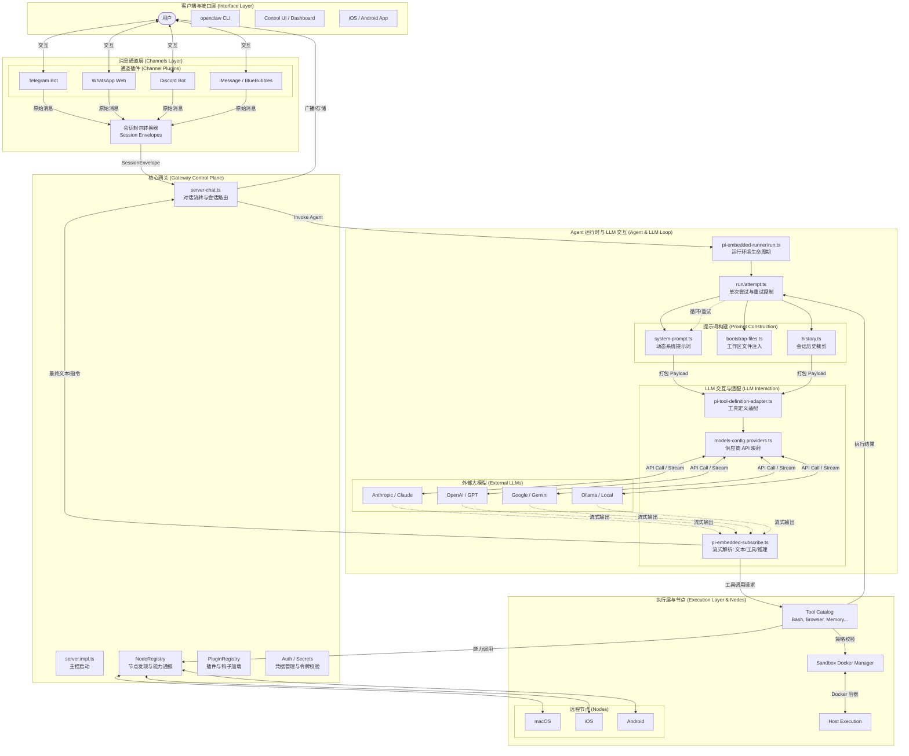

# OpenClaw 深度架构分析报告

本报告旨在对 OpenClaw 项目进行更深层次的技术解构，涵盖其核心运行时、插件化架构、安全沙箱机制、多媒体处理流水线以及与大语言模型 (LLM) 的交互细节。

---

## 1. 详细系统架构图 (Full Architecture)

以下 Mermaid 图展示了 OpenClaw 内部组件及其与 LLM 交互的完整链路：

---

## 2. LLM 交互细节解析 (LLM Interaction Deep-dive)

OpenClaw 并不是简单地发送一段文本给模型，而是通过复杂的适配层实现了高度自动化的交互：

### 2.1 提示词构建 (Prompt Engineering)
-   **系统提示词 (`system-prompt.ts`)**：动态生成包含工具说明、安全准则、当前时间、时区以及特定 persona (如 `soul.md`) 的提示词。
-   **上下文注入 (`bootstrap-files.ts`)**：自动扫描工作区中的关键文件（如 `task.md`, `README.md`），并将其作为“项目上下文”注入到 Prompt 中，使模型具备即时领域知识。

### 2.2 工具定义适配 (`pi-tool-definition-adapter.ts`)
-   OpenClaw 将内部注册的 `PiTool` 转换为模型理解的格式（如 OpenAI 的 `tools/functions` 参数或 Anthropic 的 XML/JSON 工具描述）。
-   支持工具说明的自动汇总，确保模型知道何时以及如何调用 Bash、浏览器或多媒体工具。

### 2.3 流式解析与推理剥离 (`pi-embedded-subscribe.ts`)
-   **流式拦截**：系统实时解析模型输出。如果模型发起工具调用，网关会立即拦截并执行，而无需等待全文生成结束。
-   **思维链控制**：自动识别并在界面上隔离显示 `<think>` 标签内容，确保最终用户仅看到简洁的回答，同时开发者可见推理过程。

---

## 3. 多层运行环境与重试机制

-   **外层循环 (`run.ts`)**：负责处理 API 错误、余额不足、速率限制等问题，并自动尝试备用模型或 Auth Profile（密钥轮转）。
-   **内层尝试 (`attempt.ts`)**：负责单次会话的生命周期，包括工作区锁定、插件钩子执行以及工具调用循环。

---

## 4. 插件化扩展体系

| 扩展项 | 技术实现 |
| :--- | :--- |
| **Tools** | 暴露给 Agent 的 `registerTool`，支持参数 Schema 校验和沙箱运行。 |
| **Hooks** | 允许插件在 Prompt 构建前 (`before_prompt_build`) 修改上下文。 |
| **Gateway** | 扩展自定义 RPC，允许客户端与 Agent 进行除聊天外的交互（如文件上传、配置下发）。 |

---

## 5. 安全沙箱与多媒体流水线

-   **安全隔离**：所有高危工具（如执行 Shell、控制浏览器）均受 `src/agents/sandbox/` 管理，通常在 Docker 容器中运行。
-   **媒体处理**：`src/media/` 模块负责图像的预处理、音频的实时转换（TTS）以及资产的缓存管理，确保 Agent 在处理多模态数据时的效率与安全。

---

## 8. 核心技术栈与多语言架构 (Technology Stack & Multi-Language)

OpenClaw 并非单一语言项目，而是一个典型的 **多语言异构 (Polyglot)** 架构集，旨在利用不同语言在特定领域的原生优势。下表详细说明了各子系统的实现细节：

| 子系统 (Subsystem) | 核心语言 (Language) | 关键框架 / 核心库 | 职责描述 (Responsibilities) |
| :--- | :--- | :--- | :--- |
| **网关与推理核心** | **TypeScript (Node.js)** | `@pi-agent/core`, `ws`, `express` | 实现 Agent 状态机、多模型流式解析及 WebSocket 全双工通信。 |
| **CLI & 宿主交互** | **TypeScript (Bun/Node)**| `commander`, `clack`, `jiti` | 提供沉浸式终端交互、进度条管理及 TypeScript 脚本热加载。 |
| **多平台消息通道** | **TypeScript** | `grammy`, `baileys`, `bolt`, `discord.js` | 对接 Telegram, WhatsApp, Slack 等社交平台，负责消息路由。 |
| **文档 i18n 流水线** | **Go** | 自研翻译记忆库 (TM) 驱动 | 位于 `scripts/docs-i18n/`，高效执行大规模文档翻译掩码与同步。 |
| **Apple 原生应用** | **Swift / Obj-C** | AppKit, SwiftUI | 位于 `apps/macos/ios/`，利用原生 SDK 实现菜单栏挂载与系统权限集成。 |
| **Android 移动平台** | **Kotlin / Java** | Android SDK, Gradle | 位于 `apps/android/`，处理移动端消息抓取、节点通报与权限代理。 |
| **高性能检测工具** | **Rust** (驱动集成) | `oxlint`, `oxfmt` | 为万行级别代码量提供极速的代码静态审查与毫秒级格式化能力。 |
| **安全隔离与执行** | **N/A** | Docker, Playwright | 提供代码执行的物理层沙箱隔离，并支持动态无头浏览器控制。 |

### 架构设计考量：
-   **TypeScript 为主干**：确保了开发效率与插件生态的统一性，特别是在业务逻辑变动剧烈的 Agent 运行时阶段。
-   **Go 强化流水线**：由于文档国际化涉及大量高并发字符串操作与正则匹配，Go 的性能优势显著缩短了构建周期。
-   **原生语言深度集成**：在 macOS、iOS 和 Android 端，只有原生语言才能完美调用闭源系统的底层 API，提供极致的用户体验。

*本报告基于 OpenClaw v2026.x 源码深度分析。*
