# hlist_bl_for_each_entry_rcu遍历时访问dentry->d_name.hash时出现非法地址访问0x60e

BUG: kernel NULL pointer dereference, address: 000000000000060e

- [linux 线程内核栈内存溢出导致系统崩溃 关键内存问题定位](https://zhuanlan.zhihu.com/p/13843033554)
- [一文读懂 | Linux 中的各种栈：进程栈 线程栈 内核栈 中断栈](https://cloud.tencent.com/developer/article/2168474)

## crash

### bt

#### bt

```bash
crash> bt
PID: 3996786  TASK: ffff96264e270000  CPU: 70   COMMAND: "ps"
 #0 [ffffa507c034fad8] crash_kexec at ffffffff83baec79
 #1 [ffffa507c034fae8] oops_end at ffffffff83a29a75
 #2 [ffffa507c034fb08] no_context at ffffffff83a7c9ac
 #3 [ffffa507c034fb40] __bad_area_nosemaphore at ffffffff83a7cab2
 #4 [ffffa507c034fb88] exc_page_fault at ffffffff844ce2bc
 #5 [ffffa507c034fbe0] asm_exc_page_fault at ffffffff84600afe
    [exception RIP: __d_lookup+65]
    RIP: ffffffff83db15e1  RSP: ffffa507c034fc98  RFLAGS: 00010206
    RAX: ffffa5078637f048  RBX: 00000000000005f6  RCX: 0000000000000007
    RDX: 0000000000b6fc09  RSI: ffffa507c034fdd0  RDI: ffff964615841518
    RBP: ffff964615841518   R8: 0000000000000000   R9: 0000000400000000
    R10: ffff964615841518  R11: ffffffff868b8b9c  R12: ffff964615841518
    R13: ffffa507c034fdd0  R14: 000000005b7e0484  R15: 0000000000008000
    ORIG_RAX: ffffffffffffffff  CS: 0010  SS: 0018
 #6 [ffffa507c034fcc8] lookup_fast at ffffffff83d9ef78
 #7 [ffffa507c034fd08] open_last_lookups at ffffffff83da3254
 #8 [ffffa507c034fd68] path_openat at ffffffff83da3e28
 #9 [ffffa507c034fdb8] do_filp_open at ffffffff83da68c0
#10 [ffffa507c034fec8] do_sys_openat2 at ffffffff83d8dc07
#11 [ffffa507c034ff10] __x64_sys_openat at ffffffff83d8e2d4
#12 [ffffa507c034ff38] do_syscall_64 at ffffffff844cac00
#13 [ffffa507c034ff50] entry_SYSCALL_64_after_hwframe at ffffffff84600099
    RIP: 00007fbd0610f8eb  RSP: 00007ffd91e87c70  RFLAGS: 00000246
    RAX: ffffffffffffffda  RBX: 0000557c9d99e2d0  RCX: 00007fbd0610f8eb
    RDX: 0000000000000000  RSI: 00007ffd91e87e70  RDI: 00000000ffffff9c
    RBP: 00007ffd91e87e70   R8: 0000000000000008   R9: 0000000000000001
    R10: 0000000000000000  R11: 0000000000000246  R12: 0000000000000000
    R13: 0000557c9d99e2d0  R14: 0000000000000001  R15: 00000000003cfdc3
    ORIG_RAX: 0000000000000101  CS: 0033  SS: 002b
```



```mermaid
flowchart TD
    %% 定义子图，区分用户态和内核态地址空间
    subgraph 用户态地址空间
        A[开始: 用户态进程 ps 运行 <br> PID: 3996786]
        B1[步骤 1.1: 用户进程调用 openat 系统调用]
        B2[步骤 1.2: 执行 syscall 指令 <br> 系统调用号 0x101 存入 RAX]
        M1[步骤 12.1: 通过 sysret 指令返回用户态]
        M2[步骤 12.2: 恢复用户态寄存器和堆栈]
        N[结束: 用户态进程继续运行]
    end

    subgraph 内核态地址空间
        C1[步骤 2.1: CPU 切换到内核态 Ring 0]
        C2[步骤 2.2: 跳转到 entry_SYSCALL_64_after_hwframe <br> 加载内核栈]
        D1[步骤 3.1: 执行 do_syscall_64 <br> 使用内核栈存储调用帧]
        D2[步骤 3.2: 根据 RAX 调用 __x64_sys_openat]
        E1[步骤 4.1: __x64_sys_openat 调用 do_sys_openat2]
        E2[步骤 4.2: do_sys_openat2 调用 do_filp_open]
        F1[步骤 5.1: do_filp_open 调用 path_openat]
        F2[步骤 5.2: path_openat 调用 open_last_lookups]
        G1[步骤 6.1: open_last_lookups 调用 lookup_fast]
        G2[步骤 6.2: lookup_fast 调用 __d_lookup]
        H1[步骤 7.1: __d_lookup 触发页面错误]
        H2[步骤 7.2: 跳转到 asm_exc_page_fault]
        I1[步骤 8.1: asm_exc_page_fault 调用 exc_page_fault]
        I2[步骤 8.2: exc_page_fault 调用 __bad_area_nosemaphore]
        J1[步骤 9.1: __bad_area_nosemaphore 调用 no_context]
        J2[步骤 9.2: no_context 调用 oops_end]
        K1[步骤 10.1: oops_end 调用 crash_kexec]
        K2[步骤 10.2: crash_kexec 准备生成内核转储]
        L[步骤 11: 内核崩溃并生成转储 <br> 内核栈: ffffa507c034fad8 附近]
    end

    %% 流程连接
    A --> B1 --> B2 --> C1 --> C2 --> D1 --> D2 --> E1 --> E2 --> F1 --> F2 --> G1 --> G2 --> H1 --> H2 --> I1 --> I2 --> J1 --> J2 --> K1 --> K2 --> L --> M1 --> M2 --> N

    %% 地址空间信息标注
    A:::userSpace --> |地址: 0x00007fbd0610f8eb 附近 用户代码| B1
    B1 --> B2:::userSpace --> |RAX: 0x101 openat 系统调用号| C1
    C1 --> C2:::kernelStack --> |地址: 0xffffffff84600099 entry_SYSCALL_64 <br> 内核栈: 0xffffa507c034ff50 附近| D1
    D1 --> D2:::kernelStack --> |地址: 0xffffffff83d8e2d4 __x64_sys_openat <br> 内核栈: 0xffffa507c034ff38 附近| E1
    E1 --> E2:::kernelSpace --> |地址: 0xffffffff83d8dc07 do_sys_openat2 <br> 内核栈: 0xffffa507c034fec8 附近| F1
    F1 --> F2:::kernelSpace --> |地址: 0xffffffff83da3e28 path_openat <br> 内核栈: 0xffffa507c034fdb8 附近| G1
    G1 --> G2:::kernelSpace --> |地址: 0xffffffff83d9ef78 lookup_fast <br> 内核栈: 0xffffa507c034fd08 附近| H1
    H1 --> H2:::kernelSpace --> |地址: 0xffffffff83db15e1 __d_lookup+65 <br> 内核栈: 0xffffa507c034fcc8 附近| I1
    I1 --> I2:::kernelSpace --> |地址: 0xffffffff844ce2bc exc_page_fault <br> 内核栈: 0xffffa507c034fbe0 附近| J1
    J1 --> J2:::kernelSpace --> |地址: 0xffffffff83a7c9ac no_context <br> 内核栈: 0xffffa507c034fb08 附近| K1
    K1 --> K2:::kernelSpace --> |地址: 0xffffffff83baec79 crash_kexec <br> 内核栈: 0xffffa507c034fae8 附近| L
    L --> M1 --> M2:::userSpace --> |地址: 0x00007fbd0610f8eb 附近 用户代码| N

    %% 样式定义
    classDef userSpace fill:#d4f0d4,stroke:#333,stroke-width:1px
    classDef kernelSpace fill:#f0d4d4,stroke:#333,stroke-width:1px
    classDef kernelStack fill:#f0d4d4,stroke:#ff0000,stroke-width:3px
```

#### bt -lsx

```bash
crash> bt -lsx
PID: 3996786  TASK: ffff96264e270000  CPU: 70   COMMAND: "ps"
 #0 [ffffa507c034fad8] crash_kexec+0x39 at ffffffff83baec79
    /usr/src/debug/kernel-5.10.0-136.12.0.90.ctl3.x86_64/linux-5.10.0-136.12.0.90.ctl3.x86_64/./arch/x86/include/asm/atomic.h: 41
 #1 [ffffa507c034fae8] oops_end+0x95 at ffffffff83a29a75
    /usr/src/debug/kernel-5.10.0-136.12.0.90.ctl3.x86_64/linux-5.10.0-136.12.0.90.ctl3.x86_64/arch/x86/kernel/dumpstack.c: 359
 #2 [ffffa507c034fb08] no_context+0x17c at ffffffff83a7c9ac
    /usr/src/debug/kernel-5.10.0-136.12.0.90.ctl3.x86_64/linux-5.10.0-136.12.0.90.ctl3.x86_64/arch/x86/mm/fault.c: 767
 #3 [ffffa507c034fb40] __bad_area_nosemaphore+0x52 at ffffffff83a7cab2
    /usr/src/debug/kernel-5.10.0-136.12.0.90.ctl3.x86_64/linux-5.10.0-136.12.0.90.ctl3.x86_64/arch/x86/mm/fault.c: 853
 #4 [ffffa507c034fb88] exc_page_fault+0x2dc at ffffffff844ce2bc
    /usr/src/debug/kernel-5.10.0-136.12.0.90.ctl3.x86_64/linux-5.10.0-136.12.0.90.ctl3.x86_64/arch/x86/mm/fault.c: 1354
 #5 [ffffa507c034fbe0] asm_exc_page_fault+0x1e at ffffffff84600afe
    /usr/src/debug/kernel-5.10.0-136.12.0.90.ctl3.x86_64/linux-5.10.0-136.12.0.90.ctl3.x86_64/./arch/x86/include/asm/idtentry.h: 571
    [exception RIP: __d_lookup+65]
    RIP: ffffffff83db15e1  RSP: ffffa507c034fc98  RFLAGS: 00010206
    RAX: ffffa5078637f048  RBX: 00000000000005f6  RCX: 0000000000000007
    RDX: 0000000000b6fc09  RSI: ffffa507c034fdd0  RDI: ffff964615841518
    RBP: ffff964615841518   R8: 0000000000000000   R9: 0000000400000000
    R10: ffff964615841518  R11: ffffffff868b8b9c  R12: ffff964615841518
    R13: ffffa507c034fdd0  R14: 000000005b7e0484  R15: 0000000000008000
    ORIG_RAX: ffffffffffffffff  CS: 0010  SS: 0018
    /usr/src/debug/kernel-5.10.0-136.12.0.90.ctl3.x86_64/linux-5.10.0-136.12.0.90.ctl3.x86_64/fs/dcache.c: 2453
 #6 [ffffa507c034fcc8] lookup_fast+0xb8 at ffffffff83d9ef78
    /usr/src/debug/kernel-5.10.0-136.12.0.90.ctl3.x86_64/linux-5.10.0-136.12.0.90.ctl3.x86_64/fs/namei.c: 1510
 #7 [ffffa507c034fd08] open_last_lookups+0x144 at ffffffff83da3254
    /usr/src/debug/kernel-5.10.0-136.12.0.90.ctl3.x86_64/linux-5.10.0-136.12.0.90.ctl3.x86_64/fs/namei.c: 3203
 #8 [ffffa507c034fd68] path_openat+0x88 at ffffffff83da3e28
    /usr/src/debug/kernel-5.10.0-136.12.0.90.ctl3.x86_64/linux-5.10.0-136.12.0.90.ctl3.x86_64/fs/namei.c: 3423
 #9 [ffffa507c034fdb8] do_filp_open+0x90 at ffffffff83da68c0
    /usr/src/debug/kernel-5.10.0-136.12.0.90.ctl3.x86_64/linux-5.10.0-136.12.0.90.ctl3.x86_64/fs/namei.c: 3453
#10 [ffffa507c034fec8] do_sys_openat2+0x207 at ffffffff83d8dc07
    /usr/src/debug/kernel-5.10.0-136.12.0.90.ctl3.x86_64/linux-5.10.0-136.12.0.90.ctl3.x86_64/fs/open.c: 1180
#11 [ffffa507c034ff10] __x64_sys_openat+0x54 at ffffffff83d8e2d4
    /usr/src/debug/kernel-5.10.0-136.12.0.90.ctl3.x86_64/linux-5.10.0-136.12.0.90.ctl3.x86_64/fs/open.c: 1207
#12 [ffffa507c034ff38] do_syscall_64+0x40 at ffffffff844cac00
    /usr/src/debug/kernel-5.10.0-136.12.0.90.ctl3.x86_64/linux-5.10.0-136.12.0.90.ctl3.x86_64/arch/x86/entry/common.c: 47
#13 [ffffa507c034ff50] entry_SYSCALL_64_after_hwframe+0x61 at ffffffff84600099
    /usr/src/debug/kernel-5.10.0-136.12.0.90.ctl3.x86_64/linux-5.10.0-136.12.0.90.ctl3.x86_64/arch/x86/entry/entry_64.S: 132
    RIP: 00007fbd0610f8eb  RSP: 00007ffd91e87c70  RFLAGS: 00000246
    RAX: ffffffffffffffda  RBX: 0000557c9d99e2d0  RCX: 00007fbd0610f8eb
    RDX: 0000000000000000  RSI: 00007ffd91e87e70  RDI: 00000000ffffff9c
    RBP: 00007ffd91e87e70   R8: 0000000000000008   R9: 0000000000000001
    R10: 0000000000000000  R11: 0000000000000246  R12: 0000000000000000
    R13: 0000557c9d99e2d0  R14: 0000000000000001  R15: 00000000003cfdc3
    ORIG_RAX: 0000000000000101  CS: 0033  SS: 002b
```

#### files

```bash
crash> files 3996786
PID: 3996786  TASK: ffff96264e270000  CPU: 70   COMMAND: "ps"
ROOT: /    CWD: /home/secure
 FD       FILE            DENTRY           INODE       TYPE PATH
  0 ffff9645f2196800 ffff9646df18af30 ffff9645a19738c8 FIFO
  1 ffff9646a8ff1e00 ffff96460c2e90e0 ffff9586fbf5eca0 FIFO
  2 ffff9646778ce1c0 ffff9646df18b290 ffff9645a19758e0 FIFO
  3 ffff964603e63980 ffff95861b502288 ffff95861b516b88 DIR  /proc/
```

### __d_lookup

RSI: ffffa507c034fdd0  RDI: ffff964615841518

[exception RIP: __d_lookup+65]

在 x86_64 架构的 Linux 系统调用中，寄存器 RDI 和 RSI 确实分别用于传递系统调用的第一个和第二个参数。

#### RSI: ffffa507c034fdd0

利用寄存器RSI推断BUG: kernel NULL pointer dereference, address: 000000000000060e发生的逻辑。

```c
// vim fs/dcache.c +2421

2421 struct dentry *__d_lookup(const struct dentry *parent, const struct qstr *name)
2422 {
2423     unsigned int hash = name->hash;
2424     struct hlist_bl_head *b = d_hash(hash);
```

```c
// vim fs/dcache.c +101

 101 static inline struct hlist_bl_head *d_hash(unsigned int hash)
 102 {
 103     return dentry_hashtable + (hash >> d_hash_shift);
 104 }
```

```bash
crash> struct qstr.hash ffffa507c034fdd0
      hash = 1534985348,
```

```bash
crash> p dentry_hashtable
dentry_hashtable = $2 = (struct hlist_bl_head *) 0xffffa50780801000
```

```bash
crash> struct hlist_bl_head ffffa50780801000
struct hlist_bl_head {
  first = 0x0
}
```

```bash
crash> p d_hash_shift
d_hash_shift = $3 = 7
```

```bash
crash> struct -o hlist_bl_head
struct hlist_bl_head {  [0] struct hlist_bl_node *first;
}
SIZE: 8
```

另起终端中执行：
```bash
python3 -c "print(hex(0xffffa50780801000 + (1534985348 >> 7) * 8))"
0xffffa5078637f048
```

```bash
crash> struct hlist_bl_head 0xffffa5078637f048
struct hlist_bl_head {
  first = 0x5f6
}
```

`first = 0x5f6`与`RBX: 00000000000005f6`相同。

```c
// vim fs/dcache.c +2453

2451     hlist_bl_for_each_entry_rcu(dentry, node, b, d_hash) {
2452
2453         if (dentry->d_name.hash != hash)
2454             continue;
```

```bash
crash> dis -lx __d_lookup | grep 2453 -A2
/usr/src/debug/kernel-5.10.0-136.12.0.90.ctl3.x86_64/linux-5.10.0-136.12.0.90.ctl3.x86_64/fs/dcache.c: 2453
0xffffffff83db15e1 <__d_lookup+0x41>:   cmp    %r14d,0x18(%rbx)
0xffffffff83db15e5 <__d_lookup+0x45>:   jne    0xffffffff83db15d9 <__d_lookup+0x39>
```

```bash
crash> eval 0x5f6 + 0x18
hexadecimal: 60e
    decimal: 1550
      octal: 3016
     binary: 0000000000000000000000000000000000000000000000000000011000001110
```

```bash
crash> rd 60e
rd: invalid user virtual address: 60e  type: "64-bit UVADDR"
```

BUG: kernel NULL pointer dereference, address: 000000000000060e

基本还原了crash发生的现场。

#### RDI: ffff964615841518

结合寄存器RDI进一步看看hlist_bl_for_each_entry_rcu逻辑。

```bash
crash> struct dentry.d_iname ffff964615841518
  d_iname = "3997123\000ervice\000ce\000\000tty.slice\000\000\000",
crash> struct dentry.d_parent ffff964615841518
  d_parent = 0xffff95861b502288,
crash> struct dentry.d_iname 0xffff95861b502288
  d_iname = "/\000\000\000\000\000\000\000\000\000\000\000\000\000\000\000\000\000\000\000\000\000\000\000\000\000\000\000\000\000\000",
crash> struct dentry.d_parent 0xffff95861b502288
  d_parent = 0xffff95861b502288,
```

```bash
crash> struct dentry.d_name ffff964615841518
  d_name = {
    {
      {
        hash = 1624861078,
        len = 7
      },
      hash_len = 31689632150
    },
    name = 0xffff964615841550 "3997123"
  },
```

```bash
crash> struct dentry.d_sb ffff964615841518
  d_sb = 0xffff9625911ca000,
crash>
crash> struct super_block.s_type,s_id 0xffff9625911ca000
  s_type = 0xffffffff856a89e0 <proc_fs_type>,
  s_id = "proc\000\000\000\000\000\000\000\000\000\000\000\000\000\000\000\000\000\000\000\000\000\000\000\000\000\000\000",
```

```bash
crash> mount -n ffff96264e270000 | grep -E "MOUNT|proc"
     MOUNT           SUPERBLK     TYPE   DEVNAME   DIRNAME
ffff96059259f480 ffff9625911ca000 proc   proc      /proc
ffff962592823c00 ffff96659271f800 autofs systemd-1 /proc/sys/fs/binfmt_misc
ffff95864a865180 ffff96660d1e0000 binfmt_misc binfmt_misc /proc/sys/fs/binfmt_misc/
```

```bash
crash> struct mount.mnt,mnt_mountpoint 0xffff96059259f480
  mnt = {
    mnt_root = 0xffff95861b502288,
    mnt_sb = 0xffff9625911ca000,
    mnt_flags = 4135,
    kabi_reserved1 = 0
  },
  mnt_mountpoint = 0xffff9645930d36c8,
crash> struct dentry.d_iname,d_parent 0xffff95861b502288
  d_iname = "/\000\000\000\000\000\000\000\000\000\000\000\000\000\000\000\000\000\000\000\000\000\000\000\000\000\000\000\000\000\000",
  d_parent = 0xffff95861b502288,
crash>
crash>
crash> struct dentry.d_iname,d_parent 0xffff9645930d36c8
  d_iname = "proc\000:host31\000\000\000\000\000\000\000\000\000\000\000\000\000\000\000\000\000\000\000",
  d_parent = 0xffff96858e777a28,
```

```bash
crash> struct -o dentry
struct dentry {
    [0] unsigned int d_flags;
    [4] seqcount_spinlock_t d_seq;
    [8] struct hlist_bl_node d_hash;
   [24] struct dentry *d_parent;
   [32] struct qstr d_name;
   [48] struct inode *d_inode;
   [56] unsigned char d_iname[32];
   [88] struct lockref d_lockref;
   [96] const struct dentry_operations *d_op;
  [104] struct super_block *d_sb;
  [112] unsigned long d_time;
  [120] void *d_fsdata;
        union {
  [128]     struct list_head d_lru;
  [128]     wait_queue_head_t *d_wait;
        };
  [144] struct list_head d_child;
  [160] struct list_head d_subdirs;
        union {
            struct hlist_node d_alias;
            struct hlist_bl_node d_in_lookup_hash;
            struct callback_head d_rcu;
  [176] } d_u;
  [192] atomic_t d_neg_dnum;
  [200] u64 kabi_reserved1;
  [208] u64 kabi_reserved2;
}
SIZE: 216
```

```bash
struct hlist_bl_node {
   [0] struct hlist_bl_node *next;
   [8] struct hlist_bl_node **pprev;
}
SIZE: 16
```

```bash
crash> struct -o hlist_bl_head
struct hlist_bl_head {
  [0] struct hlist_bl_node *first;
}
SIZE: 8
```

```text
[dentry_hashtable] (数组，每个元素是一个 hlist_bl_head)
        |
        |  index = hash >> d_hash_shift
        v
+--------------------------+
| struct hlist_bl_head    |   <- dentry_hashtable[index]
|--------------------------|
| *first --> d_hash node  |   -> 错误地指向了 0x5f6
+--------------------------+
        |
        v
+--------------------------+
| struct hlist_bl_node    |   <- dentry->d_hash
|--------------------------|
| *next                   |
| **pprev                 |
+--------------------------+
        |
        v
+--------------------------+
| struct dentry           |
|--------------------------|
| d_flags                 |
| d_seq                   |
| d_hash (内嵌结构体)     | <- 用于散列链表
| d_parent                |
| d_name (qstr)           | <- 用于名称匹配
|   |- hash               |
|   |- len                |
|   |- *name              |
| d_inode                 |
| d_op                    |
| d_sb                    |
| ...                     |
+--------------------------+
```

从此图来看，RSI: ffffa507c034fdd0作为__d_lookup函数第二个参数传入的时候的就有问题，接下来围绕第二个入参深入分析。

```c
// vim fs/dcache.c +2421

2421 struct dentry *__d_lookup(const struct dentry *parent, const struct qstr *name)
2422 {
2423     unsigned int hash = name->hash;
2424     struct hlist_bl_head *b = d_hash(hash);
```

### nameidata

围绕RSI: ffffa507c034fdd0推断出nameidata结构体的内容。

#### __d_lookup函数被引用点

```c
// vim fs/namei.c +1510

1504         if (unlazy_child(nd, dentry, seq))
1505             return ERR_PTR(-ECHILD);
1506         if (unlikely(status == -ECHILD))
1507             /* we'd been told to redo it in non-rcu mode */
1508             status = d_revalidate(dentry, nd->flags);
1509     } else {
1510         dentry = __d_lookup(parent, &nd->last);
1511         if (unlikely(!dentry))
1512             return NULL;
1513         status = d_revalidate(dentry, nd->flags);
1514     }
```

```bash
crash> struct qstr ffffa507c034fdd0
struct qstr {
  {
    {
      hash = 1534985348,
      len = 4
    },
    hash_len = 18714854532
  },
  name = 0xffff96270489b02e "ctty"
}
```

到这里基本上确定寻找路径`/proc/3997123/ctty`的时候踩内存了。

确认进程是否存在：
```bash
crash> ps 3997123
ps: invalid task or pid value: 3997123

PID    PPID  CPU       TASK        ST  %MEM      VSZ      RSS  COMM
```

确认detry下的子目录：
```bash
crash> eval ffff964615841518 + 0xa0
hexadecimal: ffff9646158415b8
    decimal: 18446627826485695928  (-116247223855688)
      octal: 1777774544302541012670
     binary: 1111111111111111100101100100011000010101100001000001010110111000
crash> list -s dentry.d_iname,d_name -H ffff9646158415b8
(empty)
crash> struct dentry.d_subdirs ffff964615841518
  d_subdirs = {
    next = 0xffff9646158415b8,
    prev = 0xffff9646158415b8
  },
```

```bash
crash> struct -o nameidata
struct nameidata {
    [0] struct path path;
   [16] struct qstr last;     // 10进制的16，转换成16进制是0x10
   [32] struct path root;
   [48] struct inode *inode;
   [56] unsigned int flags;
   [60] unsigned int state;
   [64] unsigned int seq;
   [68] unsigned int m_seq;
   [72] unsigned int r_seq;
   [76] int last_type;
   [80] unsigned int depth;
   [84] int total_link_count;
   [88] struct saved *stack;
   [96] struct saved internal[2];
  [192] struct filename *name;
  [200] struct nameidata *saved;
  [208] unsigned int root_seq;
  [212] int dfd;
  [216] kuid_t dir_uid;
  [220] umode_t dir_mode;
}
SIZE: 224
```

```bash
crash> struct -o saved
struct saved {
   [0] struct path link;
  [16] struct delayed_call done;
  [32] const char *name;
  [40] unsigned int seq;
}
SIZE: 48
```

```bash
crash> struct -o path
struct path {
   [0] struct vfsmount *mnt;
   [8] struct dentry *dentry;
}
SIZE: 16
```

```bash
crash> struct -o delayed_call
struct delayed_call {
   [0] void (*fn)(void *);
   [8] void *arg;
}
SIZE: 16
```

10进制的16，转换成16进制是0x10:
```bash
crash> eval 16
hexadecimal: 10
    decimal: 16
      octal: 20
     binary: 0000000000000000000000000000000000000000000000000000000000010000
```

根据offset算出nd数据结构地址:
```bash
crash> eval 0xffffa507c034fdd0 - 0x10
hexadecimal: ffffa507c034fdc0
    decimal: 18446644051440893376  (-100022268658240)
      octal: 1777775120370015176700
     binary: 1111111111111111101001010000011111000000001101001111110111000000
```

```bash
crash> struct nameidata ffffa507c034fdc0
struct nameidata {
  path = {
    mnt = 0xffff96059259f4a0,
    dentry = 0xffff964615841518
  },
  last = {
    {
      {
        hash = 1534985348,
        len = 4
      },
      hash_len = 18714854532
    },
    name = 0xffff96270489b02e "ctty"
  },
  root = {
    mnt = 0xffff966592a20de0,
    dentry = 0xffff96858e777a28
  },
  inode = 0xffff9626fdc5d2c8,
  flags = 257,
  state = 2,
  seq = 0,
  m_seq = 19851860,
  r_seq = 1071248,
  last_type = 0,
  depth = 0,
  total_link_count = 0,
  stack = 0xffffa507c034fe20,
  internal = {{
      link = {
        mnt = 0x7ffc09853ef0,
        dentry = 0x6
      },
      done = {
        fn = 0xffffffff83b7b103 <rcu_nocb_try_bypass+499>,
        arg = 0xffffffff83d69a6f <page_counter_try_charge+47>
      },
      name = 0x4 <error: Cannot access memory at address 0x4>,    // 异常值，很明显的错误
      seq = 3119488576
    }, {
      link = {
        mnt = 0x0,
        dentry = 0x9fff6
      },
      done = {
        fn = 0x40,
        arg = 0xffffffff83e2491c <files_cgroup_alloc_fd+92>
      },
      name = 0x0,
      seq = 2085869312
    }},
  name = 0xffff96270489b000,
  saved = 0x0,
  root_seq = 2,
  dfd = -100,
  dir_uid = {
    val = 1000
  },
  dir_mode = 16749
}
```

判断 `internal` 栈是否被踩（即内存是否被非法覆盖或破坏）的结论，是通过综合分析你提供的各种数据（`struct nameidata`、内存转储、调用栈等）得出的。以下是我逐步分析的过程和得出结论的依据：

---

### internal分析过程与证据

#### 1. `internal` 字段的异常值
从 `struct nameidata` 的 `internal` 数组（位于 `0xffffa507c034fe20` - `0xffffa507c034fe77`）中，我们观察到以下内容：
```c
internal = {{
    link = {
      mnt = 0x7ffc09853ef0,       // 用户空间地址，异常
      dentry = 0x6                // 低地址，异常
    },
    done = {
      fn = 0xffffffff83b7b103 <rcu_nocb_try_bypass+499>, // 有效内核函数
      arg = 0xffffffff83d69a6f <page_counter_try_charge+47> // 有效参数
    },
    name = 0x4 <error: Cannot access memory at address 0x4>, // 异常值
    seq = 3119488576            // 有效序列号
  }, {
    link = {
      mnt = 0x0,                 // 空，正常
      dentry = 0x9fff6           // 低地址，异常
    },
    done = {
      fn = 0x40,                 // 异常值
      arg = 0xffffffff83e2491c <files_cgroup_alloc_fd+92> // 有效参数
    },
    name = 0x0,                  // 空，正常
    seq = 2085869312            // 有效序列号
  }},
```
- **异常点**：
  - **`internal[0].name = 0x4`**：路径名指针应指向有效字符串（如 `0xffff96270489b02e "ctty"`），但 `0x4` 是一个低地址，且不可访问（`<error: Cannot access memory at address 0x4>`）。
  - **`internal[1].done.fn = 0x40`**：回调函数指针应为内核地址（如 `0xffffffff83b7b103`），但 `0x40` 是一个无效的低地址。
  - **`internal[0].link.dentry = 0x6` 和 `internal[1].link.dentry = 0x9fff6`**：目录项指针应为内核地址（如 `0xffff964615841518`），这些低值异常。
- **初步判断**：这些字段的值不符合预期（内核数据结构中不应出现如此低的地址），表明它们可能被非法覆盖。

#### 2. 内存转储的对比
从 `rd -x 0xffffa507c034fe00 32` 的输出中，`internal` 区域（`0xffffa507c034fe20` - `0xffffa507c034fe77`）与上述结构一致：
```bash
rd -x ffffa507c034fe20 32
ffffa507c034fe20:  00007ffc09853ef0 0000000000000006  // link.mnt, link.dentry
ffffa507c034fe30:  ffffffff83b7b103 ffffffff83d69a6f  // done.fn, done.arg
ffffa507c034fe40:  0000000000000004 ffff9587b9ef9e40  // name, seq
ffffa507c034fe50:  0000000000000000 000000000009fff6  // link.mnt, link.dentry
ffffa507c034fe60:  0000000000000040 ffffffff83e2491c  // done.fn, done.arg
ffffa507c034fe70:  0000000000000000 52e37d4e7c53d700  // name, seq
ffffa507c034fe80:  ffff96270489b000 0000000000000000
ffffa507c034fe90:  ffffff9c00000002 ffff416d000003e8
ffffa507c034fea0:  00000000ffffff9c 52e37d4e7c53d700
ffffa507c034feb0:  ffffa507c034ff18 00000000ffffff9c
ffffa507c034fec0:  0000000000000004 ffffffff83d8dc07
ffffa507c034fed0:  000080004e270000 00000004c0340000
ffffa507c034fee0:  0000000100000100 52e37d4e7c53d700
ffffa507c034fef0:  0000000000000000 ffffa507c034ff48
ffffa507c034ff00:  ffffa507c034ff58 0000000000000000
ffffa507c034ff10:  ffffffff83d8e2d4 0000000000008000
```
- **确认异常**：
  - `0xffffa507c034fe40: 0000000000000004` → `name = 0x4`
  - `0xffffa507c034fe60: 0000000000000040` → `done.fn = 0x40`
  - `0xffffa507c034fe28: 0000000000000006` → `link.dentry = 0x6`
  - `0xffffa507c034fe58: 000000000009fff6` → `link.dentry = 0x9fff6`
- **其他字段正常**：`done.fn` 和 `done.arg` 的其他值（如 `0xffffffff83b7b103`）是有效的内核地址，`seq` 也合理。
- **推测**：部分字段被破坏，而其他字段保持完整，表明覆盖是局部的。

#### 3. 栈布局与溢出可能性
- **栈地址**：
  - `struct nameidata` 位于 `0xffffa507c034fdc0`。
  - `stack` 指针为 `0xffffa507c034fe20`，包含 `internal`。
  - 调用栈从 `0xffffa507c034fec8`（`do_sys_openat2+519`）开始。
- **溢出方向**：x86_64 栈从高地址向低地址增长。如果溢出发生在更高地址（如 `0xffffa507c034ffxx`），可能向下覆盖 `0xffffa507c034fe40`（`name`）和 `0xffffa507c034fe60`（`done.fn`）。
- **重复值**：
  - `0x4` 在 `0xffffa507c034fec0` 再次出现：
    ```
    ffffa507c034fec0:  0000000000000004 ffffffff83d8dc07
    ```
  - 这可能是溢出源，暗示更高地址的数据（如局部变量）覆盖了 `internal`。

#### 4. 调用栈与上下文
调用栈（`bt`）显示：
```
 #5 [ffffa507c034fbe0] asm_exc_page_fault
    [exception RIP: __d_lookup+65]
 #6 [ffffa507c034fcc8] lookup_fast
 #8 [ffffa507c034fd68] path_openat
#10 [ffffa507c034fec8] do_sys_openat2
#13 [ffffa507c034ff50] entry_SYSCALL_64_after_hwframe
```
- **崩溃点**：`__d_lookup+65` 触发页面错误，可能与 `struct qstr`（`0xffffa507c034fdd0`，`"ctty"`）或 `dentry`（`0xffff964615841518`）相关。
- **栈使用**：`path_openat` 使用 `struct nameidata` 解析路径，`internal` 是其临时栈。如果栈分配或操作不当，可能导致覆盖。
- **异常值来源**：`0x4` 和 `0x40` 不像是正常初始值（通常为 `0` 或有效指针），更像是溢出或错误写入的结果。

#### 5. 模式与一致性
- **局部破坏**：`internal` 中只有特定字段（`name`, `done.fn`, `link.dentry`）异常，其他字段（如 `done.arg`, `seq`）正常，表明不是整个栈被清空，而是局部覆盖。
- **重复数据**：`0x4` 和 `0x52e37d4e7c53d700`（`seq`）在栈中多次出现，可能反映溢出或未清理的栈状态。
- **用户态痕迹**：`internal[0].link.mnt = 0x7ffc09853ef0` 是用户空间地址，可能被错误写入内核栈。

---

#### 得出结论的依据
基于以上分析，我得出“`internal` 栈被踩”的结论，理由如下：

1. **字段值异常**：
   - `name = 0x4` 和 `done.fn = 0x40` 是无效的低地址，与内核数据结构的预期（高地址指针）不符。
   - `link.dentry = 0x6` 和 `0x9fff6` 同样异常。

2. **局部覆盖特征**：
   - 只有部分字段被破坏，其他字段（如 `done.arg`）保持有效，符合栈被踩的典型模式（溢出通常只影响部分区域）。

3. **溢出证据**：
   - `0x4` 在 `0xffffa507c034fec0` 重复出现，位于调用栈附近，可能是从更高地址溢出的结果。
   - 栈向下增长的特性支持从 `0xffffa507c034fexx` 覆盖到 `0xffffa507c034fe40` 的可能性。

4. **上下文支持**：
   - `path_openat` 和 `lookup_fast` 操作 `struct nameidata`，若栈分配过大或指针越界，可能导致 `internal` 被覆盖。
   - 崩溃在 `__d_lookup` 表明路径解析出错，`internal` 的异常可能是同一问题的副作用。

---

#### 结论
**`internal` 栈被踩了**，表现为 `name = 0x4`、`done.fn = 0x40` 等字段被非法覆盖。覆盖是局部的，可能是从更高地址（如 `0xffffa507c034fec0`）的栈溢出导致。根本原因可能与 `path_openat` 或 `lookup_fast` 中的栈操作有关，建议进一步检查 `__d_lookup` 的崩溃点和相关数据结构（`dentry`, `qstr`）以确认溢出源。

### hash_len

link_path_walk

```c
// vim fs/namei.c +2154

2109 static int link_path_walk(const char *name, struct nameidata *nd)
2100 {
......................................................................
2146         if (likely(type == LAST_NORM)) {
2147             struct dentry *parent = nd->path.dentry;
2148             nd->state &= ~ND_JUMPED;
2149             if (unlikely(parent->d_flags & DCACHE_OP_HASH)) {
2150                 struct qstr this = { { .hash_len = hash_len }, .name = name };
2151                 err = parent->d_op->d_hash(parent, &this);
2152                 if (err < 0)
2153                     return err;
2154                 hash_len = this.hash_len;
2155                 name = this.name;
2156             }
2157         }
```

```bash
crash> struct dentry.d_inode ffff964615841518
  d_inode = 0xffff9626fdc5d2c8,
crash> struct inode.i_rdev 0xffff9626fdc5d2c8
  i_rdev = 0,
```

```bash
crash> struct dentry.d_op,d_sb ffff964615841518
  d_op = 0xffffffff84a53740 <pid_dentry_operations>,
  d_sb = 0xffff9625911ca000,
```

```bash
crash> struct dentry_operations 0xffffffff84a53740
struct dentry_operations {
  d_revalidate = 0xffffffff83e3e8b0 <pid_revalidate>,
  d_weak_revalidate = 0x0,
  d_hash = 0x0,
  d_compare = 0x0,
  d_delete = 0xffffffff83e3a3d0 <pid_delete_dentry>,
  d_init = 0x0,
  d_release = 0x0,
  d_prune = 0x0,
  d_iput = 0x0,
  d_dname = 0x0,
  d_automount = 0x0,
  d_manage = 0x0,
  d_real = 0x0,
  kabi_reserved1 = 0,
  kabi_reserved2 = 0,
  kabi_reserved3 = 0,
  kabi_reserved4 = 0
}
```

```bash
crash> struct super_block.s_type,s_id 0xffff9625911ca000
  s_type = 0xffffffff856a89e0 <proc_fs_type>,
  s_id = "proc\000\000\000\000\000\000\000\000\000\000\000\000\000\000\000\000\000\000\000\000\000\000\000\000\000\000\000",
```

```bash
crash> struct file_system_type 0xffffffff856a89e0
struct file_system_type {
  name = 0xffffffff84d57275 "proc",
  fs_flags = 24,
  init_fs_context = 0xffffffff83e39f80 <proc_init_fs_context>,
  parameters = 0xffffffff84a50820 <proc_fs_parameters>,
  mount = 0x0,
  kill_sb = 0xffffffff83e39c70 <proc_kill_sb>,
  owner = 0x0,
  next = 0xffffffff85636c40 <cgroup_fs_type>,
  fs_supers = {
    first = 0xffff9666b22298e0
  },
  s_lock_key = {<No data fields>},
  s_umount_key = {<No data fields>},
  s_vfs_rename_key = {<No data fields>},
  s_writers_key = 0xffffffff856a8a28 <proc_fs_type+72>,
  i_lock_key = {<No data fields>},
  i_mutex_key = {<No data fields>},
  i_mutex_dir_key = {<No data fields>},
  kabi_reserved1 = 0,
  kabi_reserved2 = 0,
  kabi_reserved3 = 0,
  kabi_reserved4 = 0
}
```

这里想进一步确认一下路径`/proc/3997123/ctty`是不是有误，如果在容器中，视图不一致，路径可能改变。

```bash
crash> struct task_struct.nsproxy ffff96264e270000
  nsproxy = 0xffffffff85257de0 <init_nsproxy>,
crash>
crash>
crash> struct nsproxy 0xffffffff85257de0
struct nsproxy {
  count = {
    counter = 3670
  },
  uts_ns = 0xffffffff85212700 <init_uts_ns>,
  ipc_ns = 0xffffffff856a9b00 <init_ipc_ns>,
  mnt_ns = 0xffff9586001cf5c0,
  pid_ns_for_children = 0xffffffff85257a40 <init_pid_ns>,
  net_ns = 0xffffffff85749180 <init_net>,
  time_ns = 0xffffffff85632880 <init_time_ns>,
  time_ns_for_children = 0xffffffff85632880 <init_time_ns>,
  cgroup_ns = 0xffffffff85637f00 <init_cgroup_ns>,
  kabi_reserved1 = 0,
  kabi_reserved2 = 0,
  kabi_reserved3 = 0,
  kabi_reserved4 = 0,
  kabi_reserved5 = 0,
  kabi_reserved6 = 0,
  kabi_reserved7 = 0,
  kabi_reserved8 = 0
}
```

```bash
[145] struct mnt_namespace 0xffff9586001cf5c0
[146] struct -o mnt_namespace
[147] struct mnt_namespace.root 0xffff9586001cf5c0
[148] struct mount 0xffff962590036300
[149] struct -o mount
[150] struct mount.mnt_parent 0xffff962590036300
[151] struct mount 0xffff962590036300
[152] struct -o mount
[153] struct mount.dentry 0xffff962590036300
[154] struct mount 0xffff962590036300
[155] struct mount.mnt_mountpoint 0xffff962590036300
[156] struct dentry 0xffff95e590400798
```

这里确认dentry 锁计数:
```bash
crash> struct dentry.d_lockref.count ffff964615841518
  d_lockref.count = 1
```

确认dentry有没有被释放：
```bash
crash> kmem -s ffff964615841518
CACHE             OBJSIZE  ALLOCATED     TOTAL  SLABS  SSIZE  NAME
ffff96059000db80      216     380560    436156  11788     8k  dentry
  SLAB              MEMORY            NODE  TOTAL  ALLOCATED  FREE
  ffffe3b084561000  ffff964615840000     6     37         37     0
  FREE / [ALLOCATED]
  [ffff964615841518]
```

```bash
crash> kmem -s ffff9626fdc5d2c8
CACHE             OBJSIZE  ALLOCATED     TOTAL  SLABS  SSIZE  NAME
ffff96059000ea80      696      90178    129950   2825    32k  proc_inode_cache
  SLAB              MEMORY            NODE  TOTAL  ALLOCATED  FREE
  ffffe3b007f71600  ffff9626fdc58000     5     46         46     0
  FREE / [ALLOCATED]
  [ffff9626fdc5d280]
```

确认进程工作目录：
```bash
```bash
crash> struct task_struct.fs ffff96264e270000
  fs = 0xffff962717214740,
crash> struct fs_struct.pwd 0xffff962717214740
  pwd = {
    mnt = 0xffff966592a20de0,
    dentry = 0xffff9645c39f4798
  }
crash> struct task_struct.tty ffff96264e270000
struct: invalid data structure reference: task_struct.tty
```
