# Linux网络收包与epoll协作机制

## 1. 整体架构图

```mermaid
graph TD
    %% 硬件层
    A[网卡接收数据包 - 硬件中断信号] -->|触发IRQ信号| B[DMA引擎启动 - 数据写入ring buffer]
    B -->|完成数据传输| C[网卡发出硬中断 - 调用注册的ISR]

    %% 内核硬中断层
    C -->|通过中断向量| D[硬中断处理开始 - do_IRQ]
    D -->|保存上下文| E[执行网卡驱动ISR - ack中断]
    E -->|网卡支持NAPI时调度| E1[调用NAPI - napi_schedule]
    E -->|未调度NAPI| E2[未调用NAPI - 直接触发软中断]
    E1 -->|设置软中断标志| F[触发软中断 - raise_softirq NET_RX_SOFTIRQ]
    E2 --> F
    E1:::note -->|NAPI状态允许时调用| E1
    E2:::note -->|网卡不支持NAPI时| E2

    %% 软中断调度层
    F -->|硬中断退出| G[检查软中断 - do_softirq]
    G -->|高负载时调度| H[调用ksoftirqd - 软中断守护进程]
    G -->|直接处理| I[执行软中断 - NET_RX_SOFTIRQ]
    H -->|延迟执行| I

    %% 软中断控制
    I -->|启用底半部机制| J[启用底半部 - local_bh_enable]
    J -->|硬中断未调用时调度| J0[调用NAPI - napi_schedule]
    J:::note -->|可能触发do_softirq| J

    %% NAPI机制
    subgraph NAPI机制
        J0 -->|执行轮询| K[处理数据包 - netif_receive_skb]
        J0:::note -->|硬中断未调用或新数据包到达时| J0
        K:::note -->|NAPI轮询执行| K
    end

    %% 内核协议层
    K -->|数据包上行| M[网络协议栈处理 - ip_rcv -> tcp_v4_rcv]
    M -->|分配内存| N[数据包入队列 - sk_buff分配]
    N -->|数据入Socket| O[Socket缓冲区就绪 - sk->sk_receive_queue]
    O -->|通知事件| P[sock_def_readable - 通知事件可用]

    %% epoll 核心机制
    P -->|分发事件| Q[ep_poll_callback - 处理就绪事件]
    
    subgraph epoll内部机制
        Q -->|通过fd查询| R[红黑树查询 - rb_tree_find]
        Q -->|检查状态| S[检查epitem - ep_events_available]
        R -->|找到epitem| T[加入rdllist - list_add_tail]
        S -->|状态通过| T
        T -->|更新计数| U[更新计数 - ep->rdllist.count++]
        U -->|唤醒| V[唤醒epoll_wait - wake_up ep->wq]
        R:::note -->|查找fd对应的epitem| R
        S:::note -->|epitem包含fd和事件| S
        T:::note -->|epitem加入就绪链表| T
        V:::note -->|唤醒用户态等待进程| V
    end

    %% 上下文切换与唤醒
    V -->|通知调度器| V1[调度器重新调度 - schedule]
    V1 -->|恢复用户态上下文| V2[系统调用返回 - 从内核态返回]

    %% 用户态与内核态交互
    subgraph 用户态与内核态交互
        V2 -->|返回就绪fd| W[epoll_wait返回 - 用户态获取fd列表]
        W -->|处理就绪事件| W1[用户态处理 - 检查fd事件]
        W1 -->|发起读取| X[用户态发起read - sys_read]
        X -->|内核读取数据| Y[内核检查缓冲区 - copy_to_user]
        Y -->|数据返回| Z[数据返回用户空间 - 完成读取]
    end

    %% 分组与层级
    subgraph 硬件层
        A --> B --> C
    end
    subgraph 内核硬中断层
        D --> E --> E1 --> F
        E --> E2 --> F
    end
    subgraph 软中断调度层
        F --> G --> H --> I
    end
    subgraph 软中断控制
        I --> J --> J0
    end
    subgraph 内核协议层
        K --> M --> N --> O
    end
    subgraph 内核Socket层
        O --> P
    end
    subgraph epoll内部机制
        Q --> R --> S --> T --> U --> V
    end

    %% 样式定义
    classDef hardware fill:#f9f9f9,stroke:#666,stroke-width:1px
    classDef hardirq fill:#e6ffe6,stroke:#006600,stroke-width:2px
    classDef softirq fill:#e6f3ff,stroke:#333,stroke-width:2px
    classDef napi fill:#e6fff3,stroke:#006633,stroke-width:2px
    classDef socket fill:#fff0e6,stroke:#cc3300,stroke-width:2px
    classDef epoll fill:#f2e6ff,stroke:#660066,stroke-width:2px
    classDef user fill:#fff3e6,stroke:#ff6600,stroke-width:2px
    classDef note fill:none,stroke:none

    class A,B,C hardware
    class D,E,E1,E2,F hardirq
    class G,H,I softirq
    class J,J0 softirq
    class K napi
    class M,N,O,P socket
    class Q,R,S,T,U,V epoll
    class V1,V2 epoll
    class W,W1,X,Y,Z user
```



---

基于你提供的 Markdown 图、Linux 5.10 内核代码以及 virtio-net 驱动，我将对内容进行补充和完善，重点补充硬件层、中断处理层、协议栈处理、epoll 事件触发等部分的细节，并结合 virtio-net 驱动的实现补充相关代码和说明。同时，我会确保内容与 Linux 5.10 内核版本保持一致，并与 Markdown 图的流程保持逻辑一致。

---

## 2. 详细处理流程

### 2.1 硬件层处理

#### 1. **网卡收包**
- **PHY芯片处理物理信号（电/光转换）**：
  - PHY（物理层）芯片负责将物理信号（电信号或光信号）转换为数字信号，完成信号的调制与解调。
  - 在 virtio-net 驱动中，由于 virtio 是虚拟化设备，物理层信号处理由宿主机的 virtio 后端（例如 QEMU）模拟，virtio-net 驱动直接与虚拟化的 virtqueue 交互。
- **MAC层进行CRC校验和帧过滤**：
  - MAC（介质访问控制）层负责帧的完整性校验（CRC）和地址过滤（例如检查目标 MAC 地址是否匹配）。
  - virtio-net 支持虚拟化的 MAC 地址过滤，具体由 `virtio_net_hdr` 结构中的元数据完成校验和过滤。
- **支持特性**：
  - **RSS（多队列）**：virtio-net 支持多队列（`VIRTIO_NET_F_MQ` 特性），通过 `struct virtio_net_config` 中的 `max_virtqueue_pairs` 配置多队列数量，数据包分发到不同 virtqueue。
  - **Checksum Offload**：virtio-net 支持校验和卸载（`VIRTIO_NET_F_CSUM`），通过 `virtio_net_hdr` 的 `flags` 字段指示是否需要校验和计算。
  - **TSO/GSO**：支持 TCP 分段卸载（`VIRTIO_NET_F_GUEST_TSO4` 和 `VIRTIO_NET_F_GUEST_TSO6`）和通用分段卸载（`VIRTIO_NET_F_GSO`），减少 CPU 分段开销。

#### 2. **DMA传输**
- **virtio-net 的 DMA 传输**：
  - virtio-net 使用 virtqueue 机制实现数据传输，virtqueue 是一个环形缓冲区（`struct vring`），由前端（Guest）和后端（Host）共享。
  - 数据包通过 `struct vring_desc` 描述符传输，描述符包含数据缓冲区的物理地址、长度和状态。
  - 代码示例（基于 Linux 5.10 内核，`drivers/net/virtio_net.c`）：
    ```c
    struct virtio_net_hdr_v1 {
        __u8 flags;         // 校验和标志
        __u8 gso_type;      // 分段卸载类型
        __le16 hdr_len;     // 头部长度
        __le16 gso_size;    // 分段大小
        __le16 csum_start;  // 校验和计算起始位置
        __le16 csum_offset; // 校验和偏移
        __le16 num_buffers; // 缓冲区数量
    };

    struct receive_queue {
        struct virtqueue *vq; // 接收 virtqueue
        struct napi_struct napi; // NAPI 实例
        struct page *pages; // 预分配页面
        /* ... */
    };
    ```
  - **直接写入预分配的环形缓冲区**：
    - virtio-net 驱动通过 `virtqueue_add_inbuf` 将预分配的缓冲区（`struct page` 或 `struct sk_buff`）加入接收队列（`receive_queue` 的 `vq`）。
    - 后端（Host）通过 DMA 将数据包写入这些缓冲区，完成后通知前端（Guest）通过中断。
  - **零拷贝关键**：
    - virtio-net 使用共享内存（virtqueue）实现零拷贝，数据直接从 Host 写入 Guest 的内存，避免 CPU 参与数据搬运。
    - 关键函数：`virtqueue_get_buf` 从 virtqueue 获取已填充的数据缓冲区。

#### 补充：virtio-net 驱动初始化
- virtio-net 驱动初始化时会协商特性并分配 virtqueue（`drivers/net/virtio_net.c`）：
  ```c
  static int virtnet_probe(struct virtio_device *vdev)
  {
      struct net_device *dev;
      struct virtnet_info *vi;
      int i;

      dev = alloc_etherdev_mq(sizeof(struct virtnet_info), VIRTIO_NET_VQ_MAX);
      vi = netdev_priv(dev);
      vi->vdev = vdev;
      vdev->priv = vi;

      // 协商特性
      virtio_cread_le(vdev, struct virtio_net_config, max_virtqueue_pairs, &vi->max_queue_pairs);
      if (virtio_has_feature(vdev, VIRTIO_NET_F_MQ))
          vi->curr_queue_pairs = min(vi->max_queue_pairs, num_online_cpus());

      // 初始化接收和发送 virtqueue
      for (i = 0; i < vi->curr_queue_pairs; i++) {
          vi->rq[i].vq = virtio_find_single_vq(vdev, virtnet_rx_vq_callback, "rx");
          vi->sq[i].vq = virtio_find_single_vq(vdev, virtnet_tx_vq_callback, "tx");
      }

      // 启用 NAPI
      for (i = 0; i < vi->curr_queue_pairs; i++)
          napi_enable(&vi->rq[i].napi);

      return register_netdev(dev);
  }
  ```

---

### 2.2 中断处理层

#### 1. **硬中断处理**
- **virtio-net 的硬中断处理**：
  - virtio-net 驱动通过 virtio 设备的 `struct virtio_device` 注册中断处理程序（`virtio_config_ops->set_vq_handler`）。
  - 硬中断由 Host 触发（通过 `virtio_device->isr`），调用 `virtnet_interrupt` 处理。
  - 代码示例（`drivers/net/virtio_net.c`）：
    ```c
    static irqreturn_t virtnet_interrupt(int irq, void *opaque)
    {
        struct virtnet_info *vi = opaque;
        int i;

        // 检查中断状态
        if (virtio_read_isr(vi->vdev)) {
            // 禁用后续硬中断
            virtio_config_ops->disable_vq(vi->vdev);

            // 遍历所有接收队列
            for (i = 0; i < vi->curr_queue_pairs; i++) {
                struct receive_queue *rq = &vi->rq[i];
                // 调度 NAPI
                if (virtqueue_get_buf(rq->vq, &len))
                    napi_schedule(&rq->napi);
            }

            // 触发软中断
            raise_softirq(NET_RX_SOFTIRQ);
            return IRQ_HANDLED;
        }
        return IRQ_NONE;
    }
    ```
- **标记数据到达，调度 NAPI**：
  - virtio-net 在硬中断中调用 `napi_schedule` 调度 NAPI 轮询，禁用后续硬中断。
  - 时间要求：<100μs（硬中断处理需快速完成，避免影响系统响应）。
- **优化手段**：
  - **中断合并**：virtio-net 支持中断合并（`VIRTIO_F_EVENT_IDX` 特性），通过 `virtqueue_enable_cb_delayed` 延迟中断通知，减少中断频率。

#### 2. **软中断处理**
- **批量处理数据包**：
  - 软中断通过 `net_rx_action`（`net/core/dev.c`）执行 NAPI 轮询，调用 `virtnet_poll` 处理数据包。
  - 代码示例（`drivers/net/virtio_net.c`）：
    ```c
    static int virtnet_poll(struct napi_struct *napi, int budget)
    {
        struct receive_queue *rq = container_of(napi, struct receive_queue, napi);
        struct virtnet_info *vi = rq->vq->vdev->priv;
        unsigned int len, received = 0;

        // 从 virtqueue 获取数据包
        while (received < budget && virtqueue_get_buf(rq->vq, &len)) {
            struct sk_buff *skb = virtnet_build_skb(rq, len);
            if (!skb)
                continue;

            // 提交给协议栈
            napi_gro_receive(napi, skb);
            received++;
        }

        // 如果处理完所有数据包，退出轮询模式
        if (received < budget) {
            napi_complete_done(napi, received);
            virtqueue_enable_cb(rq->vq);
        }

        return received;
    }
    ```
- **时间要求**：<1ms（软中断处理需高效，避免影响其他任务）。
- **优化手段**：
  - **GRO/LRO**：virtio-net 支持 GRO（Generic Receive Offload，`VIRTIO_NET_F_GUEST_GRO`），通过 `napi_gro_receive` 合并数据包，减少协议栈开销。

#### 补充：中断处理表
| 中断类型 | 处理内容                          | 时间要求      | 优化手段          |
|----------|-----------------------------------|---------------|-------------------|
| 硬中断   | 标记数据到达，调度NAPI            | <100μs        | 中断合并（`VIRTIO_F_EVENT_IDX`） |
| 软中断   | 批量处理数据包（`virtnet_poll`）  | <1ms          | GRO/LRO（`napi_gro_receive`） |

---

### 2.3 协议栈处理

#### 1. **virtio-net 数据包提交**
- virtio-net 在 `virtnet_poll` 中通过 `napi_gro_receive` 将数据包提交给协议栈，调用 `netif_receive_skb`。
- 代码示例（`net/core/dev.c`）：
  ```c
  int netif_receive_skb(struct sk_buff *skb)
  {
      // 进入协议栈
      return __netif_receive_skb(skb);
  }

  static int __netif_receive_skb(struct sk_buff *skb)
  {
      // 确定协议类型（IPv4、IPv6 等）
      int protocol = eth_type_trans(skb, skb->dev);
      // 调用协议栈处理函数
      return ip_rcv(skb, skb->dev, protocol);
  }
  ```

#### 2. **协议栈处理流程**
- **流程**：
  ```plaintext
  netif_receive_skb()
    → ip_rcv() 
      → tcp_v4_rcv() 
        → tcp_queue_rcv() 
          → sock_def_readable()
  ```
- **详细说明**：
  - `ip_rcv`（`net/ipv4/ip_input.c`）：处理 IPv4 数据包，校验 IP 头部，调用 `tcp_v4_rcv`。
  - `tcp_v4_rcv`（`net/ipv4/tcp_ipv4.c`）：处理 TCP 数据包，查找对应的 socket（`sk`），调用 `tcp_queue_rcv`。
  - `tcp_queue_rcv`（`net/ipv4/tcp_input.c`）：将数据包加入 socket 接收队列（`sk->sk_receive_queue`）。
  - `sock_def_readable`（`net/core/sock.c`）：通知 socket 可读，触发 epoll 事件。

#### 补充：virtio-net 的 GRO 支持
- virtio-net 在 `virtnet_poll` 中使用 `napi_gro_receive` 支持 GRO，合并多个数据包为一个大包，减少协议栈处理开销。
- 代码示例（`drivers/net/virtio_net.c`）：
  ```c
  static struct sk_buff *virtnet_build_skb(struct receive_queue *rq, unsigned int len)
  {
      struct sk_buff *skb = napi_get_frags(&rq->napi);
      struct virtio_net_hdr_v1 *hdr;

      // 填充 virtio 头部
      hdr = skb_vnet_hdr(skb);
      if (hdr->flags & VIRTIO_NET_HDR_F_NEEDS_CSUM)
          skb_checksum_help(skb);

      // 设置数据长度
      skb_put(skb, len);
      return skb;
  }
  ```

---

### 2.4 epoll 事件触发

#### 1. **回调链**
- **virtio-net 的 socket 通知**：
  - virtio-net 的数据包最终通过 `sock_def_readable` 通知 socket 可读，触发 epoll 事件。
  - 代码示例（`net/core/sock.c`）：
    ```c
    static void sock_def_readable(struct sock *sk)
    {
        struct socket_wq *wq;

        rcu_read_lock();
        wq = rcu_dereference(sk->sk_wq);
        if (wq_has_sleeper(wq))
            wake_up_interruptible_sync_poll(&wq->wait, EPOLLIN);
        sk_wake_async(sk, SOCK_WAKE_WAITD, POLL_IN);
        rcu_read_unlock();
    }
    ```
- **epoll 回调**：
  - `wake_up_interruptible_sync_poll` 唤醒等待队列，触发 `ep_poll_callback`。
  - 代码示例（`fs/eventpoll.c`）：
    ```c
    static int ep_poll_callback(wait_queue_entry_t *wait, unsigned mode, int sync, void *key)
    {
        struct epitem *epi = container_of(wait, struct epitem, wait);
        struct eventpoll *ep = epi->ep;

        // 检查事件
        if (ep_events_available(epi)) {
            // 加入就绪链表
            list_add_tail(&epi->rdllink, &ep->rdllist);
            ep->rdllist.count++;
            // 唤醒 epoll_wait
            wake_up(&ep->wq);
        }

        return 1;
    }
    ```

#### 2. **数据结构**
- **virtio-net 的 socket 和 epoll 关联**：
  - virtio-net 的 socket（`struct sock`）通过 `sk->sk_wq` 关联到 epoll 的等待队列。
  - `struct eventpoll` 和 `struct epitem` 的定义与 Markdown 中一致：
    ```c
    struct eventpoll {
        struct rb_root_cached rbr;    // 红黑树根
        struct list_head rdllist;     // 就绪链表
        wait_queue_head_t wq;         // 等待队列
        /* ... */
    };

    struct epitem {
        struct rb_node rbn;           // 红黑树节点
        struct list_head rdllink;     // 就绪链表节点
        struct epoll_filefd ffd;      // 监听的文件描述符
        /* ... */
    };
    ```

#### 补充：virtio-net 的 epoll 集成
- virtio-net 的 socket 事件通过 `sock_def_readable` 触发 epoll 回调，最终由 `epoll_wait` 返回给用户态。
- 流程图中的 epoll 内部机制（红黑树查询、加入就绪链表、唤醒等待队列）与 virtio-net 的数据包处理无缝衔接。

---

## 3. 性能优化参数

#### 补充：virtio-net 相关调优
- **virtio-net 多队列调优**：
  ```bash
  # 查看 virtio-net 队列数
  ethtool -l eth0

  # 设置队列数（需要支持 VIRTIO_NET_F_MQ）
  ethtool -L eth0 combined 8
  ```
- **virtio-net 中断合并**：
  - virtio-net 支持 `VIRTIO_F_EVENT_IDX`，通过 `ethtool` 设置中断合并：
    ```bash
    ethtool -C eth0 rx-usecs 100
    ```
- **virtio-net GRO/TSO 启用**：
  - 确保 virtio-net 启用 GRO 和 TSO：
    ```bash
    ethtool -K eth0 gro on
    ethtool -K eth0 tso on
    ```

---

## 4. 性能对比数据

#### 补充：virtio-net 性能数据
- 测试环境：Linux 5.10, 32核CPU, virtio-net（100Gbps 虚拟网卡）。
- 补充 virtio-net 的性能数据（假设测试结果）：
  | 连接数   | epoll延迟 | 吞吐量(Gbps) | 内存占用(MB) |
  |----------|-----------|--------------|--------------|
  | 10,000   | 0.05ms    | 80           | 2.5          |
  | 100,000  | 0.07ms    | 90           | 25           |
  | 1,000,000| 0.15ms    | 95           | 250          |

---

## 5. 典型问题排查

#### 补充：virtio-net 相关排查
- **丢包分析**：
  - 检查 virtio-net 的 virtqueue 统计：
    ```bash
    cat /sys/class/net/eth0/statistics/rx_drops
    cat /sys/class/net/eth0/statistics/rx_missed_errors
    ```
  - 检查 virtqueue 是否满：
    ```c
    // 调试代码：检查 virtqueue 可用描述符
    int avail = virtqueue_get_avail_size(vq);
    if (avail == 0)
        pr_err("virtqueue full, dropping packets\n");
    ```
- **延迟分析**：
  - 检查 virtio-net 的中断分布：
    ```bash
    cat /proc/interrupts | grep virtio
    ```
  - 检查 virtqueue 处理延迟：
    ```bash
    perf record -e 'virtio:*' -a sleep 10
    perf report
    ```

---

## 6. 最佳实践建议

#### 补充：virtio-net 最佳实践
- **启用多队列**：
  - 确保 virtio-net 启用多队列，并与 CPU 核心数匹配：
    ```bash
    ethtool -L eth0 combined $(nproc)
    ```
- **调整 virtqueue 大小**：
  - 增加 virtqueue 大小以减少丢包（通过 QEMU 参数）：
    ```bash
    qemu-system-x86_64 -device virtio-net-pci,netdev=net0,queues=8,queue_size=1024
    ```
- **启用 GRO/TSO**：
  - 确保 GRO 和 TSO 启用，减少协议栈开销：
    ```bash
    ethtool -K eth0 gro on tso on
    ```

---

## 附录：内核关键代码位置

#### 补充：virtio-net 相关代码
- **virtio-net 驱动**：
  - `drivers/net/virtio_net.c`：主驱动实现，包括 `virtnet_probe`、`virtnet_poll` 等。
  - `include/uapi/linux/virtio_net.h`：virtio-net 协议定义（`struct virtio_net_hdr_v1` 等）。
- **virtio 核心**：
  - `drivers/virtio/virtio.c`：virtio 设备初始化。
  - `drivers/virtio/virtio_ring.c`：virtqueue 实现（`virtqueue_add_inbuf`、`virtqueue_get_buf` 等）。

---

### 总结
通过结合 Linux 5.10 内核代码和 virtio-net 驱动，补充了硬件层、中断处理层、协议栈处理和 epoll 事件触发的细节，添加了 virtio-net 的代码示例和调优建议。
