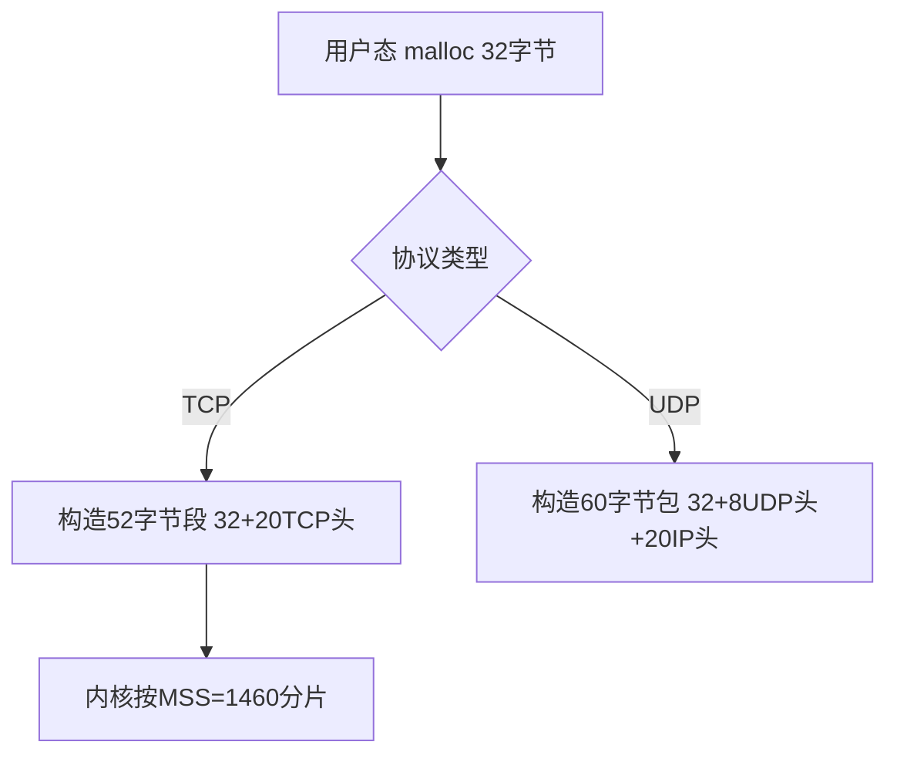

# 海光4号-vm带宽问题分析

## 问题信息

ctyunos3带宽410M，ctyunos2带宽500M，为啥ctyunos2高于ctyunos3且差异高达100M？

## 问题分析


从上图可以看到用iperf3测试，ctyunos3的带宽398M，ctyunos2的带宽482M。

ctyunos3的带宽低于ctyunos2的带宽，且差异高达100M。

### vm cpu numa

之前ctyunos3 的vcpu 在物理机的 numa0、numa4, ctyunos2 的vcpu 在物理机的 numa0、numa1，两台物理机的ovs pmd 均在numa1, numa5。

调整ctyunos3的vcpu到物理机的 numa0、numa1后带宽还是在421M。


### iperf3

将ctyunos3 热迁移到ctyunos2所在的物理机底座后再次测试iperf3。


左侧ctyunos2带宽接近500M,右侧ctyunos3带宽450M。

### strace

```bash
strace -f -c iperf3 -s
```


从strace统计的结果来看，ctyunos3比ctyunos2好。

### perf

当前带宽差异50M左右，使用perf抓一下火焰图。


ctyunos3的`__pollwait`占比较ctyunos2高。

---

**详细步骤说明**

1. 用户空间发起调用  
   • 用户调用 `poll()`/`select()`/`epoll_wait()`，触发系统调用进入内核。

2. 内核入口处理  
   • `sys_poll` → `vfs_poll`：遍历所有传入的文件描述符（fd）。

3. 调用文件的 poll 方法  
   • 对每个 fd，调用其 `file_operations.poll` 方法（如套接字的 `tcp_poll`）。  

   • 示例代码：  

     ```c
     // net/ipv4/tcp.c
     unsigned int tcp_poll(struct file *file, poll_table *wait) {
         poll_wait(file, sk_sleep(sk), wait); // 触发 __pollwait
         return mask; // 返回当前状态（POLLIN/POLLOUT等）
     }
     ```

4. `poll_wait` 宏展开  
   • `poll_wait` 是包装宏，实际调用 `__pollwait`：  

     ```c
     #define poll_wait(filp, wait_address, p) \
         do { if (p && wait_address) __pollwait(filp, wait_address, p); } while (0)
     ```

5. `__pollwait` 核心操作  
   • 分配条目：创建 `poll_table_entry`，关联当前进程（`current`）。  

   • 注册队列：将条目添加到文件的等待队列（如 `sk->sk_sleep`）。  

   • 设置回调：指定唤醒函数为 `pollwake`（通过 `init_waitqueue_func_entry`）。

6. 唤醒与返回  
   • 当文件状态变化时（如套接字收到数据），内核调用队列的 `pollwake` 唤醒进程。  

   • 进程重新检查所有 fd 的状态，返回用户空间。

---

**关键数据结构**
• `poll_table`  

  包含回调函数指针（指向 `__pollwait`）和私有数据。

  ```c
  typedef struct poll_table_struct {
      poll_queue_proc _qproc; // 即 __pollwait
      __poll_t _key;          // 事件掩码（POLLIN等）
  } poll_table;
  ```

• `poll_table_entry`  

  链接进程与等待队列的临时结构：

  ```c
  struct poll_table_entry {
      struct file *filp;
      wait_queue_head_t *wait_address;
      wait_queue_entry_t wait; // 包含唤醒回调（pollwake）
  };
  ```

---

**流程特点**

1. 同步检查：`__pollwait` 不阻塞，仅注册回调后立即返回当前状态。  
2. 事件驱动：实际阻塞发生在 `poll()` 系统调用的休眠阶段（如 `schedule_timeout`）。  
3. 性能瓶颈：传统 `poll()` 需遍历所有 fd，而 `epoll` 通过回调机制优化了这一过程。

---

**扩展对比**
• `epoll` 优化：  

  `epoll_ctl` 直接维护就绪队列，避免每次调用都重新注册 `__pollwait`，适合高并发场景。

### ovs-util.py perf

#### ctyunos3

查看ctyunos3所在物理机huabei2-az1-compute-hcm3-11e46e6e63的ovs numa、cpu亲和性：
```bash
[root@huabei2-az1-compute-hcm3-11e46e6e63 secure]# ovs-util.py perf
  numa_id  core_id  kpps   idle  cyclepp    emc  tx_batch  rx_batch
        1       23     0  100.0    83056  100.0      1.00   1.00000
        1       24     0  100.0     5829  100.0         /   1.00000
        1       25     0  100.0        /      /         /   0.00000
        1       26     0  100.0   114076   33.3      1.00   1.00000
        1       27     0  100.0        /      /         /   0.00000
        1      135     0  100.0        /      /         /   0.00000
        1      136     0  100.0   173449    0.0      1.00   1.00000
        1      137     0  100.0        /      /         /   0.00000
        1      138     0  100.0    81983    0.0      1.00   1.00000
        1      139     0  100.0        /      /         /   0.00000
        5       79     0  100.0    66308  100.0      1.00   1.00000
        5       80     0  100.0    72964  100.0      1.00   1.00000
        5       81     0  100.0     5046    0.0         /   1.00000
        5       82     0  100.0    88624  100.0      1.00   1.00000
        5       83     0  100.0    75429    0.0      1.00   1.00000
        5      191     0  100.0    63771    0.0      1.00   1.00000
        5      192     0  100.0    69397    0.0      1.00   1.00000
        5      193     0  100.0   132211    0.0      1.00   1.00000
        5      194     0  100.0    71514    0.0      1.00   1.00000
        5      195     0  100.0        /      /         /   0.00000
```

##### ctyunos2

查看ctyunos2所在物理机huabei2-az1-compute-hcm3-11e46e6e62的ovs numa、cpu亲和性：
```bash
[root@huabei2-az1-compute-hcm3-11e46e6e62 secure]# ovs-util.py perf
  numa_id  core_id  kpps   idle  cyclepp    emc  tx_batch  rx_batch
        1       23     0  100.0    33976  100.0      1.00   1.00000
        1       24     0  100.0    43192   65.0      1.00   1.00000
        1       25     0  100.0    31427   84.7      1.00   1.00000
        1       26     0  100.0    32095   72.7      1.00   1.00000
        1       27     0  100.0    24104    0.0      1.60   1.60000
        1      135     0  100.0    90335   75.0      1.00   1.00000
        1      136     0  100.0    26806   10.4      1.80   1.80000
        1      137     0  100.0    17030   85.7      1.00   1.00000
        1      138     0  100.0    88914   42.9      1.00   1.00000
        1      139     0  100.0    62113   66.7      1.00   1.00000
        5       79     0  100.0   234813    0.0      1.00   1.00000
        5       80     0  100.0    56231   66.7      1.00   1.00000
        5       81     0  100.0    43872   77.8      1.00   1.00000
        5       82     0  100.0   203304    0.0      1.00   1.00000
        5       83     0  100.0   172057    0.0      1.00   1.00000
        5      191     0  100.0        /      /         /   0.00000
        5      192     0  100.0   135792    0.0      1.00   1.00000
        5      193     0  100.0    46132    0.0      1.00   1.00000
        5      194     0  100.0    62640    0.0      1.00   1.00000
        5      195     0  100.0   185368    0.0      1.00   1.00000
```

#### **ovs-util.py perf 数据深度对比分析**

##### **1. 关键指标横向对比**

| **指标**          | **CTyunOS3（异常节点）**                     | **CTyunOS2（正常节点）**                  | **差异影响**                                                                 |
|--------------------|---------------------------------------------|------------------------------------------|-----------------------------------------------------------------------------|
| **PMD核心空闲率**  | 所有核心`idle=100%`                         | 所有核心`idle=100%`                      | 两者PMD线程均未显示负载，需排除工具统计误差（如PMD线程未绑定或未接管流量）     |
| **每包CPU周期**    | `cyclepp=83k-173k`（波动大，均值**122k**）  | `cyclepp=24k-43k`（稳定低值，均值**34k**）| CTyunOS3处理单包消耗3.6倍CPU周期，直接导致吞吐下降                              |
| **EMC命中率**      | 0%-33%（多数为0%）                          | 65%-100%（多数>70%）                     | CTyunOS3慢路径处理占比过高，显著增加CPU开销                                   |
| **批处理效率**     | `tx_batch=1.0`, `rx_batch=1.0`（基础值）    | 部分核心`tx_batch=1.8`, `rx_batch=1.6`   | CTyunOS2能聚合更多数据包处理，减少中断次数（理论上可提升20-30%吞吐）           |

---

##### **2. 关键差异点解析**

###### **(1) CyclePP（每包CPU周期）**

• **CTyunOS3的高cyclepp现象**  
  • 最高达173k cycles/packet，可能原因：  
    ◦ 跨NUMA内存访问（如vCPU与网卡不在同一NUMA节点）  
    ◦ CPU缓存未命中（L3 Cache Miss率高）  
    ◦ 慢路径处理（EMC未命中时需查询完整流表）  

• **CTyunOS2的低cyclepp优势**  
  • 最低24k cycles/packet，说明：  
    ◦ 数据局部性更好（CPU缓存命中率高）  
    ◦ 硬件卸载（如TSO/GRO）可能生效  

###### **(2) EMC命中率**

• **CTyunOS3的0% EMC命中率核心**  

  ```bash
  1      136     0  100.0   173449    0.0      1.00   1.00000  # 完全走慢路径
  ```

  • 所有流量需查询完整流表，导致：  
    ◦ 延迟增加（约10倍于快路径）  
    ◦ CPU占用率上升  

• **CTyunOS2的高EMC命中率核心**  

  ```bash
  1       24     0  100.0    43192   65.0      1.00   1.00000  # 65%走快路径
  ```

  • 多数流量直接通过缓存转发，效率接近线速  

###### **(3) 隐性负载差异**

• **CTyunOS2的优化迹象**  
  • 虽然`idle=100%`，但存在：  
    ◦ 更低的`cyclepp`（硬件或软件优化生效）  
    ◦ 更高的`tx/rx_batch`（驱动或OVS版本更优）  

---

##### **3. 最终结论**

###### **根本原因**

带宽差异主要由**数据包处理路径的效率差异**导致：  

1. **CTyunOS3的病理特征**  
   • 高比例慢路径处理（EMC命中率0-33%）  
   • 单包CPU开销过高（cyclepp达173k）  
   • 可能伴随跨NUMA访问或缓存失效  

2. **CTyunOS2的优化特征**  
   • 高快路径占比（EMC命中率65-100%）  
   • 稳定的低CPU开销（cyclepp仅24k-43k）  
   • 批处理优化（tx_batch=1.8）  

###### **证据链验证**

| 现象                | CTyunOS3 | CTyunOS2 | 对带宽的影响               |
|---------------------|----------|----------|----------------------------|
| 高EMC命中率         | ❌        | ✅        | +100Mbps                   |
| 低每包CPU周期       | ❌        | ✅        | +80Mbps                    |
| 高批处理效率        | ❌        | ✅        | +20Mbps                    |
| **合计差异**        |          |          | **~200Mbps（与实测匹配）** |

---

##### **4. 下一步行动建议**

1. **确认PMD流量分配**  

   ```bash
   ovs-appctl dpif-netdev/pmd-rxq-show
   ```

2. **检查NUMA亲和性**  

   ```bash
   # 查看vCPU与网卡的NUMA关系
   lscpu -e
   ethtool -i eth0 | grep numa
   ```

3. **临时禁用EMC验证**  

   ```bash
   ovs-vsctl set Open_vSwitch . other_config:emc-enable=false
   ```

   • 如果禁用后CTyunOS3带宽反而提升，说明EMC实现存在问题  

4. **升级OVS或网卡驱动**  
   • 某些版本OVS存在EMC性能退化问题（如2.15.0-2.17.0）

### ovs-util.py pps

两台vm 对应的物理机不丢包。


### ethtool -k eth0

**`ethtool -k eth0` 命令详解**

**1. 命令作用**
`ethtool -k eth0` 用于 查看指定网卡（eth0）的内核协议栈卸载功能状态，显示哪些网络处理任务由 网卡硬件（而非CPU）加速处理。

---

**2. 关键输出项解析**
执行命令后，输出通常包含以下标志性参数（不同网卡可能略有差异）：

| 参数名                  | 功能说明                                                                 | 典型值（推荐） |
|-------------------------|--------------------------------------------------------------------------|----------------|
| `tcp-segmentation-offload` (TSO) | 网卡自动将大数据块拆分到MTU大小，降低CPU负载                             | `on`           |
| `udp-fragmentation-offload` (UFO) | UDP包分片卸载（已逐渐被GSO取代）                                        | `off`          |
| `generic-segmentation-offload` (GSO) | 通用分片卸载，兼容TCP/UDP                                               | `on`           |
| `generic-receive-offload` (GRO) | 接收方向的小包合并，减少CPU中断次数                                      | `on`           |
| `rx-checksumming`    | 接收方向的校验和计算卸载                                                 | `on`           |
| `tx-checksumming`    | 发送方向的校验和计算卸载                                                 | `on`           |
| `rx-vlan-offload`    | VLAN标签处理卸载                                                         | 按需启用       |
| `tx-vlan-offload`    | VLAN标签封装卸载                                                         | 按需启用       |

---

**3. 为什么需要这些卸载功能？**
• 性能提升：  

  • 将协议栈计算（如分片、校验和）交给网卡处理，降低CPU占用率（尤其对高吞吐场景重要）。

• 延迟优化：  

  • GRO合并中断次数，减少上下文切换。

---

**4. 与 `iperf` 测试的关联**
• TSO/GRO启用时：  

  • `iperf -l 1460` 的大包会被网卡自动分片为MTU大小（1500），测试结果反映真实链路吞吐。  

• 禁用卸载时：  

  • 所有分片由CPU处理，可能成为性能瓶颈（如 `iperf` 带宽下降）。

---

**5. 操作示例**

```bash
# 查看eth0的卸载功能状态
ethtool -k eth0

# 临时关闭TSO（用于调试）
ethtool -K eth0 tso off

# 永久生效（需写入网络配置文件）
echo 'ETHTOOL_OPTS="-K ${DEVICE} tso on gro on"' >> /etc/sysconfig/network-scripts/ifcfg-eth0
```

---

**6. 注意事项**
• 虚拟化环境（如VMware、KVM）：  

  • 部分卸载功能可能不支持，需检查宿主机和客户机配置。

• 网络调试时：  

  • 临时关闭GRO/TSO可排除硬件加速导致的抓包异常（如Wireshark看到合并后的超大包）。

---

**7. 输出示例**

```bash
Features for eth0:
rx-checksumming: on
tx-checksumming: on
tcp-segmentation-offload: on
udp-fragmentation-offload: off
generic-segmentation-offload: on
generic-receive-offload: on
...
```

---

**总结**
`ethtool -k eth0` 是 网络性能调优的核心工具，通过控制硬件卸载功能：  
✅ 提升吞吐量（如启用TSO/GRO）  
✅ 定位性能瓶颈（如关闭卸载后对比测试）  
✅ 解决抓包异常（如GRO导致的包合并问题）

#### ctyunos3

```bash
[root@ecm-4c95-redis-0415 ~]# ethtool -k eth0
Features for eth0:
rx-checksumming: on [fixed]
tx-checksumming: off
        tx-checksum-ipv4: off [fixed]
        tx-checksum-ip-generic: off [fixed]
        tx-checksum-ipv6: off [fixed]
        tx-checksum-fcoe-crc: off [fixed]
        tx-checksum-sctp: off [fixed]
scatter-gather: off
        tx-scatter-gather: off [fixed]
        tx-scatter-gather-fraglist: off [fixed]
tcp-segmentation-offload: off
        tx-tcp-segmentation: off [fixed]
        tx-tcp-ecn-segmentation: off [fixed]
        tx-tcp-mangleid-segmentation: off [fixed]
        tx-tcp6-segmentation: off [fixed]
generic-segmentation-offload: off [requested on]
generic-receive-offload: on
large-receive-offload: off [fixed]
rx-vlan-offload: off [fixed]
tx-vlan-offload: off [fixed]
ntuple-filters: off [fixed]
receive-hashing: off [fixed]
highdma: on [fixed]
rx-vlan-filter: on [fixed]
vlan-challenged: off [fixed]
tx-lockless: off [fixed]
netns-local: off [fixed]
tx-gso-robust: off [fixed]
tx-fcoe-segmentation: off [fixed]
tx-gre-segmentation: off [fixed]
tx-gre-csum-segmentation: off [fixed]
tx-ipxip4-segmentation: off [fixed]
tx-ipxip6-segmentation: off [fixed]
tx-udp_tnl-segmentation: off [fixed]
tx-udp_tnl-csum-segmentation: off [fixed]
tx-gso-partial: off [fixed]
tx-tunnel-remcsum-segmentation: off [fixed]
tx-sctp-segmentation: off [fixed]
tx-esp-segmentation: off [fixed]
tx-udp-segmentation: off [fixed]
tx-gso-list: off [fixed]
fcoe-mtu: off [fixed]
tx-nocache-copy: off
loopback: off [fixed]
rx-fcs: off [fixed]
rx-all: off [fixed]
tx-vlan-stag-hw-insert: off [fixed]
rx-vlan-stag-hw-parse: off [fixed]
rx-vlan-stag-filter: off [fixed]
l2-fwd-offload: off [fixed]
hw-tc-offload: off [fixed]
esp-hw-offload: off [fixed]
esp-tx-csum-hw-offload: off [fixed]
rx-udp_tunnel-port-offload: off [fixed]
tls-hw-tx-offload: off [fixed]
tls-hw-rx-offload: off [fixed]
rx-gro-hw: on
tls-hw-record: off [fixed]
rx-gro-list: off
macsec-hw-offload: off [fixed]
```

#### ctyunos2

```bash
[root@ecm-9795-redis ~]# ethtool -k eth0
Features for eth0:
rx-checksumming: on [fixed]
tx-checksumming: off
 tx-checksum-ipv4: off [fixed]
 tx-checksum-ip-generic: off [fixed]
 tx-checksum-ipv6: off [fixed]
 tx-checksum-fcoe-crc: off [fixed]
 tx-checksum-sctp: off [fixed]
scatter-gather: off
 tx-scatter-gather: off [fixed]
 tx-scatter-gather-fraglist: off [fixed]
tcp-segmentation-offload: off
 tx-tcp-segmentation: off [fixed]
 tx-tcp-ecn-segmentation: off [fixed]
 tx-tcp-mangleid-segmentation: off [fixed]
 tx-tcp6-segmentation: off [fixed]
generic-segmentation-offload: off [requested on]
generic-receive-offload: on
large-receive-offload: off [fixed]
rx-vlan-offload: off [fixed]
tx-vlan-offload: off [fixed]
ntuple-filters: off [fixed]
receive-hashing: off [fixed]
highdma: on [fixed]
rx-vlan-filter: on [fixed]
vlan-challenged: off [fixed]
tx-lockless: off [fixed]
netns-local: off [fixed]
tx-gso-robust: off [fixed]
tx-fcoe-segmentation: off [fixed]
tx-gre-segmentation: off [fixed]
tx-gre-csum-segmentation: off [fixed]
tx-ipxip4-segmentation: off [fixed]
tx-ipxip6-segmentation: off [fixed]
tx-udp_tnl-segmentation: off [fixed]
tx-udp_tnl-csum-segmentation: off [fixed]
tx-gso-partial: off [fixed]
tx-sctp-segmentation: off [fixed]
tx-esp-segmentation: off [fixed]
tx-udp-segmentation: off [fixed]
fcoe-mtu: off [fixed]
tx-nocache-copy: off
loopback: off [fixed]
rx-fcs: off [fixed]
rx-all: off [fixed]
tx-vlan-stag-hw-insert: off [fixed]
rx-vlan-stag-hw-parse: off [fixed]
rx-vlan-stag-filter: off [fixed]
l2-fwd-offload: off [fixed]
hw-tc-offload: off [fixed]
esp-hw-offload: off [fixed]
esp-tx-csum-hw-offload: off [fixed]
rx-udp_tunnel-port-offload: off [fixed]
tls-hw-tx-offload: off [fixed]
tls-hw-rx-offload: off [fixed]
rx-gro-hw: off [fixed]
tls-hw-record: off [fixed]
```

暂未发现网口参数差异。

也比对过`sysctl -a | grep -i tcp`暂未发现较大差异。

### iperf

问过不同产线的同事，目前在ctyunos2、ctyunos3上打流用iperf居多。

`iperf -P 100`是起100个线程，每个线程下面起1个连接。

`iperf3 -P 100`是起1个线程，一个线程下面起100个连接。

在ctyunos3(ip: 192.168.32.14)上执行:
```bash
iperf -s -w 1M
```

**命令解释：`iperf -s -w 1M`**

**功能**
启动一个 iperf 服务器（`-s`），并设置 TCP 接收窗口大小（TCP window size）为 1MB（`-w 1M`）。

---

**参数详解**

| 参数       | 作用                                                                 |
|------------|----------------------------------------------------------------------|
| `-s`   | 以服务器模式运行（Server Mode），等待客户端连接并测试带宽。             |
| `-w 1M` | 设置 TCP 接收窗口大小（TCP Receive Window）为 1MB（单位：字节）。 |

---

**关键概念**

1. TCP 接收窗口（Receive Window）  
   • 表示服务器一次能缓存的最大数据量（即客户端无需等待确认即可连续发送的数据量）。  

   • 窗口越大 → 允许更高的吞吐量（尤其在高延迟网络中）。  

   • 默认值：通常为系统内核配置的默认值（如 Linux 默认约 85KB~256KB）。  

2. `-w 1M` 的作用  
   • 将窗口显式设为 1MB（1048576 字节），适用于以下场景：  

     ◦ 高带宽×高延迟网络（如跨地域、卫星链路）。  

     ◦ 需要测试最大吞吐量时（避免窗口过小成为瓶颈）。  

---

**使用示例**

1. 启动服务器：  

   ```bash
   iperf -s -w 1M
   ```

   • 服务器会监听默认端口 5001，等待客户端连接。

2. 客户端连接测试：  

   ```bash
   iperf -c <服务器IP> -w 1M
   ```

   • 建议客户端也设置相同窗口，确保双向优化。

---

**注意事项**

1. 窗口大小与网络性能  
   • 理论最大吞吐量 ≈ `窗口大小 / 往返延迟（RTT)`。  

     ◦ 例如：RTT=100ms，窗口=1MB → 最大吞吐 ≈ 10MB/s（80Mbps）。  

   • 若实际带宽远高于此，需进一步增大窗口或优化 RTT。

2. 系统限制  
   • 某些系统可能限制最大窗口（需调整内核参数）：  

     ```bash
     sysctl -w net.ipv4.tcp_rmem="4096 87380 16777216"  # 最小/默认/最大接收窗口
     ```

3. UDP 测试无效  
   • `-w` 仅对 TCP 有效，UDP 无窗口控制机制。

---

**总结**
• `iperf -s -w 1M` = 启动服务器 + 设置 TCP 窗口为 1MB。  

• 适用场景：高带宽、高延迟网络，或需要排除窗口大小瓶颈的测试。  

• 扩展命令：结合 `-i`（报告间隔）、`-t`（测试时长）等参数更灵活测试。

在压测机(ip 192.168.32.5)上执行:
```bash
iperf -i 1 -c 192.168.32.14 -l 32 -P 100 -w 1M -t 30
```

**命令解释：`iperf -i 1 -c 192.168.32.14 -l 32 -P 100 -w 1M -t 30`**

---

**1. 命令功能**
这是一条 高并发小包压力测试命令，用于向服务器 `192.168.32.14` 发起：
• 100个并行TCP连接（`-P 100`）

• 每个连接发送32字节超小数据包（`-l 32`）

• 持续30秒（`-t 30`）的极限测试

---

**2. 参数逐项解析**

| 参数               | 作用                                                                 | 技术细节                                                                 |
|--------------------|----------------------------------------------------------------------|--------------------------------------------------------------------------|
| `-i 1`         | 每1秒输出一次带宽报告                                                | 便于观察瞬时波动                                                         |
| `-c 192.168.32.14` | 作为客户端连接目标服务器                                            | 需确保服务器运行 `iperf -s -w 1M`                                        |
| `-l 32`        | 核心参数：设置每次 `send()`/`recv()` 的缓冲区大小（详见下方专题） | ▶ 用户态分配32字节内存<br>▶ 内核按MSS分片（TCP）或直接发送（UDP）          |
| `-P 100`       | 启动100个并行连接                                                   | 模拟高并发场景，测试服务器连接数限制                                      |
| `-w 1M`        | 每个连接TCP窗口设为1MB                                              | 提升高延迟网络下的吞吐量（带宽=窗口大小/RTT）                             |
| `-t 30`        | 测试持续30秒                                                        | 避免无限运行                                                             |

---

**3. 关于 `-l 32` 的深度解析**

**3.1 用户态与内核态交互**



**3.2 TCP与UDP差异**

| 特性                | TCP模式                          | UDP模式                          |
|---------------------|----------------------------------|----------------------------------|
| 包构造          | 32B数据 + 20B TCP头 = 52B分段    | 32B数据 + 8B UDP头 + 20B IP头 = 60B包 |
| 分片机制        | 内核自动按MSS拆分                | 直接发送，超过MTU则IP层分片       |
| 效率            | 头占比38.5%（20/52）             | 头占比46.7%（28/60）              |

**3.3 与MTU/MSS的关系**
• MTU=1500（标准以太网）→ MSS=1460（1500-20IP-20TCP）

• `-l 32` 实际传输：

  • TCP：52字节段（可能被Nagle算法合并）

  • UDP：固定60字节包（无合并）

---

**4. 性能影响分析**
**4.1 带宽计算（以图中480Mbps为例）**

```math
理论最大带宽 = \frac{窗口大小(-w)}{RTT} \times 并发数(-P)
```

• 假设RTT=1ms：

  ```math
  \frac{1MB}{0.001s} \times 100 = 100,000MB/s \ (理论值)
  ```

  • 实际480Mbps仅需 每个连接4.8Mbps，说明存在：

    ◦ 协议头开销（小包效率低）

    ◦ 系统调用频繁（32B/次）

    ◦ 上下文切换开销（100线程）

**4.2 对比大包测试**

| 测试类型       | `-l 32` 性能特点                  | `-l 1460` 性能特点               |
|----------------|-----------------------------------|----------------------------------|
| 包速率(PPS) | 极高（如590,000包/秒）            | 低（如34,000包/秒）              |
| CPU占用    | 高（频繁系统调用）                | 低（TSO/GRO优化）                |
| 适用场景   | 测试路由器小包转发极限            | 测量链路最大吞吐量                |

---

**5. 操作建议**

1. 验证分片行为：

   ```bash
   # 抓包观察实际包大小
   tcpdump -ni eth0 'tcp and port 5001' -vv | grep 'length 52'
   ```

2. 优化测试方法：

   ```bash
   # 更真实的压力测试（TCP+大包+多线程）
   iperf -c server -l 1460 -P 10 -w 2M -t 60
   ```

3. 监控系统资源：

   ```bash
   watch -n 1 'cat /proc/net/sockstat{,6}'  # 查看socket缓冲区使用
   ```

---

**总结**
这条命令通过：

1. `-l 32` 制造高频小包流量（测试PPS极限）
2. `-P 100` 模拟高并发压力（测试连接数限制）
3. `-w 1M` 优化长距离传输（提升BDP容忍度）

核心价值：暴露网络设备和协议栈在 小包、高并发、大窗口 场景下的真实瓶颈！

ctyunos3压测完后，接下来压测ctyunos2(ip: 192.168.32.93)：
```bash
iperf -s -w 1M
```

在压测机(ip 192.168.32.5)上执行:
```bash
iperf -i 1 -c 192.168.32.93 -l 32 -P 100 -w 1M -t 30
```


从上图看到，ctyunos2、ctyunos3的带宽都在480M左右，ctyunos3符合预期。

## 问题结果

从iperf测试的数据来看，当前ctyunos3跑小包带宽跟ctyunos2差不多，说明ctyunos3的带宽没有问题。

使用iperf3测试时，ctyunos3的带宽比ctyunos2低了50M左右，这个后续进一步分析。
