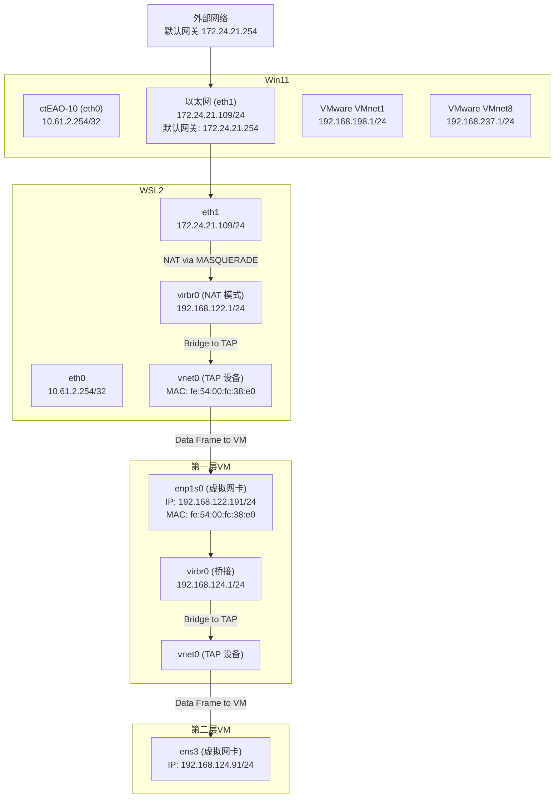

# win11 wsl2 vm嵌套网络拓扑

## win11 网络

```bash
PS C:\Users\17895> ipconfig

Windows IP 配置


未知适配器 ctEAO-10:

   连接特定的 DNS 后缀 . . . . . . . :
   IPv4 地址 . . . . . . . . . . . . : 10.61.2.254
   子网掩码  . . . . . . . . . . . . : 255.255.255.255
   默认网关. . . . . . . . . . . . . :

以太网适配器 以太网:

   连接特定的 DNS 后缀 . . . . . . . :
   本地链接 IPv6 地址. . . . . . . . : fe80::ef34:dd3d:aaaa:75f%25
   IPv4 地址 . . . . . . . . . . . . : 172.24.21.109
   子网掩码  . . . . . . . . . . . . : 255.255.255.0
   默认网关. . . . . . . . . . . . . : 172.24.21.254

无线局域网适配器 WLAN:

   媒体状态  . . . . . . . . . . . . : 媒体已断开连接
   连接特定的 DNS 后缀 . . . . . . . :

无线局域网适配器 本地连接* 9:

   媒体状态  . . . . . . . . . . . . : 媒体已断开连接
   连接特定的 DNS 后缀 . . . . . . . :

无线局域网适配器 本地连接* 10:

   媒体状态  . . . . . . . . . . . . : 媒体已断开连接
   连接特定的 DNS 后缀 . . . . . . . :

以太网适配器 VMware Network Adapter VMnet1:

   连接特定的 DNS 后缀 . . . . . . . :
   本地链接 IPv6 地址. . . . . . . . : fe80::d925:7b6:2ec0:a735%24
   IPv4 地址 . . . . . . . . . . . . : 192.168.198.1
   子网掩码  . . . . . . . . . . . . : 255.255.255.0
   默认网关. . . . . . . . . . . . . :

以太网适配器 VMware Network Adapter VMnet8:

   连接特定的 DNS 后缀 . . . . . . . :
   本地链接 IPv6 地址. . . . . . . . : fe80::13c9:c4a1:5de2:ae2c%7
   IPv4 地址 . . . . . . . . . . . . : 192.168.237.1
   子网掩码  . . . . . . . . . . . . : 255.255.255.0
   默认网关. . . . . . . . . . . . . :

以太网适配器 蓝牙网络连接:

   媒体状态  . . . . . . . . . . . . : 媒体已断开连接
   连接特定的 DNS 后缀 . . . . . . . :
```

## wsl2 网络

```bash
root@wujing:/mnt/c/Users/17895# cat .wslconfig
[wsl2]
kernel=C:\\Users\\17895\\bzImage
networkingMode=mirrored

# Enable experimental features
[experimental]
sparseVhd=true
```

```bash
root@wujing:~# ip a
1: lo: <LOOPBACK,UP,LOWER_UP> mtu 65536 qdisc noqueue state UNKNOWN group default qlen 1000
    link/loopback 00:00:00:00:00:00 brd 00:00:00:00:00:00
    inet 127.0.0.1/8 scope host lo
       valid_lft forever preferred_lft forever
    inet 10.255.255.254/32 brd 10.255.255.254 scope global lo
       valid_lft forever preferred_lft forever
    inet6 ::1/128 scope host
       valid_lft forever preferred_lft forever
2: eth0: <BROADCAST,MULTICAST,UP,LOWER_UP> mtu 1420 qdisc mq state UP group default qlen 1000
    link/ether 00:15:5d:13:0c:12 brd ff:ff:ff:ff:ff:ff
    inet 10.61.2.254/32 brd 10.61.2.254 scope global noprefixroute eth0
       valid_lft forever preferred_lft forever
3: eth1: <BROADCAST,MULTICAST,UP,LOWER_UP> mtu 1500 qdisc mq state UP group default qlen 1000
    link/ether 1c:83:41:cf:a8:7c brd ff:ff:ff:ff:ff:ff
    inet 172.24.21.109/24 brd 172.24.21.255 scope global noprefixroute eth1
       valid_lft forever preferred_lft forever
    inet6 fe80::ef34:dd3d:aaaa:75f/64 scope link nodad noprefixroute
       valid_lft forever preferred_lft forever
4: eth2: <BROADCAST,MULTICAST> mtu 1500 qdisc mq state DOWN group default qlen 1000
    link/ether 00:50:56:c0:00:01 brd ff:ff:ff:ff:ff:ff
5: eth3: <BROADCAST,MULTICAST> mtu 1500 qdisc mq state DOWN group default qlen 1000
    link/ether a8:59:5f:53:19:d9 brd ff:ff:ff:ff:ff:ff
6: loopback0: <BROADCAST,MULTICAST,UP,LOWER_UP> mtu 1500 qdisc mq state UP group default qlen 1000
    link/ether 00:15:5d:78:8f:74 brd ff:ff:ff:ff:ff:ff
7: eth4: <BROADCAST,MULTICAST> mtu 1500 qdisc mq state DOWN group default qlen 1000
    link/ether 00:50:56:c0:00:08 brd ff:ff:ff:ff:ff:ff
8: virbr0: <BROADCAST,MULTICAST,UP,LOWER_UP> mtu 1500 qdisc noqueue state UP group default qlen 1000
    link/ether 52:54:00:7d:0b:60 brd ff:ff:ff:ff:ff:ff
    inet 192.168.122.1/24 brd 192.168.122.255 scope global virbr0
       valid_lft forever preferred_lft forever
9: vnet0: <BROADCAST,MULTICAST,UP,LOWER_UP> mtu 1500 qdisc noqueue master virbr0 state UNKNOWN group default qlen 1000
    link/ether fe:54:00:fc:38:e0 brd ff:ff:ff:ff:ff:ff
```

```bash
root@wujing:~# ip route
default via 172.24.21.254 dev eth1 proto kernel metric 25
10.113.0.0/16 via 169.254.1.1 dev eth0 proto kernel metric 1
10.246.28.220 via 169.254.1.1 dev eth0 proto kernel metric 1
10.246.28.230 via 169.254.1.1 dev eth0 proto kernel metric 1
10.246.117.145 via 169.254.1.1 dev eth0 proto kernel metric 1
10.246.183.186 via 169.254.1.1 dev eth0 proto kernel metric 1
10.251.232.140 via 169.254.1.1 dev eth0 proto kernel metric 1
10.251.232.146 via 169.254.1.1 dev eth0 proto kernel metric 1
21.40.82.136 via 169.254.1.1 dev eth0 proto kernel metric 1
21.40.82.148 via 169.254.1.1 dev eth0 proto kernel metric 1
21.40.82.149 via 169.254.1.1 dev eth0 proto kernel metric 1
21.40.82.155 via 169.254.1.1 dev eth0 proto kernel metric 1
21.40.82.156 via 169.254.1.1 dev eth0 proto kernel metric 1
21.40.82.157 via 169.254.1.1 dev eth0 proto kernel metric 1
21.40.83.2/31 via 169.254.1.1 dev eth0 proto kernel metric 1
21.40.83.5 via 169.254.1.1 dev eth0 proto kernel metric 1
21.40.83.6/31 via 169.254.1.1 dev eth0 proto kernel metric 1
21.40.83.8/31 via 169.254.1.1 dev eth0 proto kernel metric 1
21.40.83.10 via 169.254.1.1 dev eth0 proto kernel metric 1
21.40.83.11 via 169.254.1.1 dev eth0 proto kernel metric 1
21.40.83.13 via 169.254.1.1 dev eth0 proto kernel metric 1
21.40.83.14/31 via 169.254.1.1 dev eth0 proto kernel metric 1
21.40.83.19 via 169.254.1.1 dev eth0 proto kernel metric 1
21.40.83.20/31 via 169.254.1.1 dev eth0 proto kernel metric 1
21.40.83.23 via 169.254.1.1 dev eth0 proto kernel metric 1
21.40.83.32 via 169.254.1.1 dev eth0 proto kernel metric 1
21.40.83.41 via 169.254.1.1 dev eth0 proto kernel metric 1
21.40.83.50 via 169.254.1.1 dev eth0 proto kernel metric 1
21.40.83.51 via 169.254.1.1 dev eth0 proto kernel metric 1
21.40.83.58 via 169.254.1.1 dev eth0 proto kernel metric 1
21.40.83.59 via 169.254.1.1 dev eth0 proto kernel metric 1
21.40.83.61 via 169.254.1.1 dev eth0 proto kernel metric 1
21.40.83.62/31 via 169.254.1.1 dev eth0 proto kernel metric 1
21.40.83.64 via 169.254.1.1 dev eth0 proto kernel metric 1
21.40.83.80 via 169.254.1.1 dev eth0 proto kernel metric 1
21.57.154.133 via 169.254.1.1 dev eth0 proto kernel metric 1
21.57.154.134 via 169.254.1.1 dev eth0 proto kernel metric 1
30.0.196.125 via 169.254.1.1 dev eth0 proto kernel metric 1
30.8.7.65 via 169.254.1.1 dev eth0 proto kernel metric 1
169.254.1.1 via 169.254.1.1 dev eth0 proto kernel metric 1
169.254.1.1 dev eth0 proto kernel scope link metric 1
172.24.21.0/24 dev eth1 proto kernel scope link metric 281
172.24.21.254 dev eth1 proto kernel scope link metric 25
192.168.122.0/24 dev virbr0 proto kernel scope link src 192.168.122.1
```

```bash
root@wujing:~# brctl show
bridge name     bridge id               STP enabled     interfaces
virbr0          8000.5254007d0b60       yes             vnet0
```

```bash
root@wujing:/mnt/c/Users/17895# iptables -t nat -L -v -n
# Table `nat' contains incompatible base-chains, use 'nft' tool to list them.
Chain PREROUTING (policy ACCEPT 0 packets, 0 bytes)
 pkts bytes target     prot opt in     out     source               destination

Chain INPUT (policy ACCEPT 0 packets, 0 bytes)
 pkts bytes target     prot opt in     out     source               destination

Chain OUTPUT (policy ACCEPT 0 packets, 0 bytes)
 pkts bytes target     prot opt in     out     source               destination
                                                                                                                                                                       Chain POSTROUTING (policy ACCEPT 336K packets, 20M bytes)
 pkts bytes target     prot opt in     out     source               destination
 336K   20M LIBVIRT_PRT  0    --  *      *       0.0.0.0/0            0.0.0.0/0

Chain LIBVIRT_PRT (1 references)
 pkts bytes target     prot opt in     out     source               destination
   15  1142 RETURN     0    --  *      *       192.168.122.0/24     224.0.0.0/24
    0     0 RETURN     0    --  *      *       192.168.122.0/24     255.255.255.255
    5   300 MASQUERADE  6    --  *      *       192.168.122.0/24    !192.168.122.0/24     masq ports: 1024-65535
    0     0 MASQUERADE  17   --  *      *       192.168.122.0/24    !192.168.122.0/24     masq ports: 1024-65535
    2   168 MASQUERADE  0    --  *      *       192.168.122.0/24    !192.168.122.0/24
```

### wsl2 上添加静态路由

```bash
ip route add 192.168.124.0/24 via 192.168.122.191 dev virbr0
```

含义：告诉物理机，124 网段的所有包，转发给 122.191（即第一层 VM）

如需永久保存：

- Debian/CentOS: 添加到 /etc/network/interfaces 或 nmcli connection modify

可以看到新增了一条路由：

```bash
ip route | grep 192.168.124.0
192.168.124.0/24 via 192.168.122.191 dev virbr0
```

## 第一层vm

```bash
root@debian:/home/wujing# ip a
1: lo: <LOOPBACK,UP,LOWER_UP> mtu 65536 qdisc noqueue state UNKNOWN group default qlen 1
    link/loopback 00:00:00:00:00:00 brd 00:00:00:00:00:00
    inet 127.0.0.1/8 scope host lo
       valid_lft forever preferred_lft forever
    inet6 ::1/128 scope host
       valid_lft forever preferred_lft forever
2: enp1s0: <BROADCAST,MULTICAST,UP,LOWER_UP> mtu 1500 qdisc pfifo_fast state UP group default qlen 1000
    link/ether 52:54:00:fc:38:e0 brd ff:ff:ff:ff:ff:ff
    inet 192.168.122.191/24 brd 192.168.122.255 scope global dynamic enp1s0
       valid_lft 2200sec preferred_lft 2200sec
    inet6 fe80::5054:ff:fefc:38e0/64 scope link
       valid_lft forever preferred_lft forever
3: virbr0: <BROADCAST,MULTICAST,UP,LOWER_UP> mtu 1500 qdisc noqueue state UP group default qlen 1000
    link/ether 52:54:00:e8:c6:c3 brd ff:ff:ff:ff:ff:ff
    inet 192.168.124.1/24 brd 192.168.124.255 scope global virbr0
       valid_lft forever preferred_lft forever
4: virbr0-nic: <BROADCAST,MULTICAST> mtu 1500 qdisc pfifo_fast master virbr0 state DOWN group default qlen 1000
    link/ether 52:54:00:e8:c6:c3 brd ff:ff:ff:ff:ff:ff
5: vnet0: <BROADCAST,MULTICAST,UP,LOWER_UP> mtu 1500 qdisc pfifo_fast master virbr0 state UNKNOWN group default qlen 1000
    link/ether fe:54:00:5a:1a:8e brd ff:ff:ff:ff:ff:ff
    inet6 fe80::fc54:ff:fe5a:1a8e/64 scope link
       valid_lft forever preferred_lft forever
```

```bash
root@debian:/home/wujing# ip route
default via 192.168.122.1 dev enp1s0 proto static metric 100
192.168.122.0/24 dev enp1s0 proto kernel scope link src 192.168.122.191 metric 100
192.168.124.0/24 dev virbr0 proto kernel scope link src 192.168.124.1
```

```bash
root@debian:/home/wujing# iptables -L -v -n
Chain INPUT (policy ACCEPT 238K packets, 378M bytes)
 pkts bytes target     prot opt in     out     source               destination
 12   744 ACCEPT     udp  --  virbr0 *       0.0.0.0/0            0.0.0.0/0            udp dpt:53

 7   454 ACCEPT     tcp  --  virbr0 *       0.0.0.0/0            0.0.0.0/0            tcp dpt:53
 21  6888 ACCEPT     udp  --  virbr0 *       0.0.0.0/0            0.0.0.0/0            udp dpt:67
 0     0 ACCEPT     tcp  --  virbr0 *       0.0.0.0/0            0.0.0.0/0            tcp dpt:67
Chain FORWARD (policy ACCEPT 0 packets, 0 bytes)
 pkts bytes target     prot opt in     out     source               destination
 40  5530 ACCEPT     all  --  *      virbr0  0.0.0.0/0            192.168.124.0/24     ctstate RELATED,ESTABLISHED
 50  4671 ACCEPT     all  --  virbr0 *       192.168.124.0/24     0.0.0.0/0
 0     0 ACCEPT     all  --  virbr0 virbr0  0.0.0.0/0            0.0.0.0/0
 4   336 REJECT     all  --  *      virbr0  0.0.0.0/0            0.0.0.0/0            reject-with icmp-port-unreachable
 0     0 REJECT     all  --  virbr0 *       0.0.0.0/0            0.0.0.0/0            reject-with icmp-port-unreachable
```

问题出在 第一层 VM 的 iptables 的 FORWARD 链：

- 存在默认的 REJECT 规则（行 7 和 8）：

    ```bash
    REJECT all -- * virbr0 ... reject-with icmp-port-unreachable
    REJECT all -- virbr0 * ... reject-with icmp-port-unreachable
    ```

### 第一层 VM 配置 iptables 放通转发

调整 iptables 规则，删除那两条 REJECT 规则，允许转发第二层 VM 的流量：

```bash
iptables -D FORWARD -o virbr0 -j REJECT --reject-with icmp-port-unreachable
iptables -D FORWARD -i virbr0 -j REJECT --reject-with icmp-port-unreachable
```

或者更温和的做法是插入规则允许对应流量：

```bash
root@debian:/home/wujing# iptables -I FORWARD 1 -i virbr0 -o virbr0 -j ACCEPT
root@debian:/home/wujing# iptables -I FORWARD 1 -s 192.168.124.0/24 -d 192.168.122.0/24 -j ACCEPT
root@debian:/home/wujing# iptables -I FORWARD 1 -s 192.168.122.0/24 -d 192.168.124.0/24 -j ACCEPT
```

```bash
root@debian:/home/wujing# iptables -L FORWARD -v -n --line-numbers
Chain FORWARD (policy ACCEPT 0 packets, 0 bytes)
num   pkts bytes target     prot opt in     out     source               destination
1        0     0 ACCEPT     all  --  *      *       192.168.122.0/24     192.168.124.0/24
2        0     0 ACCEPT     all  --  *      *       192.168.124.0/24     192.168.122.0/24
3        0     0 ACCEPT     all  --  virbr0 virbr0  0.0.0.0/0            0.0.0.0/0
4       40  5530 ACCEPT     all  --  *      virbr0  0.0.0.0/0            192.168.124.0/24     ctstate RELATED,ESTABLISHED
5       50  4671 ACCEPT     all  --  virbr0 *       192.168.124.0/24     0.0.0.0/0
6        0     0 ACCEPT     all  --  virbr0 virbr0  0.0.0.0/0            0.0.0.0/0
7        4   336 REJECT     all  --  *      virbr0  0.0.0.0/0            0.0.0.0/0            reject-with icmp-port-unreachable
8        0     0 REJECT     all  --  virbr0 *       0.0.0.0/0            0.0.0.0/0            reject-with icmp-port-unreachable
```

由于 iptables 是顺序匹配的，因此这些 ACCEPT 规则生效，优先于后面的 REJECT，从而解决了问题。

## 第二层vm

```bash
root@debian:/home/wujing# ip a
1: lo: <LOOPBACK,UP,LOWER_UP> mtu 65536 qdisc noqueue state UNKNOWN group default qlen 1
    link/loopback 00:00:00:00:00:00 brd 00:00:00:00:00:00
    inet 127.0.0.1/8 scope host lo
       valid_lft forever preferred_lft forever
    inet6 ::1/128 scope host
       valid_lft forever preferred_lft forever
2: ens3: <BROADCAST,MULTICAST,UP,LOWER_UP> mtu 1500 qdisc pfifo_fast state UP group default qlen 1000
    link/ether 52:54:00:5a:1a:8e brd ff:ff:ff:ff:ff:ff
    inet 192.168.124.91/24 brd 192.168.124.255 scope global dynamic ens3
       valid_lft 2208sec preferred_lft 2208sec
    inet6 fe80::5054:ff:fe5a:1a8e/64 scope link
       valid_lft forever preferred_lft forever

root@debian:/home/wujing# ip route
default via 192.168.124.1 dev ens3 proto static metric 100
192.168.124.0/24 dev ens3 proto kernel scope link src 192.168.124.91 metric 100
```

在wsl2 上添加静态路由、第一层 VM 配置 iptables 放通转发后，wsl2 与第二层 VM 互通，ping、ssh等都行。

## 网络拓扑图

基于提供的信息，将给出网络拓扑图，反映从 Win11 到 WSL2 以及 WSL2 上的嵌套虚拟机（第一层 VM 和第二层 VM）的网络结构。拓扑图将包含 NAT 模式下的 `virbr0` 不直接桥接 `eth1` 的特性，并考虑静态路由和 iptables 配置。以下是使用 Mermaid 格式的网络拓扑图代码：

### Mermaid 代码



### 说明

1. **Win11**：
   - `ctEAO-10 (eth0)`: IP 10.61.2.254/32，WSL2 的虚拟接口。
   - `以太网 (eth1)`: IP 172.24.21.109/24，默认网关 172.24.21.254，连接外部网络。
   - `VMware VMnet1` 和 `VMnet8`: VMware 虚拟网络，未直接参与 WSL2 嵌套。

2. **WSL2**：
   - `eth0`: IP 10.61.2.254/32，映射 Win11 的 `ctEAO-10`。
   - `eth1`: IP 172.24.21.109/24，映射 Win11 的 `以太网`，通过 NAT 间接支持 `virbr0`。
   - `virbr0`: IP 192.168.122.1/24，使用 NAT 模式，桥接 `vnet0`，流量通过 `MASQUERADE` 规则转换到 `eth1` 的 IP。
   - `vnet0`: 虚拟网卡，连接到第一层 VM 的 `enp1s0`。

3. **第一层 VM**：
   - `enp1s0`: IP 192.168.122.191/24，连接 WSL2 的 `virbr0`。
   - `virbr0`: IP 192.168.124.1/24，桥接 `vnet0` 和第二层 VM。
   - `vnet0`: 虚拟网卡，连接到第二层 VM 的 `ens3`。

4. **第二层 VM**：
   - `ens3`: IP 192.168.124.91/24，嵌套在第一层 VM 内。

5. **流量路径**：
   - 外部网络 → Win11 `eth1` → WSL2 `eth1` → NAT (via iptables `MASQUERADE`) → `virbr0` → `vnet0` → 第一层 VM `enp1s0` → 第一层 VM `virbr0` → `vnet0` → 第二层 VM `ens3`。
   - 返回流量通过 PREROUTING 反向映射，静态路由 (`192.168.124.0/24 via 192.168.122.191`) 和 iptables 放通转发确保互通。

### 关键配置点

- **WSL2 网络模式**：`.wslconfig` 的 `networkingMode=mirrored` 使 WSL2 网络镜像 Win11。
- **NAT 模式**：`virbr0` 使用 NAT，`MASQUERADE` 规则动态转换地址，无需桥接 `eth1`。
- **静态路由**：WSL2 的 `ip route add 192.168.124.0/24 via 192.168.122.191` 转发嵌套 VM 流量。
- **iptables 放通**：第一层 VM 的 `iptables -I FORWARD` 规则放通 `virbr0` 和 192.168.122.0/24 ↔ 192.168.124.0/24 流量。

### 注意事项

- 当前拓扑基于 NAT 模式，若需桥接 `eth1` 到 `virbr0`，需手动配置（`brctl addif virbr0 eth1`）并调整 IP/路由。
- 连通性（ping、SSH）已通过静态路由和 iptables 优化。

## 为啥wsl2中的网桥virbr0无需桥接到eth1？

以下是基于你提供的 WSL2 嵌套虚拟化环境，总结 `virbr0` 在 NAT 模式下为何无需桥接到 `eth1` 的原因：

### 1. **NAT 模式的机制**

- **地址转换**：`virbr0` 使用 NAT（网络地址转换）模式，通过 `MASQUERADE` 规则动态将虚拟机子网（192.168.122.0/24）的源地址转换为主机 `eth1` 的 IP（172.24.21.109）。这由 `iptables -t nat` 中的 POSTROUTING 链实现，例如：

  ```
  MASQUERADE 6 -- * * 192.168.122.0/24 !192.168.122.0/24 masq ports: 1024-65535
  ```

  这种转换允许虚拟机流量通过主机网络栈访问外部网络，无需 `virbr0` 直接连接 `eth1`。

- **隔离性**：NAT 模式将 `virbr0` 管理的虚拟网络与主机的物理网络（`eth1` 的 172.24.21.0/24）隔离。虚拟机的 IP 对外部不可见，通信依赖主机的 NAT 代理。

### 2. **路由与主机的角色**

- **默认路由**：WSL2 的 `ip route` 显示 `default via 172.24.21.254 dev eth1`，表示主机通过 `eth1` 处理外部流量。`virbr0` 的流量被路由到 `eth1` 并由 NAT 规则处理，无需桥接。
- **静态路由**：添加的 `192.168.124.0/24 via 192.168.122.191 dev virbr0` 确保嵌套 VM 流量正确转发，但外部访问仍依赖 `eth1` 的 NAT。

### 3. **桥接 vs NAT**

- **桥接模式**：若 `virbr0` 桥接到 `eth1`（通过 `brctl addif virbr0 eth1`），虚拟机将加入 172.24.21.0/24 子网，直接与外部网络通信。但这需要调整 IP 和禁用 NAT，失去隔离性。
- **NAT 模式**：`virbr0` 仅桥接 `vnet0`，流量通过主机网络栈（路由 + `MASQUERADE`）间接转发到 `eth1`，避免了直接桥接的复杂性和冲突风险。

### 4. **libvirt 的默认配置**

- libvirt 在创建 `virbr0` 时默认启用 NAT 模式，配置 `MASQUERADE` 规则而非桥接。这是因为 WSL2 的 `mirrored` 网络模式和虚拟化需求更适合 NAT，提供灵活性和隔离。

### 5. **具体证据**

- **`brctl show`** 只列出 `vnet0`，无 `eth1`，表明 `virbr0` 仅服务于虚拟网络。
- **`iptables -t nat`** 的 `MASQUERADE` 规则动态适配 `eth1` 的 IP，替代了桥接需求。
- `eth1` 作为主机与外部的接口，通过 NAT 间接支持 `virbr0`。

### 6. **总结**

- `virbr0` 无需桥接到 `eth1`，因为 NAT 模式通过 `MASQUERADE` 规则在主机层面动态转换地址，`eth1` 作为外部接口通过路由和 NAT 间接处理流量。这种设计确保了网络隔离和灵活性，符合 WSL2 嵌套虚拟化的默认行为。

### 那wsl2中的virbr0、vnet0，第一层vm中的enp1s0是怎么连接的？

在 WSL2 嵌套虚拟化环境中，`virbr0` (WSL2)、`vnet0` (WSL2)、和第一层 VM 中的 `enp1s0` 之间的连接是通过虚拟网络技术实现的，具体依赖于 KVM/QEMU 和 libvirt 的配置。以下是详细的连接机制和过程：

### 1. **角色与关系**

- **`virbr0` (WSL2)**：
  - 这是 WSL2 主机上的虚拟网桥，IP 为 192.168.122.1/24，使用 NAT 模式（通过 `MASQUERADE` 规则）。
  - 由 libvirt 自动创建，用于连接主机和第一层 VM 的虚拟网络。
- **`vnet0` (WSL2)**：
  - 这是 WSL2 主机上为第一层 VM 创建的 TAP 设备（虚拟网络接口），MAC 地址为 fe:54:00:fc:38:e0（根据 `ip a` 输出）。
  - 作为 `virbr0` 的一个端口，桥接主机和虚拟机的网络流量。
- **`enp1s0` (第一层 VM)**：
  - 这是第一层 VM 内的虚拟网卡接口，IP 为 192.168.122.191/24，MAC 地址与 `vnet0` 一致（fe:54:00:fc:38:e0）。
  - 在 VM 内部表现为以太网接口，连接到 `virbr0` 提供的网络。

### 2. **连接机制**

- **TAP 设备的作用**：
  - `vnet0` 是一个 TAP（Tun/TAP）设备，由 QEMU 在启动第一层 VM 时创建。TAP 设备工作在数据链路层（二层），模拟物理网卡的功能。
  - `vnet0` 的一端连接到 WSL2 主机的内核网络栈，另一端通过 QEMU 桥接到第一层 VM 的虚拟网卡（`enp1s0`）。

- **桥接过程**：
  - `virbr0` 是一个软件网桥，类似于物理交换机，管理多个接口。
  - libvirt 通过 `brctl addif virbr0 vnet0`（或类似命令）将 `vnet0` 添加到 `virbr0` 的接口列表（`brctl show` 确认 `vnet0` 是 `virbr0` 的接口）。
  - 当第一层 VM 启动时，QEMU 创建 `vnet0` 并将其与 VM 的 `enp1s0` 关联，MAC 地址保持一致，确保二层通信。

- **数据流**：
  - **从 WSL2 到第一层 VM**：
    1. 流量进入 `virbr0`（可能来自外部通过 NAT 或主机网络）。
    2. `virbr0` 根据 MAC 地址表将流量转发到 `vnet0`。
    3. `vnet0` 将以太网帧传递给第一层 VM，VM 内的 `enp1s0` 接收并处理。
  - **从第一层 VM 到 WSL2**：
    1. `enp1s0` 生成以太网帧，发送到 `vnet0`。
    2. `vnet0` 将帧注入 WSL2 内核，`virbr0` 接收并根据桥接表转发（可能通过 NAT 发往外部）。

### 3. **具体配置证据**

- **WSL2 的 `ip a`**：
  - `9: vnet0: <BROADCAST,MULTICAST,UP,LOWER_UP> mtu 1500 qdisc noqueue master virbr0 state UNKNOWN ... link/ether fe:54:00:fc:38:e0`
  - 表明 `vnet0` 是 TAP 设备，桥接到 `virbr0`，MAC 地址与第一层 VM 的 `enp1s0` 匹配。
- **第一层 VM 的 `ip a`**：
  - `2: enp1s0: ... link/ether 52:54:00:fc:38:e0 ... inet 192.168.122.191/24`
  - 确认 `enp1s0` 是 VM 的网卡，IP 在 `virbr0` 子网内，与 `vnet0` 的 MAC 一致。
- **桥接状态**：
  - `brctl show` 显示 `virbr0` 的 interfaces 包含 `vnet0`，验证桥接关系。

### 4. **连接建立过程**

- **QEMU 配置**：
  - 当启动第一层 VM 时，libvirt 生成 XML 配置（例如 `/etc/libvirt/qemu/networks/default.xml`），指定 NAT 网络并创建 `vnet0`。
  - 命令示例（后台执行）：`ip tuntap add dev vnet0 mode tap` 和 `brctl addif virbr0 vnet0`。
- **VM 启动**：
  - QEMU 将 `vnet0` 的一端连接到 VM 的虚拟网卡，另一端桥接到 `virbr0`。
  - VM 操作系统检测到 `enp1s0` 并通过 DHCP（由 `virbr0` 的 DNSMASQ 提供）获取 IP 192.168.122.191。

### 5. **NAT 模式下的特殊性**

- 由于 `virbr0` 使用 NAT 模式，`vnet0` 和 `enp1s0` 的连接仅限于虚拟网络内部。外部流量通过 `MASQUERADE` 规则（`iptables -t nat`）转换为 `eth1` 的 IP（172.24.21.109），无需 `virbr0` 桥接 `eth1`。

### 6. **总结**

- **`virbr0` 和 `vnet0` 的连接**：`virbr0` 作为网桥，`vnet0` 作为 TAP 设备被添加到 `virbr0`，形成主机端的虚拟网络接口。
- **`vnet0` 和 `enp1s0` 的连接**：`vnet0` 通过 QEMU 桥接到第一层 VM 的 `enp1s0`，MAC 地址一致，实现在二层的数据帧传递。
- **整体机制**：libvirt 和 QEMU 协作创建 TAP 设备和网桥，确保 WSL2 主机的 `virbr0` 通过 `vnet0` 与第一层 VM 的 `enp1s0` 建立虚拟网络连接。
