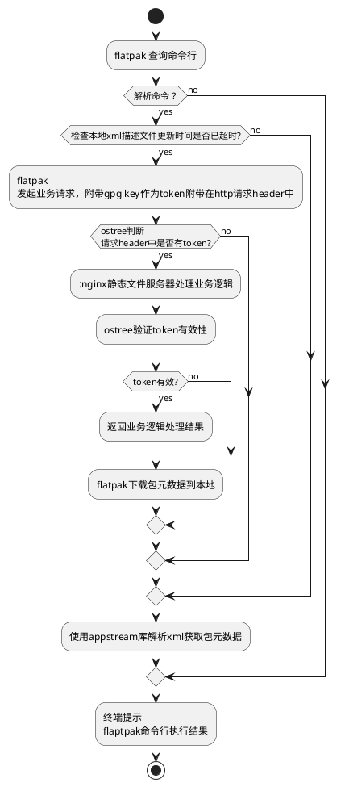

# flatpak



```bash
uos@uos:~$ flatpak search zoom --columns=all
Description                                                                       Application                      Version      Branch Remotes
Zoom - Video Conferencing, Web Conferencing, Webinars, Screen Sharing             us.zoom.Zoom                     5.11.10.4400 stable flathub
FIPS - OpenGL-based FITS image viewer                                             space.fips.Fips                  3.4.0        stable flathub
PhotoQt Image Viewer - View and manage images                                     org.photoqt.PhotoQt              2.9.1        stable flathub
KmPlot - Mathematical Function Plotter                                            org.kde.kmplot                   1.3.22080    stable flathub
XaoS - Fast interactive real-time fractal zoomer/morpher                          io.github.xaos_project.XaoS      4.2.1        stable flathub
Vieb - Vim Inspired Electron Browser                                              dev.vieb.Vieb                    9.0.0        stable flathub
sleek - todo manager based on the todo.txt syntax for Linux, free and open-sourc… com.github.ransome1.sleek        1.2.1        stable flathub
Minder - Create, develop and visualize your ideas                                 com.github.phase1geo.minder      1.14.0       stable flathub
Gnome Next Meeting Applet - Show your next events in your panel                   ….chmouel.gnomeNextMeetingApplet 2.8.1        stable flathub
wavbreaker - GUI tool to split WAV, MP2 and MP3 files 
```
