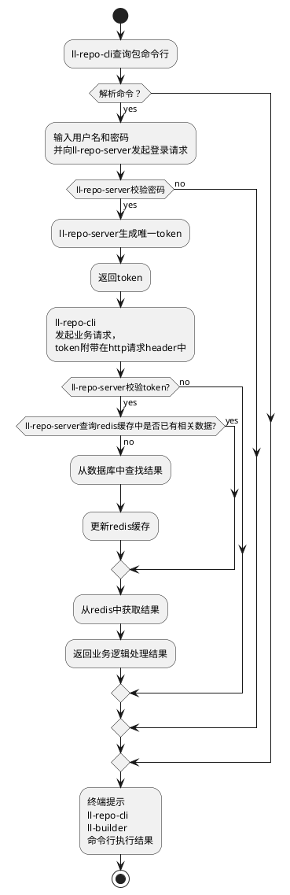

# 玲珑应用包管理系统

```plantuml
@startuml
start
:ll-repo-cli查询包命令行;
if (解析命令？) then (yes)
    :输入用户名和密码\n并向ll-repo-server发起登录请求;
    if (ll-repo-server校验密码) then (yes)
        :ll-repo-server生成唯一token;
        :返回token;
        :ll-repo-cli\n发起业务请求，\ntoken附带在http请求header中;
        if (ll-repo-server校验token?) then (yes)
                if (ll-repo-server查询redis缓存中是否已有相关数据?) then (yes)
                else (no)
                    :从数据库中查找结果;
                    :更新redis缓存;
                endif
            :从redis中获取结果;
            :返回业务逻辑处理结果;
        else (no)
        endif
    else (no)
    endif
endif
:终端提示\nll-repo-cli\nll-builder\n命令行执行结果;
stop
@enduml
```
