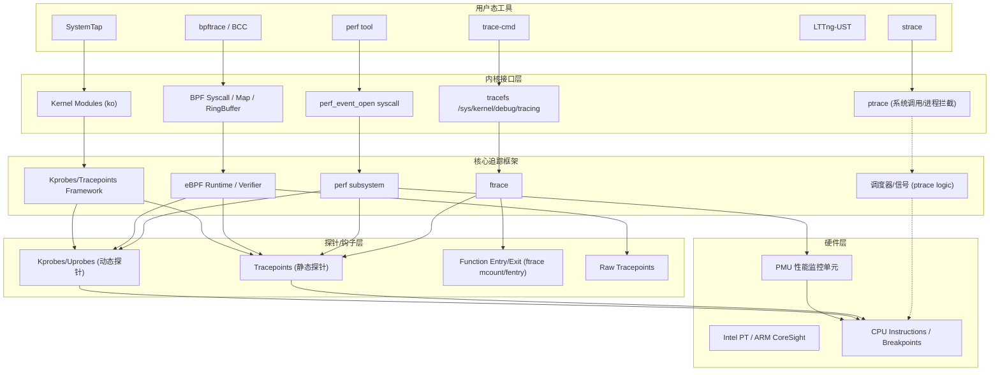

# Linux 追踪与性能分析框架全景图

## 1. 技术全景架构图

## 2. 层级深度解析

### A. 用户态 (User Space)
*   **perf**: 标准的性能分析工具，侧重于采样和硬件计数。
*   **bpftrace / BCC**: BPF 的高级前端，通过脚本编写复杂的逻辑。
*   **trace-cmd**: `ftrace` 的专用前端工具。
*   **strace**: 基于 `ptrace` 系统调用，开销大，仅建议开发调试使用。
*   **SystemTap**: 经典的 Linux 深度追踪工具。通过将脚本编译成内核模块 (.ko) 运行，功能极其强大但操作相对厚重。

### B. 内核接口 (Kernel Interface)
*   **tracefs**: 挂载在 `/sys/kernel/debug/tracing`，`ftrace` 的主要交互入口。
*   **perf_event_open**: 强大的系统调用，支持多种事件类型。
*   **BPF Maps**: 用于内核态与用户态的高效数据交换。

### C. 核心引擎 (Core Engines)
*   **ftrace**: 记录内核函数调用流、中断延迟、调度时延等。
*   **perf subsystem**: 协调硬件计数器和软件采样。
*   **eBPF**: 安全执行用户注入的代码片段，实现高度定制化。

### D. 探针技术 (Probes) —— 按开销从低到高排序
1. **Raw Tracepoints (最低)**: BPF 专用的极致性能探针。跳过了标准 Tracepoints 的格式化（打包）和 Ring Buffer 拷贝过程，直接访问内核原始参数，是目前软件探针中开销的极限。
2. **静态探针 (Tracepoints)**: 开发者在源码中预埋的稳定接口。关闭时仅为 `NOP` 指令，开启时调用预定义的桩函数。
3. **Fentry/Fexit**: 现代 BPF 推荐的函数插桩机制（基于 `ftrace` 插桩点）。通过将函数入口的 `NOP` 动态替换为直接调用（Direct Call）到 BPF 蹦床（Trampoline），避开了复杂的异常处理逻辑，比 `Kprobes` 快一个数量级。
4. **动态探针 (Kprobes/Uprobes) (最高)**: 运行时动态修改内存指令（如插入 `int3` 断点）。触发时会引发 CPU 陷阱（Trap），涉及寄存器保存/恢复等繁重的异常处理流程。

### E. 核心机制对比：strace vs. Others
*   **strace (ptrace)**: 离硬件最“远”。依赖信号和进程调度。每次追踪会导致两次上下文切换，性能损耗巨大（通常 10x~100x 慢）。
*   **perf/ftrace/BPF**: 离硬件“近”。在内核态直接处理或通过内存映射（Ring Buffer）传输数据，对原程序的运行时干扰（Heisenbug）极小。

### E. 硬件底层 (Hardware)
*   **PMU**: CPU 内部硬件，记录 IPC、Cache Miss 等。
*   **BTS/PT**: 记录指令分支流，用于高精度还原。

## 3. 核心工具对比总结

| 特性 | ftrace | perf | eBPF (bpftrace) | SystemTap | strace |
| :--- | :--- | :--- | :--- | :--- | :--- |
| **主要定位** | 函数流、延迟分析 | 硬件热点、统计 | 定制化、数据聚合 | 全能型探针(DTrace-like) | 系统调用 |
| **性能损耗** | 极低 (动态 NOP) | 低 (硬件采样) | 极低 (内核态处理) | 中 (编译/模块加载) | **极高 (ptrace)** |
| **底层依赖** | 编译器桩/NOP | PMU/软件采样 | JIT/Verifier/Probes | **内核模块 (LKM)** | 信号/调度/Trap |
| **交互方式** | tracefs | 二进制命令 | 脚本引擎/Maps | 脚本编译为 .ko | ptrace 系统调用 |
| **典型优势** | **function_graph** | 硬件瓶颈定位 | **O(1) 数据聚合** | 几乎能访问内核所有数据 | 零门槛查看参数 |
| **生产建议** | 推荐 | 推荐 | 强烈推荐 | 慎用 (版本匹配严苛) | 慎用 (仅开发) |
