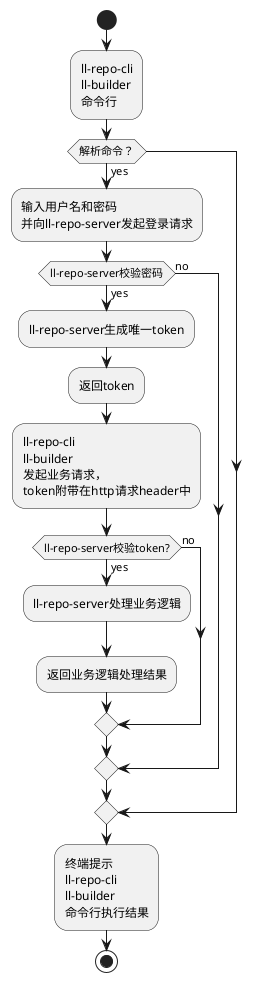
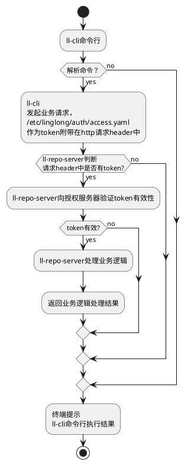
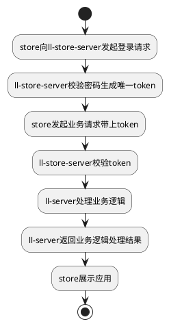

# 玲珑仓库概要设计说明书

## ll-repo-cli\ll-builder、ll-repo-server交互流程图



## ll-cli、ll-repo-server交互流程图



## store、ll-store-server交互流程图



## ll-repo-server数据结构

### App

```go
type App struct {
    gorm.Model
    AppId       string    `json:"appId" gorm:"type:varchar(100);column:app_id;NOT NULL;uniqueIndex:idx_channel_app_id_version_arch_module,priority:2"`
    Name        string    `json:"name" gorm:"column:name"`
    Version     string    `json:"version" gorm:"type:varchar(50);column:version;NOT NULL;uniqueIndex:idx_channel_app_id_version_arch_module,priority:3"`
    Arch        string    `json:"arch" gorm:"type:varchar(20);column:arch;NOT NULL;uniqueIndex:idx_channel_app_id_version_arch_module,priority:4"`
    Kind        string    `json:"kind" gorm:"column:kind"`
    Runtime     string    `json:"runtime" gorm:"column:runtime"`
    RepoName    string    `json:"repoName" gorm:"column:repo_name"`
    Description string    `json:"description" gorm:"column:description"`
    Size        int64     `json:"size" gorm:"column:size"`
    Channel     string    `json:"channel" gorm:"type:varchar(50);column:channel;NOT NULL;uniqueIndex:idx_channel_app_id_version_arch_module,priority:1"`
    Module      string    `json:"module" gorm:"type:varchar(50);column:module;NOT NULL;uniqueIndex:idx_channel_app_id_version_arch_module,priority:5"`
    CheckSum    string    `json:"check_sum" gorm:"column:check_sum"`
}
```

app表候选键：

- app_id
- version
- arch
- channel
- module

### Repo

```go
type Repo struct {
    gorm.Model
    Repo        string    `json:"repo" gorm:"column:repo;uniqueIndex:idx_repo,priority:1"`          // 仓库名
    Mode        string     `json:"mode" gorm:"column:mode"`                                         // 以给定模式初始化存储库（bare、bare-user、bare-user-only、archive）
    Description string    `json:"description" gorm:"column:description"`                            // 仓库描述信息
}
```

repo表候选键：

- repo  // 仓库名

#### User

```go
type User struct {
    gorm.Model
    User        string    `json:"user" gorm:"column:user;uniqueIndex:idx_user,priority:1"`          // 用户名
    Passwd      string    `json:"passwd" gorm:"column:passwd"`                                      // 密码
    RepoName    string    `json:"repoName" gorm:"column:repo_name"`                                 // 仓库名
    Role        string    `json:"role" gorm:"column:role"`                                          // 角色 （Maintainer、Developer、Reporter、Guest）
}
```

user表候选键：

- user 用户名

#### SyncTask

```go
type SyncTask struct {
    gorm.Model
    Task              string    `json:"task" gorm:"column:task;"`                                  // 同步任务名称
    SourceUrl         string    `json:"source_url" gorm:"column:source_url"`                       // 数据源url
    SourceRepoName    string    `json:"source_repo_name" gorm:"column:source_repo_name"`           // 数据源仓库名
    TargetRepoName    string    `json:"target_repo_name" gorm:"column:target_repo_name"`           // 目的源仓库名
    Progress          string    `json:"progress" gorm:"column:progress"`                           // 同步进度百分比
}
```

sync_task表候选键：

- task // 同步任务名称

```go
type SyncedApp struct {
    gorm.Model
    Task        string    `json:"task" gorm:"column:task;NOT NULL;uniqueIndex:idx_task_channel_app_id_version_arch_module,priority,priority:1"`                                     // 同步任务名称
    AppId       string    `json:"appId" gorm:"type:varchar(100);column:app_id;NOT NULL;uniqueIndex:idx_task_channel_app_id_version_arch_module,priority,priority:3"`
    Version     string    `json:"version" gorm:"type:varchar(50);column:version;NOT NULL;uniqueIndex:idx_task_channel_app_id_version_arch_module,priority,priority:4"`
    Arch        string    `json:"arch" gorm:"type:varchar(20);column:arch;NOT NULL;uniqueIndex:idx_task_channel_app_id_version_arch_module,priority,priority:5"`
    Channel     string    `json:"channel" gorm:"type:varchar(50);column:channel;NOT NULL;uniqueIndex:idx_task_channel_app_id_version_arch_module,priority,priority:2"`
    Module      string    `json:"module" gorm:"type:varchar(50);column:module;NOT NULL;uniqueIndex:idx_task_channel_app_id_version_arch_module,priority,priority:6"`
    Synced      int       `json:"synced" gorm:"column:synced;"`                                                                                                      // 是否已同步

}
```

- task // 同步任务名称
- app_id
- version
- arch
- channel
- module
